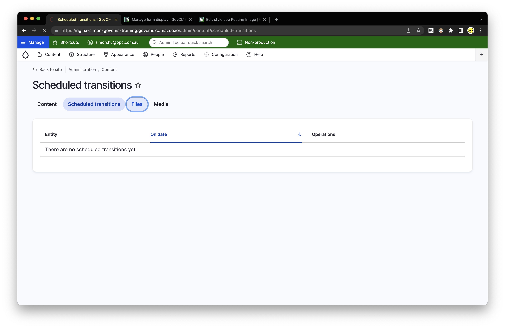

# CONTENT

# UNIT 1: FUNCTIONAL ANALYSIS

come for the software, stay for the community
slack for drupal community "???????
wordpress vs drupal
WYSIWYG for wordpress

container of roles
preset for the roles
when you create a new user ...
people \> user \> option to assign roles (one or multiple)

in general if you are working on the GovCMS SaaS version
you will not get the privilege of creating/modifying permission
roles delegate

`PaaS` : can go into drupal org, and get the thousand of module working (rather unlimited)
(can make ssh connection to the server (VAP agencies with the ability to ....) ), more expensive
`SaaS` : fixed amount of privilege and setting you can tweak (quite limited)
(department of finance provide the maintenance, hence they do not allow ppl to randomly bring their modules, and chuck it in the existing website, because they could cause potential risk, which as a government do not want encounter )

the order for the roles are:
- the higher / comes first : higher privilege
- the lower privilege: the lower privilege

this user that are coloured in grey are the "first user" of the drupal website
and that user is also the "super user" of the system, aka administrator with highest clearance

noting that:
even some of the roles have no ticking item
the previously mentioned super #1 user will
still have the ability to perform those action

f instances
- lower environment / secondary environment
- UAT / testing
	- if you do not use the secondary environment
	- it will go to sleep (the instance will be paused)

different login have a different top bar
- the `no bar` is denoting you are not logged in and is having no privilege to edit any content
- the `green ` is denoting you are not on a production environment
- the `red   ` is warning that you are touching the actual live site

theme = twig

drupal made of two section
frontend
backend (the admin portal)
it usually have different screen ratios
hence the backend is usually a different theme to accomodate this
(by default it is set to Gin)

Currently most drupal backend are moving towards "Claro" (set to default at 9+ version)
- Gin is a sub theme built on top of the Claro
- Reason ppl use Gin, is
	- it has been enhanced b the open community
		- the usability has been well refined
		- for instance if you go into the add content page ....
		- The sticky on top of the content page is one of the enchanted design

[https://www.drupal.org/project/usage/gin](https://www.drupal.org/project/usage/gin)

The settings for the Gin
(developer, admin portal theme )

Claro now comes with default in drupal core
And the following are the "default theme that comes with GovCMS" 
- Olivero - (frontend theme)
- Claro - (admin theme)
- Gin - (admin theme)

"module: layout builder"
- instead using the admin panel's block builder 
- you can use a more user interactive stuff .... aka ..... an more GUI approach to design the layout

you can order the menu item in two ways
1. drag and dropping   
2. using the weight ....  

each time you create a menu
the drupe score system automatically create a custom block
which you can place anywhere within the layout

1. go to customer
	design documentation / mockuyp
	acceptance criteria
	depednening on requirement
	there will be different page holding different content
2. being structure
	forcing structureal content is important
	help the user to progress and add content without having any knowledge to the database

custom permission
you can create permission on whatever names (say for instance permission of "going to toilet" page)
you can assign the permission to what ever roles
(however if you are working under the department of finance's CMS then this feature might be limited)
# UNIT 2: DESIGNING AND PLANNING CONTENT

# UNIT 3: MANAGE MEDIA

file vs media assets
"file" could be more deep down the level for instance a asset that is used as the background for the footer
"media assets" are rather content related, that is say a image in a blog post

noticing that
file has no option of deleting
file us staying on the server no matter what you do with a media it is a part of
media has option of deleting (just like any content type)
media type is just a "wrapper" for the file, it contains the file, the image name, the alt text, etc
a more concrete example would be
a video as a media type, may containing the transcript, the audio, the video
the video, the audio, the transcript file are file type, not media type

GOOD thing about file type
you can reuse it in multiple media type
BAD things about the file type
many user might come to the same file (from different media type)
file type is only deleted if the amount of usage reaches zero (garbage collection)

You may want to delete the files in case
- it is linked via a URL Alias,
- even though the content containing it has been deleted
- you can still read this file
- (and you do not wanna anyone from potentially seeing this file)

`"media file replace "`
- it is still a manual process
- due to legitimate issue, this is not enabled by default

if you want to remove some of the redundant field in the current drupal website
you can do the following to check out if they have been used

`focal point `
allow you to pin point the position of image you want to keep
# UNIT 4: TAXONOMY - CATEGORISING CONTENT
# UNIT 5: TEXT FORMATS AND RICH TEXT
# UNIT 6: CONTENT LISTING WITH VIEWS

Content Construction Kit (for drupal of version \<7.0)
if on SaaS you do not have to be worried of the security

security txt
if you have the dept of security ,.,,,,,
they do not necessirotly have access to the backend portal,
but you can have them

security announcement
contributed module
core module itself
having the whole community's eye, hence update on a faster paste

every drupal module
have
maintainer
issues  (feature request +bugs)
bug
feature request (= issues - bugs)
if you wanna check the modules's security
you can go down to the release page, and if you
see the contributed module labeled as green then/.....

GREEN: tested and production ready
YELLOW: non-production ready
VERSION-ING: "8.X-3.13" → meaning
it is adapted to work with drupal 8.X version,
and the softer itself is on version of 3.13

the GovCMS have the ability (and should) be updating all modules (same for all cutover using GovCMS) at once
(that is to say
you will probably need to maintain the customer with your digital agencies that does not use GoVCMS manually
on the contract if that customer is using SaaS govCMS then there's a bunch of content modules and are stirctly maintained by the dept of finance, hence you should not be chucking in custom module as it will impose potential security vulanabilities)

an active member in the community will post a "request (bug/security/feature)" to the contributed module maintainer
depending on the criticality of .... the request .... then ....
(20% of the request are rather not true, for instance "you can delete the database as admin" ← this is by design !!!! not a bug)

having many contributed module will cause overhead
what the dept of finance did :

for view filtering criteria
custom module
better select
select 2

drupal 9 layout builder

# UNIT 7: URL ALIASES
# UNIT 8: SITE BUILDING EXERCISES
# UNIT 9: SEARCH AND RELATED CONTENT
# UNIT 10: SITE PERFORMANCE