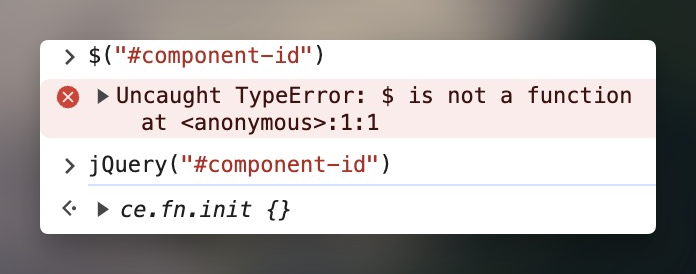

## jQuery dollar sign


### Why isn't the dollar sign working ?

In the normal scenario we can use one of the following:

```javascript
$("#element-name").xxx();      /* Normal jQuery */
jQuery("#element-name").xxx(); /* Safe   jQuery */
```

But in some area case the the "normal jquery" will not function anymore (for instance the below); After some quick research online, we found this has to do with the "[jQuery compatiibilty mode](https://learn.jquery.com/using-jquery-core/avoid-conflicts-other-libraries/)", which serves the purpose to avoid conflict with other javascript library. (other library may have also use the dollar sign, or extended the function of dollar sign, importing jquery with out the compatibility mode may override these functions).




### What are the work-around for this ?

Below are some of the alternatives you can by-pass this with:

-   in order to use `$…` instead of `jQuery…`, so it will map “`$`” to “`jQuery`” for us

```javascript
(function($) {
    // $ Will work here
    // $("#element-name").xxx();
})( jQuery );
```

-   If we need to use it in the header and document ready, we can use the following

```javascript
jQuery(document).ready(function( $ ) {
    // $ Will work here
    // $("#element-name").xxx();
});
```


---

## The `noConflict()` function

### What is this function ?

The function `jQuery.noConflict()` "frees" the "`$`" from being associated with jQuery. Normally in your code you can use `$` as a replacement for "`jQuery`". If you use "`noConflict()`" you can't do that anymore and so you have to replace each "`$`" with "`jQuery`";


Without the `noConflict`:
```javascript
 $(document).ready(function(){
    $("#insideTable > tbody > tr:odd").addClass("odd");
    $("#insideTable > tbody > tr:not(.odd)").hide();
    $("#insideTable > tbody > tr:odd").show();
    $("#insideTable > tbody > tr.odd").click(function(){
        $(this).next().toggle();
        $(this).find(".arrow").toggleClass("up");
    });

});
```
With the `noConflict`:
```javascript
jQuery.noConflict();
jQuery(document).ready(function(){
    jQuery("#insideTable > tbody > tr:odd").addClass("odd");
    jQuery("#insideTable > tbody > tr:not(.odd)").hide();
    jQuery("#insideTable > tbody > tr:odd").show();
    jQuery("#insideTable > tbody > tr.odd").click(function(){
        jQuery(this).next().toggle();
        jQuery(this).find(".arrow").toggleClass("up");
    });
});
```

### Why we need it ?

Sometimes we would want to run this after the importation of jQuery, because:

> Many JavaScript libraries use `$` as a function or variable name, just as jQuery does. In jQuery's case, `$` is just an alias for jQuery, so all functionality is available without using `$`. If we need to use another JavaScript library alongside jQuery, we can return control of `$` back to the other library with a call to `$.noConflict()`:

If you want, you can also create a totally new alias to use:
```javascript
 jQuery.noConflict();
jQuery(document).ready(function(){
    jQuery("#insideTable > tbody > tr:odd").addClass("odd");
    jQuery("#insideTable > tbody > tr:not(.odd)").hide();
    jQuery("#insideTable > tbody > tr:odd").show();
    jQuery("#insideTable > tbody > tr.odd").click(function(){
        jQuery(this).next().toggle();
        jQuery(this).find(".arrow").toggleClass("up");
    });
});
```

---

## Reference
- [\*Avoiding Conflicts with Other Libraries](https://learn.jquery.com/using-jquery-core/avoid-conflicts-other-libraries/)
- [https://stackoverflow.com/questions/6746352](https://stackoverflow.com/questions/6746352/replace-dollar-sign-with-jquery#:~:text=noConflict()%20%22frees%22%20the%20%22,%22%20with%20%22jQuery%22%3B%20.&text=Calling%20noConflict()%20removes%20the,the%20%24%20and%20the%20jQuery%20function.)
- [https://dannyda.com/2022/05/22/how-to-use-jquery-where-we-cant-use-the-dollar-sign-does-not-work/](https://dannyda.com/2022/05/22/how-to-use-jquery-where-we-cant-use-the-dollar-sign-does-not-work/)