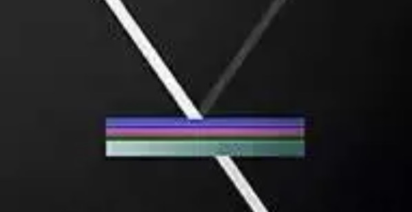
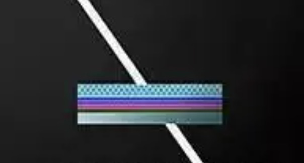

## What is Chromatic Aberration

The term can be separated into two parts:

-   **Chromatic**: Relating to color or the way colors appear.
-   **Aberration**: An optical flaw or distortion that deviates from the ideal conditions and affects the quality of an image or focus.

In simple words, optical phenomenon in which **different wavelengths of light do not converge at the same point** after passing through a lens or other optical system, resulting in **color fringing** and **blurred edges** in the image. This is usually due to lens's inability to focus all colors of light at a single point due to their different wavelengths.

Since light of differenet wavelength converges differently as it passes through different media (for instance "blue light" travels slower in glass comparing to that of "red light", as a result, when it passes from air to glass, it will refract in a "bigger" angle), you can see this effect in the following diagram.

## Consequence of Chromatic Aberration

The result of the Chromatic Aberration is usually color fringing or blurring.

## Mitigating Chromatic Aberration Effect

The migitation appraoch can be separated into two types:

**Method-1**: Single-Layer Coating

The first type simpley **increase the amount of light** entering the lens, this is usually done by adding a **single layer of coating** on top of the lens that reduces the amount of light reflected from glass.

Normally when light travels through each glass component in the lens, there will be roughly 10% light energy loss, this is because: refraction rate of glass and air are different (which is why in the early ages there's almost no lens made of complex glass elements).  After applying a single layer of coating on top of the glass component, the coating have a refraction rate lower than glass higher than the air (I will not go into the detail of why this reduce the chance of reflection; But if you are interested, lookup the term: [Maxwell's Equations and Light](https://www.sjsu.edu/faculty/beyersdorf/Archive/Phys158F06/8-29 Maxwells equations.pdf))

**Method-2**: Multi-Layer Coating

Each layer of coating is design to target specific wavelength of light, helping to mitigate chromatic abbreation, by reducing the difference refraction of different colors (especially those corresponding to the blue and violet colors that are more prone to chromatic aberration). The precise design of multi-layer coatings requires complex calculations and optimization to target the desired wavelengths and achieve the desired reduction in chromatic aberration.

## Reference

-   [Glossary of Lens Terminology](https://kenrockwell.com/tech/lenstech.htm)
-   [Zhihu - 镜头杂谈【5】镀膜篇](https://zhuanlan.zhihu.com/p/26102452?utm_id=0)
-   [Zhihu - 解析镜头的三大镀膜技术](https://zhuanlan.zhihu.com/p/531581041)

