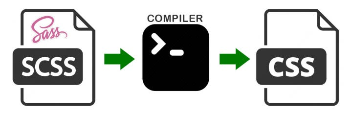

All of the following when used properly will do the same thing, the different is that “#3” is only valid in SCSS file, it not going to be understand by the browser, you will need to compile the code into CSS before using it.

```
#1: Plain Value (neither)
.main-header { color: #F06D06;            }
.main-footer { background-color: #F06D06; }#2: CSS Variable
:root        {--main-color: #F06D06;}
.main-header { color: var(--main-color);            }
.main-footer { background-color: var(--main-color); }#3: SCSS Variable
#   / Preprocessor Variable
$brandColor: #F06D06;
.main-header { color: $brandColor;             }
.main-footer { background-color: $brandColor;  }
```

From the first glance it seems both “CSS Variable” and “Preprocessor Variable” will do the same thing, that is to make the code more readable and maintainable by storing the plan colour coding into a variable. But ……

## CSS Variable `--var` (ALWAYS USE THIS)

```
:root        {--main-color: #F06D06;}
.main-header { color: var(--main-color);            }
.main-footer { background-color: var(--main-color); }
```

Advantage:

-   They work **without** the need of **preprocessor** (rendering from SCSS to CSS)
-   They **cascade** the variable can override when you set them insider a child selector
-   You **can change** the css variable via **Javascript**
-   The browser **repaints** as needed on the value change (@media / or other state such as hover)

Note:

-   CSS variables are a quite **recent** addition to the CSS standard (The last call working draft seams to be from **2014**).

## SCSS Variable `$var`

```
$brandColor: #F06D06;
.main-header { color: $brandColor;             }
.main-footer { background-color: $brandColor;  }
```

Disadvantage:

-   Converted into CSS at **compile** time
-   You **cannot change** sass variable with javascript via **Javascript** (you cannot change then on runtime, because it is already compiled into values)

Note:

-   Historically SCSS is a fairly **old technique**. Actually it dates back to as far as **2007**. It was invented by the motivation that CSS lacks certain features amongst which are variables (and nesting and loops and mix-ins etc.).
