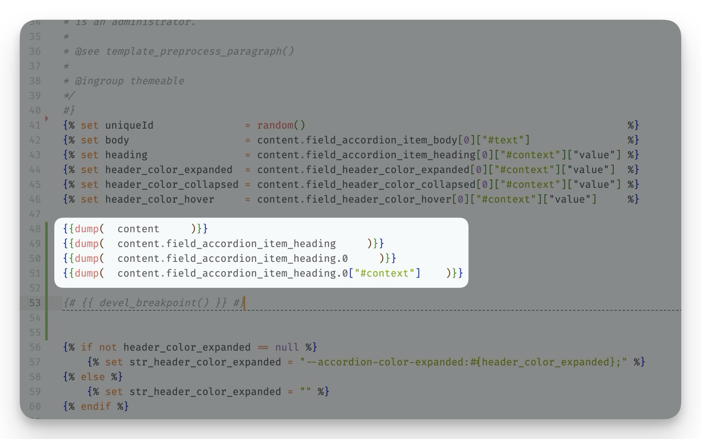

> Note:
> This post focuses on developing a Drupal website on a MacOS machine using MAMP & MAMP Pro hosting software, Apache HTTP Server, and MySQL Backend. The goal is to debug the PHP file to access the variables available in a Twig template.

In the previous post we have successfully turn on the xdebug in php, and setup the PhpStorm to import the project, and using the debugger to add a breakpoint on the `index.php`; now in this post we will guide you through how to use the debugger on the process of developing twig template.

To beign with, we will understand that debugging twig template is not debugging the `.html.twig` file, it is not executable, and is only the template document that gets filled on run to become the rendered site; In fact, all `.twig` file, when run,  will get turned into a `.php` file (so called the "twig cache"), and are stored at `<project-root>/sites/files/php/twig` folder in your project directory. Upon every run if the "twig cache" php file exits then the actual "twig template" will get ignored, and only executing the php file (if not exits then it will first get rendered into php first). So the fact is that we are actually debugging the rendered `.php` file.

## Drupal: Development Settings

To begin with you might want to turn on "twig development mode", this will show the twig tempalte you are using, and enabling the ability to use dump command (twig debug mode), as well as turning off the twig cache, so on every refresh/reload you will get a fresh twig-php file from the twig-template file (Disable Twig cache), these settings can be found at: "[https://your-website-domain/admin/config/development/settings](https://your-website-domain/admin/config/development/settings)".

## Old Method: `dump()`

Originally before we have the PhpStorm debugging, we can use the feature provided the the twig debug: `dump()`, for instance we have the file `paragraph--accordion-single.html.twig` (located at `theme/custom/xxx/templates/paragraph`), a twig template for a paragraph type named "accordion single":

And we add the following `dump()` command in its twig file, to print out the values for ite field of machine name `field_accordion_item`, shown as the follows:

We fill get the printout from `dump()` when we refreshes the page:

Well.... this seem to be convinient, you get the values inside the twig context/context via dump ! But what if, you do not know the variable's name, then you would have to manually get into the dump by clicking the little ▶ icon; Then you will realize you can get as deep as 5 levels (max_nesting_level = 5). Even worse, some of the properties that seems to be key-value pairs are in fact "private" (for instance "`#value`"), you cannot access it with straight `parent["key"]` (for instance to access "`parent[#value]child`", do "`parent.child.value`" and there's lots of odd things like this throughout my experience, such as you will need to get to the node's parent to access its value ....).

## New Method: Xdebug and `devel_breakpoint()`

Now with the xdebug and capabilities of debugger from the PhpStorm, you can access the twig template context variables via the debug panel variables inspector, simply turn on the debug mode, write `devel_breakpoint()` in the twig template, and open the corresponding page that uses the twig template:

## Reference
https://www.youtube.com/watch?v=GXWfA5AFI0I
https://www.jetbrains.com/help/phpstorm/symfony-twig.html#twig-code-inspection