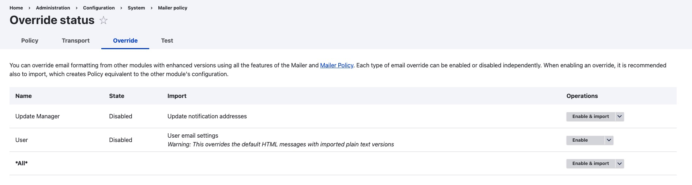

## Useful Links
- Symfony Mailer Library Official: [LINK](https://symfony.com/doc/current/mailer.html)
- Drupal Symfony Mailer Module: [LINK](https://www.drupal.org/project/symfony_mailer)

## Description
- This module is a simple wrapper for Symfony Mailer, providing full support for HTML mails, templating, theming with inline CSS, file attachments and more. Loosely based on the popular swiftmailer module.

## Version Check
**Double checking the drupal version** (Because the Symfony Mailer Module will only work under drupal version 10.1+ )
(This module is not compatible with Drupal 10.1 due to #3371042: Drupal 10.1.0 new aggregation breaks InlineCssEmailAdjuster. [https://www.drupal.org/project/symfony\_mailer](https://www.drupal.org/project/symfony_mailer))

## Procedure

**1 - Getting Started with `Symfony Mailer` Module**

...

**2 - Migrating from `SwiftMailer` Module**

**Installation**

-   Via Composer `composer require 'drupal/symfony_mailer:^1.3' `

**Overriding**

You can override the email handler ("notifying via email" feature) via:

- GUI at "Configuration » System » Mailer » Override"
- (or)  drush commands `drush mailer:override-info` and `drush mailer:overrid`
After correct configuration of this overrider, the original hook will no longer be called, instead will go through the Symfony Emailer, and you can import configuration from the existing modules to create an equivalent Mailer policy.

**Mailer Policy**

This is where you customise your template of outgoing email, please go to GUI: "Configuration » System » Mailer". There are many possible policies to apply including: subject; body; addresses (from, to, ...); theme, transport, convert to plain text. Each policy can be set globally or for emails of a specific type.

## Example

