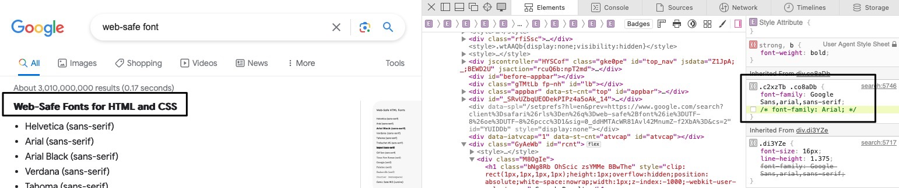
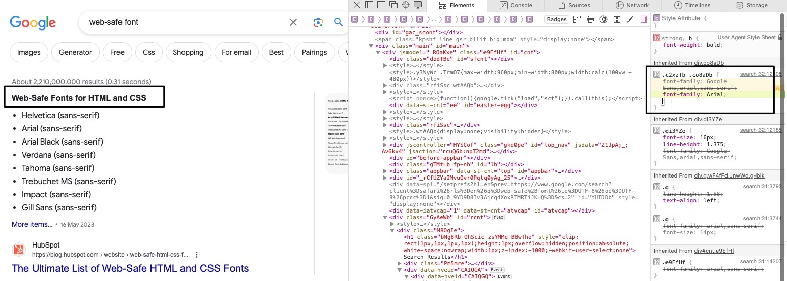
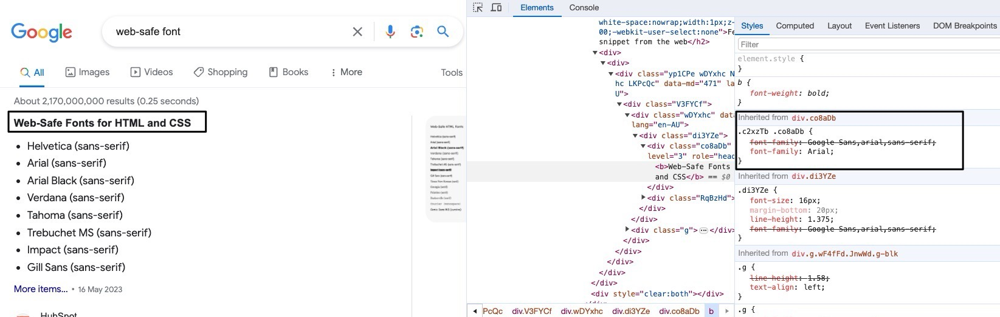

## Intuition

I ran acorss this issue when I was testing a client's website acorss different browsew, we use a `font-family` of `Barlow Bold` across the website for `<b>` or `<strong>` component to add a bit of visual highlight to the audience. After completed the development of the whole site mainly using <u>chrome</u>, I tested for the responsiveness and cross-browser via <u>firefox</u> and <u>edge</u>, of which all looks fine; Until I opened the website using <u>safari</u>, all the sudden all the text starting to look bolder and blurried.

After some play-around I found the similar issue occuring on "[Google](https://google.com)"

A TLDR quick fix to make "<u>safari and chrome font look the same</u>" is to use one of the "[**web-safe front**](https://www.w3schools.com/cssref/css_websafe_fonts.php)", for instance "Arial", like below:

---

---

## Reference

-   [Same font except its weight seems different on different browsers](https://stackoverflow.com/questions/5082632/same-font-except-its-weight-seems-different-on-different-browsers): [Screenshot](2024-02-20T152038AEST.jpg)

-   [How to prevent different browsers rendering fonts differently?](https://stackoverflow.com/questions/30876894/how-to-prevent-different-browsers-rendering-fonts-differently): [Screenshot](2024-02-20T152058AEST.jpg)

