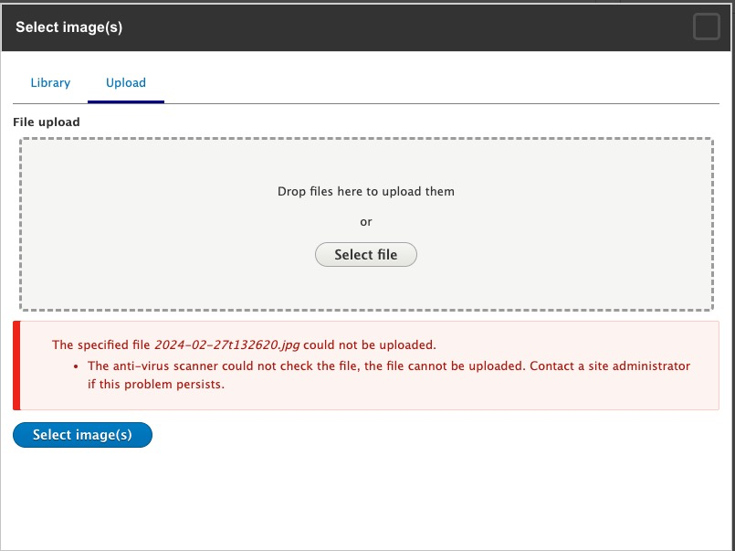
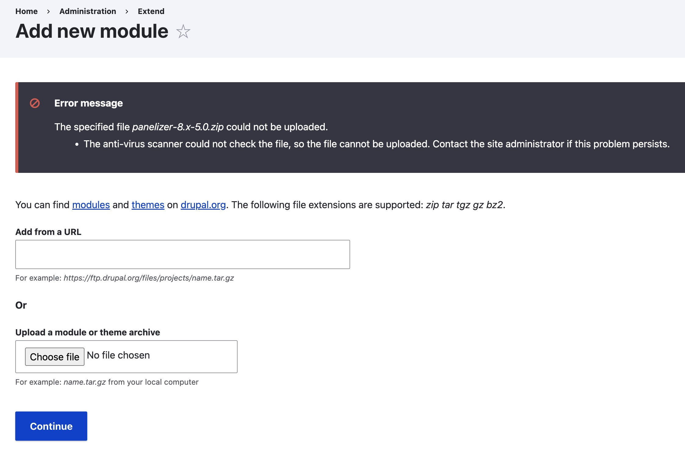
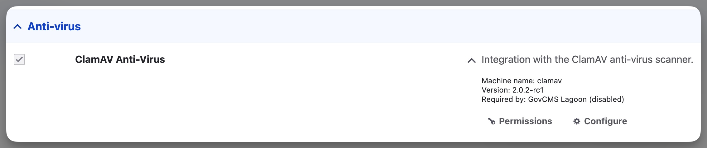
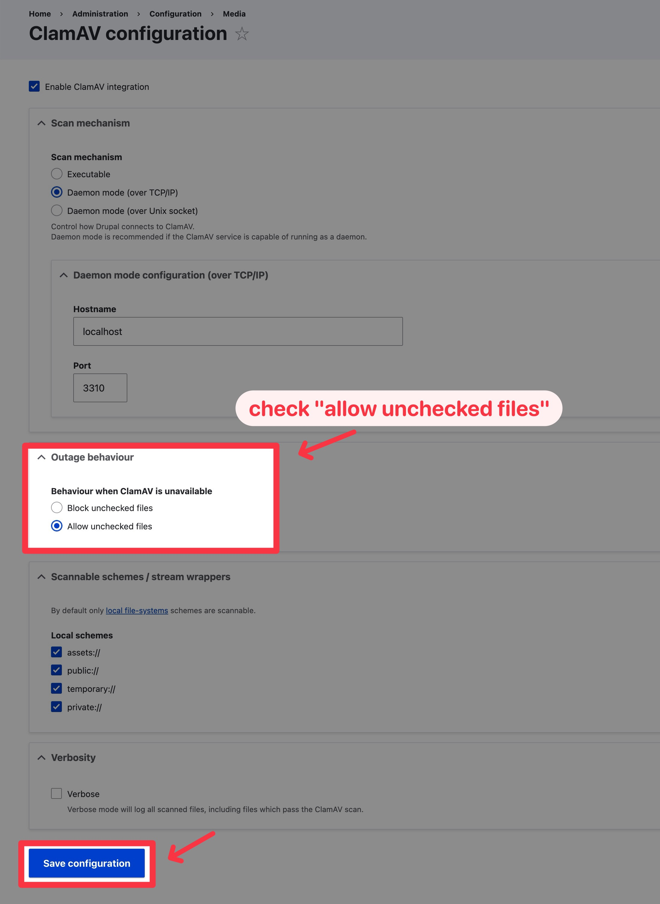

## Issue Found 
```
Drupal Core: 8.7.8
Lightning: 4.0.5
PHP: 7.2

Steps to reproduce.
- Enable ClamAV and leave "host" field blank.
- Go to Content > Add Media > Image.
- Upload an image.
- An error should be returned reading: "The anti-virus scanner could not check the file, so the file cannot be uploaded. Contact the site administrator if this problem persists." This is the expected result since we did not configure the clamav host.
- Create a content type with an image field. In form display set the widget as Entity Browser with Image browser in settings.
- Go to Content > Add Content > Content type - with the image field that has entity browser widget configured.
- Click Select Images
- Click Upload tab
- Upload image.
```







## Resolution Approah

First find the "<u>**ClamAV Anti-Virus**</u>" panel via searching over the module admin page:



Click on "<u>**Configure**</u>" and under **outage behavior** check "**<u>allow unchecked files</u>**", and save configuration via the bottom button


