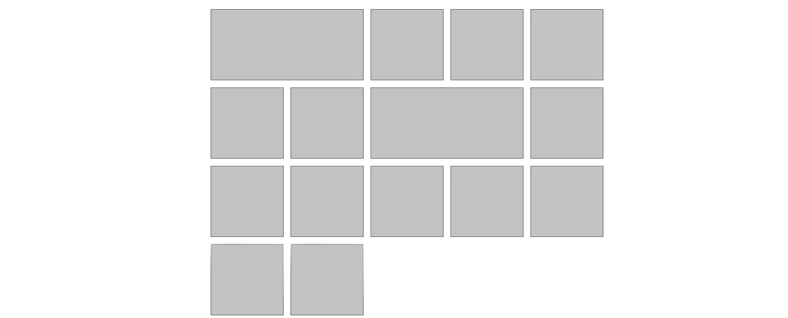

### Single Column Layout

A **single column layout** in web design is a basic layout structure that features content arranged in a single vertical column. This design approach is straightforward and typically used for websites that prioritize simplicity and readability. Single column layouts are common in blogs, portfolios, and other content-focused websites where a clean and linear presentation is desired.


```html
<!doctype html>
<title>Example</title>
<style>
   .main-column{width:50%;margin:0 auto;border:1px solid #ddd;border-radius:4px;padding:20px;font-family:sans-serif;color:#3a3a3a}.post{margin:30px 0 10px}
</style>
<body>
  <section class="main-column">
    <div class="post">
      <h3>Title</h3>
      Bacon ipsum dolor sit amet swine biltong hamburger kevin shoulder short loin leberkas. Boudin tenderloin pork
      belly chuck turducken leberkas meatball pork chop fatback ham hock meatloaf tail short ribs brisket. Turducken
      bacon, jowl ribeye beef ribs pork belly rump. Turkey filet mignon capicola, frankfurter cow strip steak pastrami
      swine prosciutto kielbasa.
    </div>
    <div class="post">
      <h3>Title</h3>
      Bacon ipsum dolor sit amet swine biltong hamburger kevin shoulder short loin leberkas. Boudin tenderloin pork
      belly chuck turducken leberkas meatball pork chop fatback ham hock meatloaf tail short ribs brisket. Turducken
      bacon, jowl ribeye beef ribs pork belly rump. Turkey filet mignon capicola, frankfurter cow strip steak pastrami
      swine prosciutto kielbasa.
    </div>
    <div class="post">
      <h3>Title</h3>
      Bacon ipsum dolor sit amet swine biltong hamburger kevin shoulder short loin leberkas. Boudin tenderloin pork
      belly chuck turducken leberkas meatball pork chop fatback ham hock meatloaf tail short ribs brisket. Turducken
      bacon, jowl ribeye beef ribs pork belly rump. Turkey filet mignon capicola, frankfurter cow strip steak pastrami
      swine prosciutto kielbasa.
    </div>
  </section>
</body>
```


### Holy Grail Layout

**The Holy Grail layout** is a popular web design pattern featuring a header and footer that stick to the top and bottom of the page, with three columns in the middle that are equal in height. This layout is challenging due to achieving equal-height columns and maintaining responsiveness. (example screenshot: [screenshot](mjqDk.png))


```html
<!doctype html>
<title>Example</title>
<style>
 *{box-sizing:border-box}body{margin:0}#main{display:flex;min-height:calc(100vh - 40vh)}#main>article{flex:1}#main>aside,#main>nav{flex:0 0 20vw;background:beige}#main>nav{order:-1}article,aside,footer,header,nav{padding:1em}footer,header{background:#9acd32;height:20vh}
</style>
<body>
  <header>Header</header>
  <div id="main">
    <article>Article</article>
    <nav>Nav</nav>
    <aside>Aside</aside>
  </div>
  <footer>Footer</footer>
</body>
```


```html
<!doctype html>
<title>Example</title>
<style>
  #main,body{display:flex}*{box-sizing:border-box}body{min-height:100vh;flex-direction:column;margin:0}#main{flex:1}#main>article{flex:1;order:1}#main>aside,#main>nav{flex:0 0 20vw}#main>nav{background:#d7e8d4;order:3}#main>aside{background:beige;order:2}footer,header{background:#9acd32;height:20vh}article,aside,footer,header,nav{padding:1em}
</style>
<body>
  <header>Header</header>
  <div id="main">
    <article>Article</article>
    <nav>Nav</nav>
    <aside>Aside</aside>
  </div>
  <footer>Footer</footer>
</body>
```


### Modular Grid Layout

**Modular Grid Layout** is a structured design approach that uses a grid system to organize and align content on a webpage. It divides the space into columns and rows, allowing for consistent placement of elements like images, text, and multimedia. This design technique promotes visual harmony and order in web design.



```html
<!doctype html>
<title>Example</title>
<style>
  @import url(breakpoint);.l-grid{display:grid}.modular{grid-template-columns:repeat(auto-fit,minmax(200px,1fr));grid-auto-rows:minmax(200px,min-content);grid-gap:20px;max-width:1100px;margin:60px auto}.grid-item{padding:1em;background-color:#ccc;border:1px solid #000}
</style>
<body>
    <div class="l-grid modular ">
      <div class="grid-item major-col">Grid Item</div>
      <div class="grid-item ">Grid Item</div>
      <div class="grid-item">Grid Item</div>
      <div class="grid-item">Grid Item</div>
      <div class="grid-item">Grid Item</div>
      <div class="grid-item">Grid Item</div>
      <div class="grid-item major-col">Grid Item</div>
      <div class="grid-item">Grid Item</div>
      <div class="grid-item">Grid Item</div>
      <div class="grid-item">Grid Item</div>
      <div class="grid-item">Grid Item</div>
      <div class="grid-item">Grid Item</div>
      <div class="grid-item">Grid Item</div>
      <div class="grid-item">Grid Item</div>
      <div class="grid-item">Grid Item</div>
    </div>
</body>
```


### Masonry Layout

**Masonry layout** in web design is a layout method where elements are stacked vertically with varying positions, similar to bricks in a masonry wall. It optimizes space by aligning items of different heights neatly. This design approach is commonly used for websites to create visually appealing and organized grids of content. (example screenshot: [screenshot](2024-03-05T132501.jpg))


```html
<!doctype html>
<title>Example</title>
<style>
	#container{width:100%;max-width:700px;margin:2em auto}.cols{-moz-column-count:3;-moz-column-gap:3%;-moz-column-width:30%;-webkit-column-count:3;-webkit-column-gap:3%;-webkit-column-width:30%;column-count:3;column-gap:3%;column-width:30%}.box{margin-bottom:20px}.box.one{height:200px;background-color:#d77575}.box.two{height:300px;background-color:#dcbc4c}.box.three{background-color:#a3ca3b;height:400px}.box.four{background-color:#3daee3;height:500px}.box.five{background-color:#bb8ed8;height:600px}.box.six{background-color:#baafb1;height:200px}
</style>
<body>
<div id="container" class="cols">
    <div class="box one"></div>
    <div class="box two"></div>
    <div class="box one"></div>
    <div class="box three"></div>
    <div class="box two"></div>
    <div class="box five"></div>
    <div class="box one"></div>
    <div class="box two"></div>
    <div class="box six"></div>
    <div class="box three"></div>
    <div class="box two"></div>
</div>
</body>
```


## Reference

- [Masonry layout with CSS only! - YouTube](https://www.youtube.com/watch?v=KrPz_wmBsAE)
- [Design Patterns - Web.Dev](https://web.dev/patterns/layout/holy-grail?hl=en)
- [Flexbox Website Layout Examples - Quackit](https://www.quackit.com/css/flexbox/examples/flexbox_website_layout_examples.cfm)
- [Modular auto grid wth transform - CodePen](https://codepen.io/SuoweiHu/pen/QWPbOjJ)
- [Pure CSS masonry layout - CodePen](https://codepen.io/gabrieleromanato/pen/DWREqy)
- [Single Column Layout - CodePen](https://codepen.io/SuoweiHu/pen/KKYpyaY)