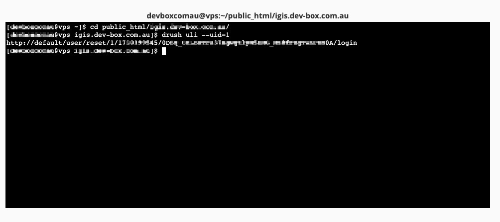
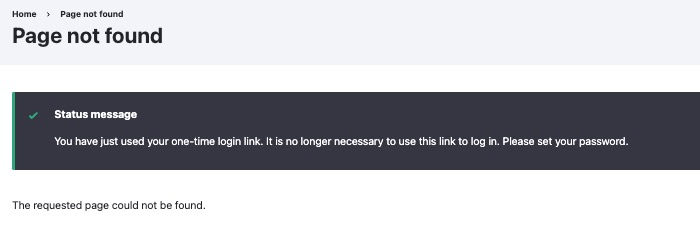

## Get One-Time Login
First you will open your terminal and navigate to the root directory of the website, then execute the `drush user-login` command. For instance here I will be using CPanel:



Some similar commands are:

```
drush uli --name=admin
drush uli --uid=1
```


## Using One-Time Login

Once you've got the login url from the terminal, for instance:

```
http://default/user/reset/1/0123456789/0D_CraSDdasdaa432s2DSAJDKLJASKLD_0A/login
```

You will need to copy the bit after the `default/` starting with `/user` , and paste them after the base url of your drupal website (or in another word, replace `default` with the `base-url` of your website), for instance:

```
http://www.example.com.au/user/reset/1/0123456789/0D_CraSDdasdaa432s2DSAJDKLJASKLD_0A/login
```

Then you should be prompted to have succssfully logged in with the corresponding user.



(**Note**: the one-time login have to be performed within 60 seconds, it cannot be reused overtime, you will be seeing something like: "Error message: You have tried to use a one-time login link that has expired. Please request a new one using the form below" when the login expires.)
