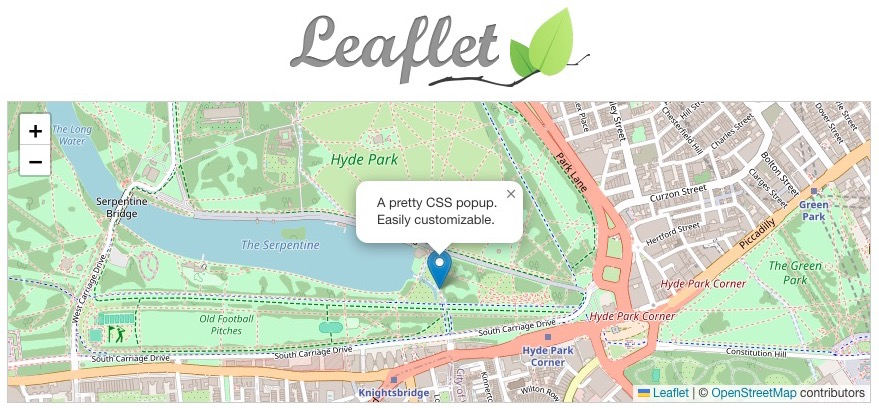

## What is Leaflet ?

>   Leaflet is the leading **open-source JavaScript library** for mobile-friendly interactive maps. Weighing just about 42 KB of JS, it has all the mapping features most developers ever need.
>
>   Leaflet is designed with **simplicity, performance and usability** in mind. It works efficiently across all major desktop and mobile platforms, **can be extended with lots of plugins**, has a beautiful, easy to use and well-documented API and a simple, readable source code that is a joy to contribute to.

**Advantages** comparing to other JavaScript map library:

-   **Cost** (free/open-source)
-   **Simplicity** (only 42KB)
-   **Community Support**
-   **Documentation** (or help widely available, thanks to its large community)
-   **Plug-in extension** (and extendability overall)

**Disadvantages** comparing to other JavaScript map library:

-   **Vector tile support** (only support raster tiles)
-   **API integration** (unlike mapbox-gl-js)
-   3D rendering that uses **WebGL** (unlike mapbox-gl-js or CesiumJS)
-   Built with **primitive** feature (you need to write your own advanced styling)

---
## Example

You can download the example code [here](./leaflet%20example.zip)

---
## Reference

-   [Leaflet Official Documentation](https://leafletjs.com/)
