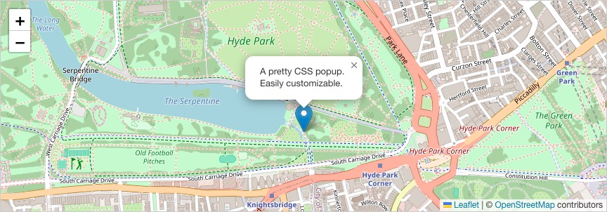
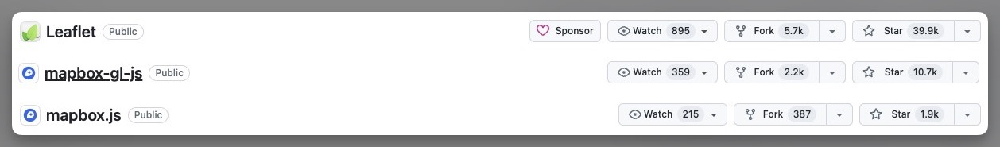

>    **(p.s. The comparison based on project status, statistics, and data collected at: 2024-04-22, It may be out-dated at the date you view the article**

---

## Comparison - Overview

| Leaflet                                | **Mapbox.js**                      | **Mapbox GL JS**                             |
| -------------------------------------- | ---------------------------------- | -------------------------------------------- |
| Active maintenance                     | Project **deprecated**             | In active development.                       |
| Supports **raster tiles**.             | Supports **raster tiles**.         | Supports **raster tiles**, **vector tiles**. |
| Map tiles are generated by **server**. | Map tiles generated by **server**. | Maps rendered client-side by **browser**.    |
| **Static** data and style              | **Static** data and style          | **Dynamic** data and style                   |
| 39.9k star                             | 1.9k star                          | 10.7 star                                    |

---

## Comparison - In Depth

### Leaflet

> **[Leaflet](https://leafletjs.com/)** is the leading open-source JavaScript library for mobile-friendly interactive maps. Weighing just about 42 KB of JS, it has all the mapping features most developers ever need.

Leaflet is known for its ease of **customization** and **extensibility**, making it a preferred choice for developers looking to implement mapping functionality in their web projects.

You are able to use varies plug-ins to enrich the look of leaflet based map, for instance the [Leaflet.markercluster](https://github.com/Leaflet/Leaflet.markercluster) to add clustering for markers, or [Leaflet.SmoothWheelZoom](https://github.com/mutsuyuki/Leaflet.SmoothWheelZoom) to change from step zooming to smooth scrolling. (The number of plug-in you can choose from is big, thanks to the big community of leaflet).

### Mapbox

#### **Mapbox Tiling Service**

>   **[Mapbox Tiling Service (MTS)](https://docs.mapbox.com/api/maps/mapbox-tiling-service/)** is a tool for creating vector tilesets. With MTS, you use sets of configuration options to transform your geospatial data into vector tiles. The resulting tiles are hosted on Mapbox servers for use in your applications.

A map tiling service is like a tool that takes a big map and breaks it into small pieces, just like how a large image can be split into smaller sections for easier viewing. This makes it easier and faster to load maps on websites or apps because only the visible parts of the map are loaded at a time, rather than the whole map all at once.

Features of Mapbox Tiling Service include: Efficiently generates map tiles for web maps, while also supports custom styling and customization of map tiles. (you can use MTS in leaflet application by changing the [`TileLayer`](https://leafletjs.com/reference.html#tilelayer))

#### Mapbox.js & Mapbox GL JS

>   **[Mapbox.js](https://github.com/mapbox/mapbox.js)** is a leaflet plugin, , a lightweight JavaScript library for traditional raster maps. It has seized development as the company have moved towards using Mapbox GL JS which uses WebGL and have the ability to use vector maps tile.

Mapbox.js is a intermediate step towards Mapbox GL JS, it tries to solve some of the pain of using mapbox tiling service in leaflet, it is no longer in active development (deprecated), and should be avoided in new projects.

>   **[Mapbox GL JS](https://docs.mapbox.com/mapbox-gl-js/guides)** is a client-side JavaScript library for building web maps and web applications with Mapbox's modern mapping technology. You can use Mapbox GL JS to display Mapbox maps in a web browser or client, add user interactivity, and customize the map experience in your application.

Mapbox GL JS uses advanced technology (WebGL) to create modern and interactive 3D maps with features like data-driven styling and animations. It's best for projects that need complex visualizations. On the other hand, Mapbox.js uses traditional web technologies for simpler map customization and integration, suitable for basic mapping needs without advanced 3D features.

---

## Popularity

We can do a quick comparison over the popularity of these packages via their **amount of download on npm** (via [npm trends - leaflet vs mapbox-gl vs mapbox.js](https://npmtrends.com/leaflet-vs-mapbox-gl-vs-mapbox.js)), from a quick glance the `mapbox-gl` and `leaflet` seems to have about the same popularity.

However if we would to compare their **stars on GitHub**, `leaflet` sits on roughly 4 times the starts of  `mapbox-gl-js`, and almost 20 times compared to `mapbox.js`,

---

## Reference

-   [Map libraries comparison: Leaflet vs Mapbox GL vs OpenLayers - trends and statistics](https://www.geoapify.com/map-libraries-comparison-leaflet-vs-mapbox-gl-vs-openlayers-trends-and-statistics)

-   [What are Leaflet and Mapbox, and what are their differences?](https://stackoverflow.com/questions/12262163/what-are-leaflet-and-mapbox-and-what-are-their-differences)
-   [Transition from Mapbox.js to Mapbox GL JS](https://docs.mapbox.com/help/troubleshooting/transition-from-mapbox-js-to-mapbox-gl-js/)
-   [Wappalyzer - Mapbox GL JS vs. Leaflet](https://www.wappalyzer.com/compare/mapbox-gl-js-vs-leaflet/)
