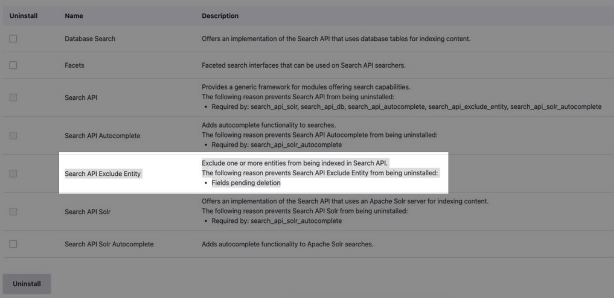
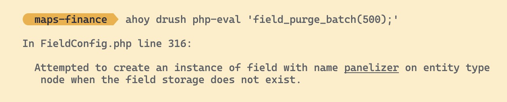
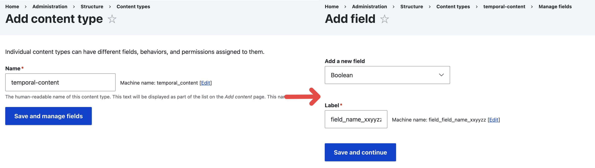

## Error Discovered

```
> drush php-eval 'field_purge_batch(500);'
  In FieldConfig.php Line 316:

     Attempted to create an instance of field with name field_name_xxyyzz
     on entity type node when the field storage does not exist.

```

Also see [screenshot of issue](image-20240424084236614.png)


## Error Reproduced

I was attmpting to migrate/upgrade one of the client website from a GovCMS PaaS to GovCMS SaaS. Due to the strict limit of module permitted, during this progress I had to uninstall a number of modules from the original PaaS site.

One of the module I had to uninstall `Search API Exclude Entity` (which allows exclusion of nodes from search) requires me to **manually remove the boolean field value** from all content type (which serves as the purpose to toggle on/off the exclusion). After that I got the following prompt when attempting to uninstall the module



In order to **clear the residual** of the fields, so I can safely uninstall the module and move on, I found [this post](https://drupal.stackexchange.com/questions/315586/what-is-the-meaning-of-fields-pending-deletion), that instructs me to perform a cron job via drush php-eval command, of which has brought us to the issue:




## Error Resolution

The resolution is suggested on the drupal community by [shashank5563](https://www.drupal.org/project/features/issues/2661806#comment-13476949) (see [screenshot of the post](2024-04-24T085229.jpg)), where we can recreate this field via a **"temporal" content type**, resolve the issue (in my case run  `drush php-evel`) , then come back and delete the "temporal" content type (and after the deleting every old content type will be working fine.



The **steps** are the following:

1.   **create new content type**

     -   name, configuration for the content type doesn't matter
     -   it is only a container for the fields

2.   **create new field of exact machine name**

     -   if the error gives "<u>*Attempted to create an instance of field with name field_name_xxyyzz on entity type node when the field storage does not exist*</u>", then you will need to create a field with machien name *<u>field_name_xxyyzz</u>*

     -   the field type and configuration of the field doesn't matter

         (in some rare case you might have to install module to get the available machine name, for instance "panelizer" and "layout", they might have to be reused instead of created)

3.   **resolve issue**

     -   either like the original author of this resolution method, found it straight working

         or in my case continue to run  `drush php-eval`

4.   **deletion of the content type / fields**
     -   you can delete the content type after the issue is resolved
     -   or just delete the field that is causing the error


----------------------------
## Reference
- https://www.drupal.org/project/search_api_exclude_entity
- https://drupal.stackexchange.com/questions/315586/what-is-the-meaning-of-fields-pending-deletion
- https://www.drupal.org/project/features/issues/2661806