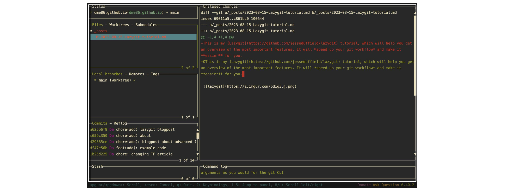
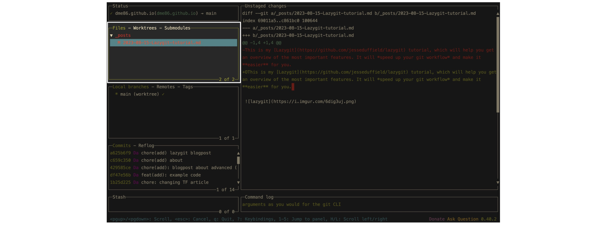

--------
## Global Shortcuts

**common**

-   `p` pull
-   `P` push
-   `q` quit
-   `z` undo
-   `<c+z>` redo
-   `/` search (regex match)

**less common**

-   `shift+plus/minus` next/previous layout
-   `@` toggle command log panel
-   `:` execute custom command (shell commands)
-   `R` refresh git stauts (git stauts && git brach &&)
-   `<c+r>` open recent git repositories

------
## Panel ① - File Staging Area

**common**

-   `<space>` stage file selected
-   `o` open file selected
-   `a` stage all files
-   `d` discard changes of file selected
-   `D` advanced discard change options
-   `Dx` nuke working tree = git reset (`git reset --hard HEAD`) + remove unwanted files from your working directory (`git clean -fd`)

**less common**

-   `S` view stash options
-   `Ss` stash staged files only
-   `Sa` stash all files
-   `y` open yank/copy menu
-   `r` refresh file
-   `<c+o>` copy relative url path to clipboard

------
## Panel ② - Branches and Origins

**common**

-   `<space>` checkout branch selected
-   `n` create new branch (from current selected branch)

**less common**

-   `o` open the current branch's github page

-   `c` checkout by branch name
-   `M` merge selected branch into currently checked out branch

------
## Panel ③ - Commits and Reflog

**common**

-   `r` reword commit (you will have to force push after this)
-   `t` create a new commit that undoes the changes introduced by a specific commit without modifying the commit history

**reset**
-   `g` show reset options
-   `gm` mixed reset: keep **unstaged** and **staged** changes on current working directory
-   `gs` soft reset: keep only **staged** changes (remove **unstaged changes**)
-   `gh` hard reset: (recommended but be careful) keep none of the changes on current working directory, make current files **exactly like** the resetting commit

**fixup**

-   `f` quick <u>fixup</u> current commit with the previsou commit
-   `F` show <u>fixup</u> options
-   `Ff` <u>fixup</u> last commit (add a new commit with the commit message "!fixup msg-of-last-commit")
-   `S` show apply all <u>fixup</u> commit options
-   `Sa` show apply all <u>fixup</u> commit above current commit

**less common**

-   `o` open the current commit's github page
-   `r` reword the selected commit
-   `A` ammend last commit (add current staged changes to last commit, without any commit message change)
-   `d` **(do not use !)** drop the selected commit (will not reset/revert the changes !!!!)

------
## Panel ④ - Stash Area

**common**

-   `g` (recommended) apply the stash entry to your working directory, and remove the stash entry.
-   `<space>` (do not use) apply the stash entry to your working directory, but **not** remove the stash entry.

**less common**

-   `r` rename stash entry
-   `d` drop (delete the stash entiy without recovery)

------

## Reference
- https://www.youtube.com/watch?v=CPLdltN7wgE

