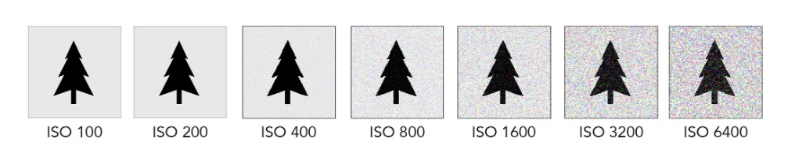

## My false assumption ?

I never thought too hard about this topic before. What I used to **falsely assume** was that the camera is smart enough to detect the brightness of the scene and adjust the ISO accordingly. For instance, if the camera detects that I am outside the door, where the incoming light is presumably very bright, it will set the ISO to a high value before making any adjustments to the shutter speed and aperture.

But it is **clearly incorrect** because a photographer may choose to put on an ND filter, or the lens may have varying FoV. All of these factors may make it impossible to determine if the camera is outdoors or indoors. (Of course, one could argue that with the sophistication of AI, it can definitely resolve this through machine learning or simply very careful parameter tuning... And I don‘t know how to counter prove that...)

## What is actually happening ?

I looked up the relevant article online about this, the most backed-up answer I found is from the manual of the camera makers:

>   In exposure modes P and A, sensitivity will only be adjusted if underexposure would result at the shutter speed selected for **minimum shutter speed** (1/4000–30 s, or Auto; In exposure modes S and M, ISO sensitivity will be adjusted for optimal exposure at the shutter speed selected by the user).
>
>   In exposure mode Auto, the camera will choose the minimum shutter speed based on the focal length of the lens (safe shutter speed); choosing fast speeds when photographing fast-moving subjects reduces blur.
>
>   **-- Nikon - D850 Online Manual**

>   The camera automatically chooses a sensitivity between the default and maximum values. Sensitivity is only raised above the default value if the shutter speed required for optimal exposure would be slower than the value selected for **MIN. SHUTTER SPEED**.
>
>   The camera may select shutter speeds slower than MIN. SHUTTER SPEED if pictures would still be underexposed at the value selected for MAX. SENSITIVITY. If AUTO is selected for MIN. SHUTTER SPEED, the camera will automatically choose a minimum shutter speed approximately equal to the inverse of the lens’ focal length, in seconds (for example, if the lens has a focal length of 50 mm, the camera will choose a minimum shutter speed in the neighborhood of 1⁄50 s). The minimum shutter speed is not affected by the option selected for image stabilization.
>
>   **-- Fujifilm - The Shooting Menu**

You can find the equivalant settings in Sony camera as the following screenshot illustrates:

(<u>left</u>: minimum/maximum iso setting)

(<u>right</u>: minimum shutter speed setting)

## Conclusion to findings ?

We all know ISO is how sensitive your camera is to light. Turn it up, and your camera won't need as much light to take a shot; However, this usually mean you will then need to have a faster shutter speed, or smaller apreature; Consequently, under the same explosure, the camera sensor will in-take less light for higher ISO; Of which will result in lower signal to noise ratio, hence more graininess in image.

This is why "*<u>keeping your ISO low</u>*" has always been mentioned in the photography tutorials, but of course you should use your best judgment based on your need, for some condition you might use a unconventional high or low ISO (for instance you want to freeze the wing of brid under sun light, additionally, "*<u>keep your ISO low</u>*" is also very a debated topic, I won't go into the details of this). With the camera manual backing-up as the working mechnism behind Auto-ISO, it seems this configuration can help us **keep the ISO setting as low as possible** without worrying too much when the brightness of the theme changes (it will raise the ISO for us whenever needed and only when needed!).

The above shall conclude my findings regarding Auto-ISO. I am feeling much safer now when I turn on this setting. I can confidently predict when this setting will increase the ISO for me, and bear in mind that I won't get a high ISO under bright sunlight and a grainy image.

## Reference

**Camera Manual**

-   **English version**

    - **Nikon**

        >   In exposure modes P and A, sensitivity will only be adjusted if underexposure would result at the shutter speed selected for **minimum shutter speed** (1/4000–30 s, or Auto; In exposure modes S and M, ISO sensitivity will be adjusted for optimal exposure at the shutter speed selected by the user).
        >
        >   In exposure mode Auto, the camera will choose the minimum shutter speed based on the focal length of the lens (safe shutter speed); choosing fast speeds when photographing fast-moving subjects reduces blur.

        https://onlinemanual.nikonimglib.com/d850/en/10_iso_sensitivity_02.html

    - **Fujifilm**

        >   The camera automatically chooses a sensitivity between the default and maximum values. Sensitivity is only raised above the default value if the shutter speed required for optimal exposure would be slower than the value selected for **MIN. SHUTTER SPEED**.
        >
        >   The camera may select shutter speeds slower than MIN. SHUTTER SPEED if pictures would still be underexposed at the value selected for MAX. SENSITIVITY. If AUTO is selected for MIN. SHUTTER SPEED, the camera will automatically choose a minimum shutter speed approximately equal to the inverse of the lens’ focal length, in seconds (for example, if the lens has a focal length of 50 mm, the camera will choose a minimum shutter speed in the neighborhood of 1⁄50 s). The minimum shutter speed is not affected by the option selected for image stabilization.

        https://fujifilm-dsc.com/en/manual/x-pro2/menu_shooting/iso_auto_setting/index.html

    - **Sony**

        >   **ISO AUTO Min. SS**: If you select [ISO AUTO] or [ISO AUTO] under [Multi Frame NR] when the shooting mode is P (Program Auto) or A (Aperture Priority), you can set the shutter speed at which the ISO sensitivity starts changing.

        https://helpguide.sony.net/ilc/1540/v1/en/contents/TP0000829903.html#:~:text=If%20you%20select%20%5BISO%20AUTO,effective%20for%20shooting%20moving%20subjects.

- **Chinese version**

    - **Nikon**

        >   在曝光模式**P**和**A**下，仅当在**最小快门速度**（1/4000秒至30秒，或**自动**）中所选的快门速度下会导致曝光不足时，照相机才调整ISO感光度（在模式**S**和**M**下，照相机将为在用户所选快门速度下获取良好曝光而调整ISO感光度）。若选择了**自动**，照相机将根据镜头焦距选择最小快门速度；在拍摄快速移动的拍摄对象时选择较快速度可减少模糊。

        https://onlinemanual.nikonimglib.com/d850/zh-cn/10_iso_sensitivity_02.html

    - **Fujifilm**

        >   相机自动在默认值和最大值之间选择一个感光度。感光度仅在获取理想曝光需要的快门速度低于 **最低快门速度** 中的所选值时才会提高到默认值以上。

        https://fujifilm-dsc.com/zhs/manual/x-pro2/menu_shooting/iso_auto_setting/index.html

**YouTube**

- https://www.youtube.com/watch?v=2iFX_r-yfbs
- https://www.youtube.com/watch?v=Tos-RK7zgBU