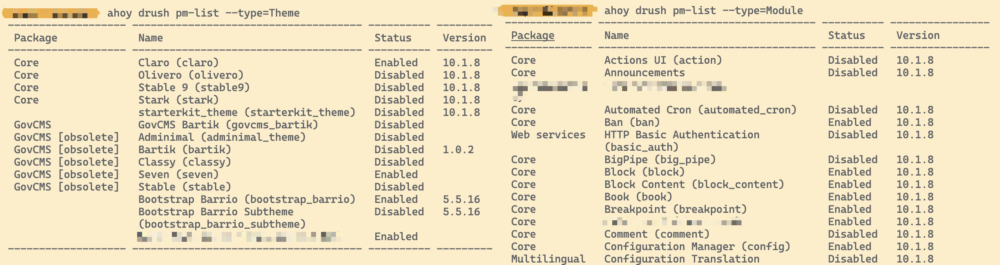
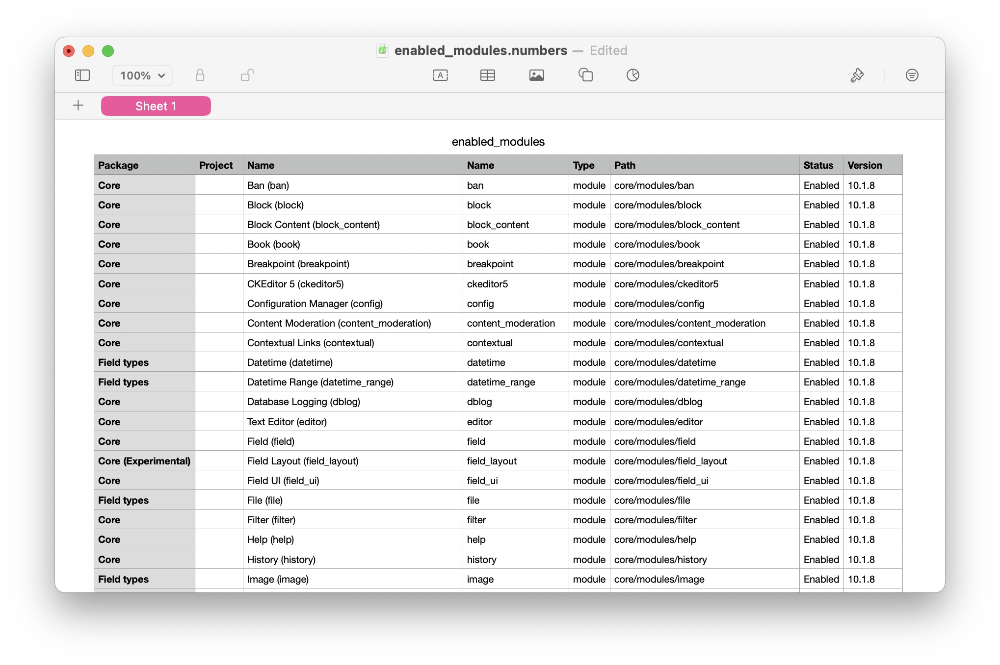

## Basic Usage

List installed theme, list intstalled modules 

```
drush pm-list --type=Theme
drush pm-list --type=Module --status=enabled
```




## Exporting to File

List the installed modules using `debug` verbose mode, and export into `csv` format into file `enabled_modules.csv`:

```
drush pm-list --type=Module --status=Enabled -vvv --format=csv >> enabled_modules.csv
```

(noting that the `--type` and `--status` option have to be in front of the `--format` option, otherwise it will not work)




## Other Usage

For other use case, you can refer to the document found via `drush pm-list --help`

```shell
Show a list of available extensions (modules and themes).

Options:
  --format[=FORMAT] Format the result data. Available formats: csv,json,list,php,print-r,sections,string,table,tsv,var_dump,var_export,xml,yaml [default: 
                    "table"]                                                                                                                              
  --type[=TYPE]     Only show extensions having a given type. Choices: module, theme. [default: "module,theme"]                                           
  --status[=STATUS] Only show extensions having a given status. Choices: enabled or disabled. [default: "enabled,disabled"]                               
  --package=PACKAGE Only show extensions having a given project packages (e.g. Development).                                                              
  --core            Only show extensions that are in Drupal core.                                                                                         
  --no-core         Only show extensions that are not provided by Drupal core.                                                                            
  --fields=FIELDS   Available fields: Package (package), Name (display_name), Name (name), Type (type), Path (path), Status (status), Version (version)   
                    [default: "package,display_name,status,version"]                                                                                      
  --field=FIELD     Select just one field, and force format to 'string'.                                                                                  

Aliases: pml, pm-list
```


## Reference 

-   drush commands (pm:list): https://drushcommands.com/drush-9x/pm/pm:list/
-   pm-list output suitable for CSV import in spreadshit: https://www.drupal.org/project/drush/issues/1123250


