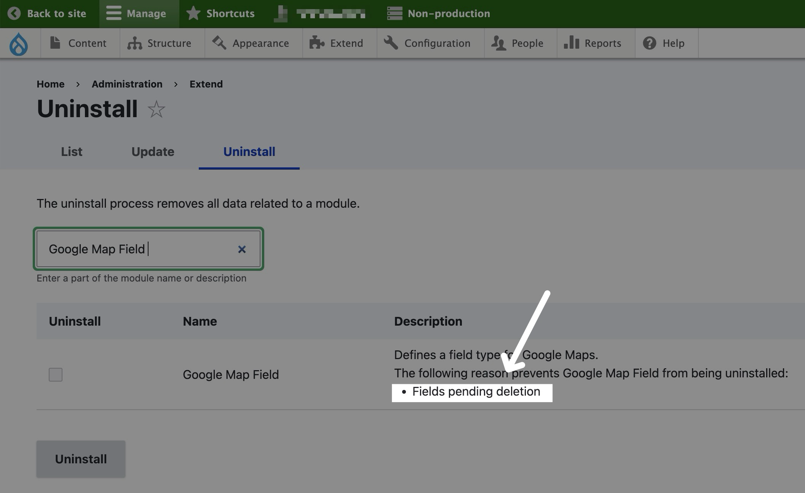
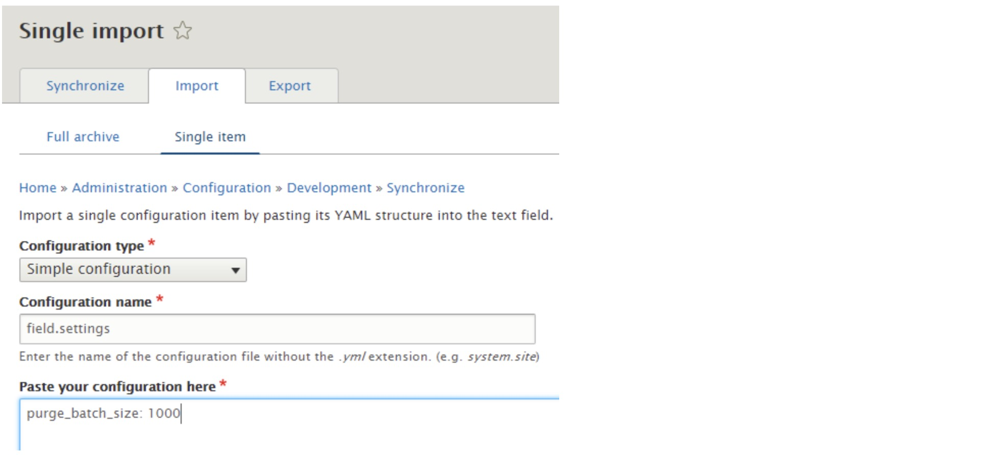

## Error/Issue Encountered

When I am attempting to uninstall one of the modules, it says `The following reason prevents XXXX from being uninstalled: Fields pending deletion`, like the following screenshot shows:




## Resolution Approach - 1

Method proopsed by **[naomi](https://drupal.stackexchange.com/questions/244275/fields-pending-deletion-stopping-module-unistall-how-to-delete-manually)**:

>   It turns out that **deleted fields in Drupal 8 are stored in the `key_value` table**.
>
>   To find them you can do that via the command
>
>   ```csharp
>   select * from key_value where name = "field.field.deleted" or name = "field.storage.deleted"
>   ```
>
>   The values are stored as a blob, but can be viewed (e.g. in phpmyadmin you can click on it to download, and view in vim or similar). The value does not make much sense to a human, but having gone through the code printing and error-logging various things it was clear to me that these entries were what was holding up the uninstall. I backed up the table and deleted the entries, and then was able to uninstall the module.

The same suggestion is made here in answer to a related issue: https://drupal.stackexchange.com/a/230199/25792


## Resolution Approach - 2
Method proposed by **[MegaChriz](https://www.drupal.org/project/feeds/issues/3292518)**:
> Try one or more of the following:
> 1. Try to run cron again.
>
> 2. Check the log for any warnings about fields.
>
> 3. Try to enforce field deletion using the following command: 
>
>   ```bash
>   drush php-eval 'field_purge_batch(10000);
>   ```
>

Method proposed by **[sealionking](https://drupal.stackexchange.com/questions/244275/fields-pending-deletion-stopping-module-unistall-how-to-delete-manually)**:

>   I encountered the same issue with a field which was used in 7000+ entities, while the purge_batch_size: 1000 is not work, increase the number to over 7000 works. So `purge_batch_size: 10000` works for my instance.
>
>   I solved this problem just by execute the following command:
>
>   ```bash
>   drush php-eval 'field_purge_batch(10000);'
>   ```

Method proposed by **[4uk4](https://drupal.stackexchange.com/users/47547/4uk4)**: 

>   The fields are deleted by cron runs. But only a fixed batch size. You can configure a higher value. If you can't use drush you can do this in UI. Go to the page */admin/config/development/configuration/single/import* and add in `field.settings` a higher batch size:
>
>   ```yaml
>   purge_batch_size: 1000
>   ```
>
>   and run cron again.
>
>   


## Reference
- https://drupal.stackexchange.com/questions/244275/fields-pending-deletion-stopping-module-unistall-how-to-delete-manually
- https://www.drupal.org/project/feeds/issues/3292518