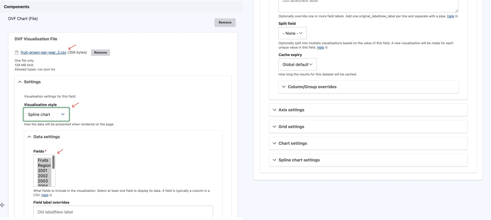
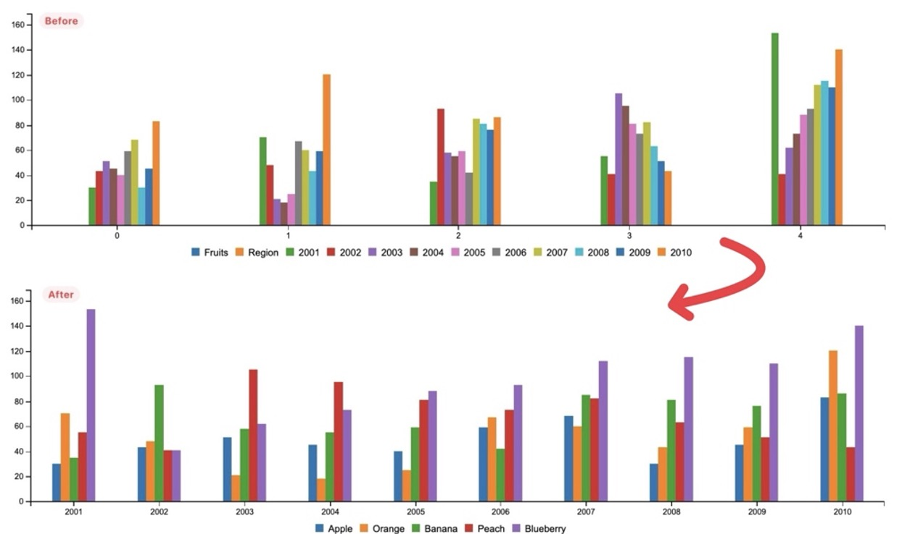
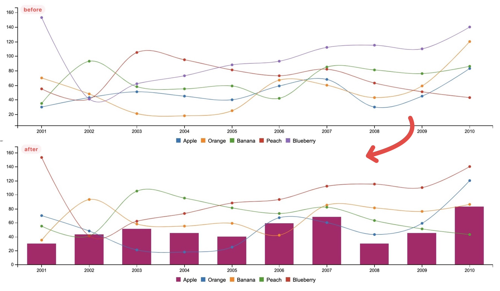
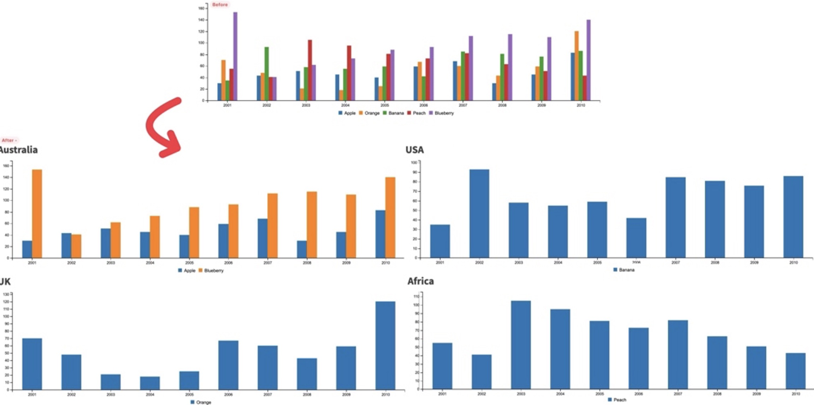

## **Introduction**

Data Visualisation Framework (DVF) is a Drupal 8/9 module designed to turn data sets into visualisations. In summary, it reads data from a source, such as CSV, JSON or even a remote CKAN instance. It then provides the tools for content authors to turn that data into a visualisation that is easily digestible for the website users.

In this documentation, we will demonstrate how we can utilise the DVF to create different types of interactive charts, how we can use different types of charts, and how to configure the DVF field to enable customised colours, styles, and labels.


## **Creating DVF Chart**

Let's use a few examples of utilising DVF to create interactive charts with CSV files as data source.

### Data Source: CSV Files

In DVF, you can use the data source either via the File or URL. In this example, for simplicity, we will only demonstrate using the "DVF Chart (File)" option. If you happen to require generating data from an online resource (for example, Australian open government data), then you can use the "DVF Chart (URL)" option.

We will use a simple dataset about fruit grown per year in a CSV file as the data source: `fruit-grown-per-year.csv`:

```
Fruits, 2001, 2002, 2003
Apple, 30, 40, 50
Orange, 70, 40, 20
Banana, 35, 90, 50
Peach, 55, 40, 100
Blueberry, 150, 40, 60
```

Note that if your dataset have comma in it (for instance "Table 2: Business numbers by annual turnover in June 2023" on page "https://www.asbfeo.gov.au/small-business-data-portal/number-small-businesses-australia"), then you will need to wrap those in the double quotation mark (for intance, first row of the Table 2 should be: <u>\$0 to less than $50k, "638,893", 24.67</u>) and when you do so, those numbers will be interpreted as string of words, hence cannot be used as number in the data visualization charts.


### Content Setup: DVF Chart (File/URL)

Firstly, create a content via content type which already have "DVF Chart (File)" configured, here we will use "Basic Page". You can create it via using the admin toolbar: "Content > Add Content > Basic Page", or directly opening url "https://asbfeo.gov.au/node/add/page".


Secondly, add a "DVF Chart (File)" paragraph/component in the component section of the "Basic Page" creation page. Once the component is created, choose a file to use as the data source by clicking "Choose File" and upload the "fruit-grown-per-year.csv" file earlier. Next, open "Settings" and select "Spline Line" in the drop down as the visualisation style, and select  all fields in the data settings section. (we will cover the details of some of the options appeared here)



Lastly, fill in the remainder of the fields with the content, and click "Save".

### Final Outcome: Visulisation Chart

At the end you get a interactive spline line chart that you can hover on to show the detailed information/number of data, and you also have different options to download the data, and toggle the table view when needed.


## DVF Chart: Chart Types and Configuration

The DVF module is extremely flexible with the different ways data can be visualised. This section covers a number of different examples utilising the out-of-the-box visualisations that come packaged with DVF, as well as the configurable option available with DVF.


### Example Data Source

For this example we will use a more complicated version of the fruit harvested per year in different region as example: `fruits-harvested.csv`:

```
Fruits, Region, 2001, 2002, 2003, 2004, 2005, 2006, 2007, 2008, 2009, 2010
Apple, Australia, 30, 43, 51, 45, 40, 59, 68, 30, 45, 83
Orange, UK, 70, 48, 21, 18, 25, 67, 60, 43, 59, 120
Banana, USA, 35, 93, 58, 55, 59, 42, 85, 81, 76, 86
Peach, Africa, 55, 41, 105, 95, 81, 73, 82, 63, 51, 43
Blueberry, Australia, 153, 41, 62, 73, 88, 93, 112, 115, 110, 140
```

### Chart Types

The available chart types in DVF are Table, Pie chart, Scatter plot chart, Gauge chart, Bubble chart, Line chart, Bar chart, Spline chart, Donut chart, Radar chart. (You can choose them in the "Visualisation Style")


### Axis Settings

You can change the tick value and group x-axis by value or key, in the following example, we will alter the default options of the bar chart to create some unique look:

-   Visualisation Style:
    -   Bar Chart
-   Data Settings > Fields:
    -   De-select: Fruit, Region
    -   Select: Years (2001 ~ 2010)

-   Axis settings > X Axis settings:
    -   **Tick values** field = `Fruits` (Uses fruit names in the legend)
    -   **X axis groupting** = `Group by label values` (Displays the years along bottom axis)



#### Column/Group override

We can combine different types of chats via the Column/Group Override option. For instance if we have a spline chart for fruit harvesting of different year grouped by different type of fruit, and we want all fruit but "apple" to be displayed in trendline (spline chart),  "apple" to be displayed in bars **(aka Mix Chart Type)** :

-   Visualisation Style:
    -   Spline
-   Data Settings > Fields:
    -   De-select: Fruit, Region
    -   Select: Years (2001 ~ 2010)
-   Axis settings > X Axis settings:
    -   Tick values field = `Fruits` (Uses fruit names in the legend)
    -   X axis groupting = `Group by label values` (Displays the years along bottom axis)

-   Column/Group overrides

    -   Apple field:

        ```
        type|bar
        color|#b00b69
        ```



#### Split Chart

You can turn one dataset into many charts using the "Split field". This will datasets together based on the value of a field in the dataset. In this example we are splitting on the "Region" field, which if you look back to the sample dataset we are using has 2 fruits with the region set to Australia, with all the rest having unique regions.



