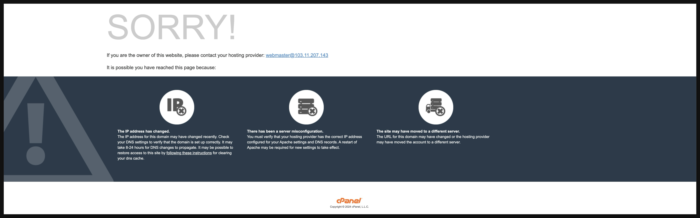

### Expected Behavior

If one have taken a **network related course** in their university, then he/she might comprehend the process website opening be like:
1. Enter Url/Domain in the browser address bar (`www.example.com`)
2. The browser resolve the DNS record and retrive its IP address (`100.100.100.100`)
3. The browser establish the TCP connection with the server of IP address using HTTP port 80 (or HTTPS port 443)
4. The browser sends an HTTP (or HTTPS) request to the server and retrive the (source) html code code
5. The browser render the website using its engine and display the website

So in theory, if we would be able to get the IP address of the target server, we can skip step 1, and everything else would work as anticipated as above ?
**WRONG !** There are many other factors affecting the certain details of the above process.


### Actual Behavior

In reality, the **domain name** is not only used for DNS lookup, but also used in the HTTP (or HTTPS) request header. Taking the domain `www.example.com` of IP address `100.100.100.100` for example, if we would enter their domain and ip into the address of the browser, the browser will actually send different http (or https) request:

```
===== HEADER FOR www.example.com =====
GET / HTTP/1.1
Host:            www.example.com
User-Agent:      Mozilla/5.0 (Windows NT 10.0; Win64; x64) AppleWebKit/537.36 (KHTML, like Gecko) Chrome/58.0.3029.110 Safari/537.36
Accept:          text/html,application/xhtml+xml,application/xml;q=0.9,image/webp,*/*;q=0.8
Accept-Language: en-US,en;q=0.5
Accept-Encoding: gzip, deflate, br
Connection:      keep-alive
Cookie:          userID=12345; sessionToken=abcde;
```

```
===== HEADER FOR 100.100.100.100
GET / HTTP/1.1
Host:            100.100.100.100
User-Agent:      Mozilla/5.0 (Windows NT 10.0; Win64; x64) AppleWebKit/537.36 (KHTML, like Gecko) Chrome/58.0.3029.110 Safari/537.36
Accept:          text/html,application/xhtml+xml,application/xml;q=0.9,image/webp,*/*;q=0.8
Accept-Language: en-US,en;q=0.5
Accept-Encoding: gzip, deflate, br
Connection:      keep-alive
Cookie:          userID=12345; sessionToken=abcde;
```

Notice that the http request send by the browser accessing the website via ip adress has `Host: 100.100.100.100`, which is different to the `Host: www.example.com`. The majority of the HTTP servers (Nginx, Apache, etc) have a concept/feature called "**Virtual Server**", which will take advantage of the differnt `Host` in the HTTP header, and behave differently based on this value. 


This "**Virtual Server**" can be used for different purposes, for instance: **Reverse Proxy**, when user access the server from different sub-doamins, return different service/website; e.g. Domain `example-nas-synology.com` have many sub-domains, each point to differnt service: `photo.example-nas-synology.com` brings user to the photo manager, `file.example-nas-synology.com` brings them to the file manager, etc. Similarly, it can also be used to achieve **DDoS Protection** and **Security** feature, for instance Ventra/CPanel server, if you access it directly via the IP address, it will **redirct** you to the following page.



(taking doamin `www.example.com` of ip  `100.100.100.100` for example, if you would access it from the domain `http://www.example.com` it will return you the `index.php` or `index.html`, but if you would access it from the ip `http://100.100.100.100`, it will redirect you to its error page `http://100.100.100.100/cgi-sys/defaultwebpage.cgi`)


## Reference
- [https://superuser.com/questions/1810856/can-you-go-to-a-website-by-typing-the-ip-address-into-the-address-bar](https://superuser.com/questions/1810856/can-you-go-to-a-website-by-typing-the-ip-address-into-the-address-bar)