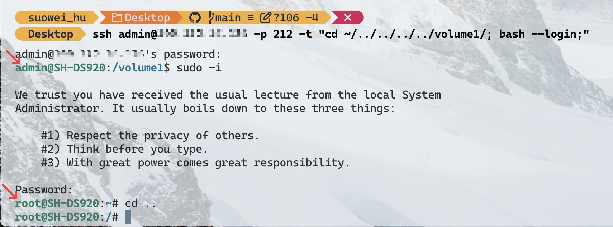

(This only works for my DSM 6.0, at the time where you read this post, it may be outdated)

1. First launch the terminal application on the computer
2. Type in the following command and press enter: `ssh admin@255.255.255.255 -p 22 -t "cd ~/../../../../volume1/; bash --login;"` (change the ip and port to match your configration)
3. Enter the password of the `admin` user (this is the default administration user of your synology server)
4. Type `sudo -i` and press Enter.
5. Enter the password of your DSM/SRM's administrator account again, and press Enter.
6. You are now signed in to your DSM/SRM with root privilege via SSH

## Reference
https://kb.synology.com/en-global/DSM/tutorial/How_to_login_to_DSM_with_root_permission_via_SSH_Telnet#anchor1