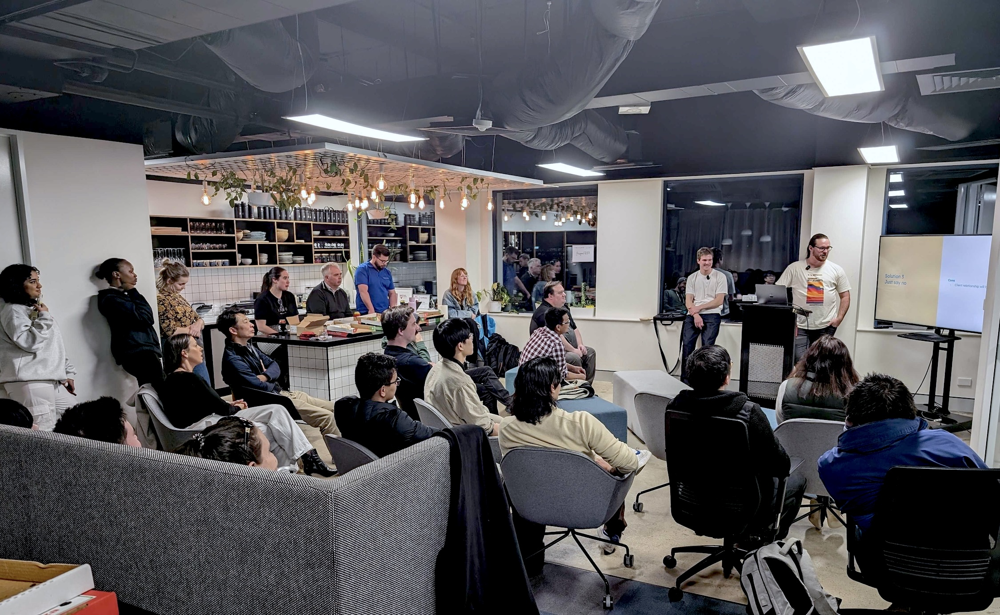

## Overview

Yesterday, I attended an offline meetup where three presentations were given. The first was on handling misaligned user data through a data pipeline and storing it in a solar database by [Brynn Briedis (gumnut)](). The second focused on replacing paragraph type and twig template with vue components as the render template by [Alex Monaghan](https://www.linkedin.com/in/alex-monaghan-b7a416202/). The final, and most enjoyable, presentation by [Toby Wild](https://www.linkedin.com/in/toby-wild-b2aa0027/) discussed improving user experience for those working 8 hours in the Drupal admin backend, specifically for content authors. (p.s. he have a [blog](https://tobywild.com/) too !)

The first two, most definitely, will require some time to setup, consequently I am not able to make-up something like this article, I have to try those out myself first. But Toby's idea, despite its simplicity, is very actioable, and can be easily done !

## Toby's Talk 

In the presentation he gave an counter-example of how the "[2018 Hawaii false missile alert](https://en.wikipedia.org/wiki/2018_Hawaii_false_missile_alert)" is a disaster of the system backend design, the user interface of the alert system should've been more accurate. And emphasize the importance of backend design by providing a sound value it will provide to the business, that the most suffering user of the system we build are content authorer, and they are the people that are most likely to promote/speak-up for us in the business. 

There he had recommended the use of the following module/practice: 

-   **Field Group**: group miltiple fields into tabs 
    -   [example](1_wrHbAY4l_ulmlyN_Uwuahw.png)
    -   More over there're many modules that expands on this module, but may only come across your relevance if you are not in a GovCMS environment I assume.... (see: [Modules that depend on fieldgroup](https://www.drupal.org/project/field_group#Modules%20that%20depend%20on%20fieldgroup))
-   **Gin Admin Theme**: a radically new UI layout  with goodies like Darkmode
    -   [example](2024-06-06T084537.jpg)
    -   At first I thought this is the work of some gurus at the [pragma](https://www.pragma.com.au/people/) , its minimal and tailwind like, I very much like the look of this theme. 
-   **Navigation/Navigator**: provides new left-aligned, collapsable admin tool bar 
    -   it is a part of the drupal core now, some post that maybe helpful: [page-1](https://www.drupal.org/project/navigation), [page-2](https://www.drupal.org/project/drupal/issues/3438895). 

I will definitely have to give a try to see how these workout, at this stage I cannot force the shift on any existing client (as it might poses extra understanding & tranining on the content authors), I'll add more content under this post if I find anything intersting...

