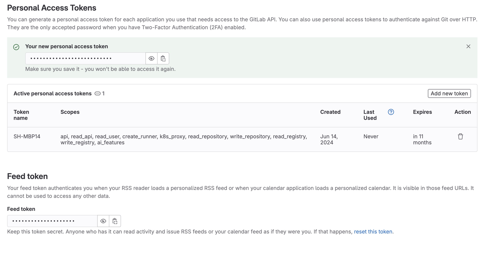

---
## Issue Reproduced

```
...
WARN[0000] /Users/admin/sites/XXXXX/docker-compose.yml: `version` is obsolete
[+] Running 2/2
✘ mariadb Error Head "https://gitlab-registry-productio...                0.4s
! cli Warning   context canceled                                          0.4s
Error response from daemon: Head "https://gitlab-registry-production.govcms.amazee.io/v2/xxxxxx/xxxxxx/mariadb-drupal-data/manifests/latest":
unauthorized: HTTP Basic: Access denied. The provided password or token is incorrect or your account has 2FA enabled and you must use a personal access token instead of a password.
See https://projects.govcms.gov.au/help/user/profile/account/two_factor_authentication#troubleshooting
...

```


---

## Resolution of Error

First get a personal acecss token with the proper privilledge, if you are unsure, select all privilledge:
(your personal access token should look somthing like `glpat-XXXXXXXXXXXXXXXXX`)




Second get into your command-line terminal, log-out then log-back-in with the personal access token created:
```
> docker logout
  Removing login credentials for https://index.docker.io/v1/

> docker login gitlab-registry-production.govcms.amazee.io -u "simon.hu@opc.com.au" -p "glpat-XXXXXXXXXXXXXXXXX"
  WARNING! Using --password via the CLI is insecure. Use --password-stdin.
  Login Succeeded
```
