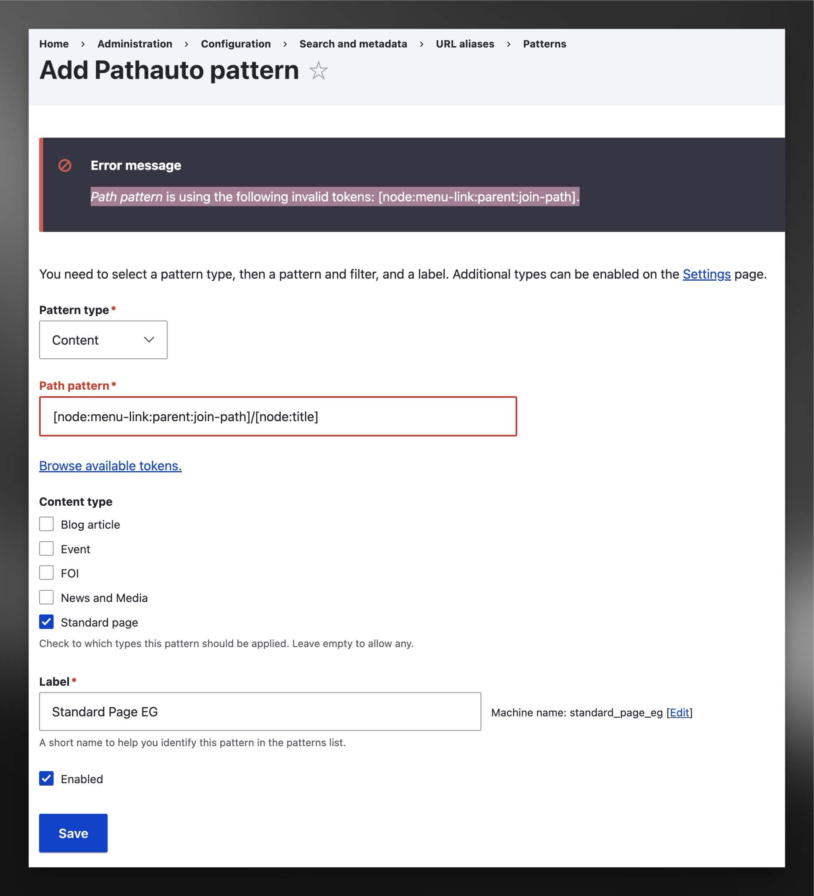
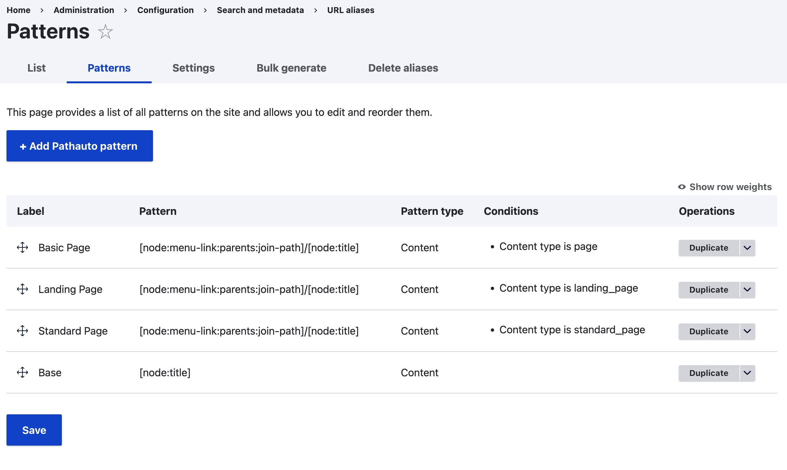

---
## Issue Reproduced

I was going to make a **<u>node's url</u>** match with **<u>its menu configuration</u>**, this causes me having to go to the configuration page:  **<u>"Admin > Config > Url-Alias > Pattern"</u>** (/admin/config/search/path/patterns), and add a pattern "[node:menu-link:parents:join-path]/[node:title]".

As I try to add the new pattern as described above, I've got the error: "**<u>*Path pattern* is using the following invalid tokens: [node:menu-link:parent:join-path].</u>**"

After some investigation, I findout this issue **<u>only happens</u>** on GovCMS **<u>SaaS</u>** Platform; The Venilla Drupal 10 works fine (adding the pattern "[node:menu-link:parents:join-path]/[node:title]") without this issue and same does the PaaS version of the platform. (Hopefully this can get patched soon.... ?)

---
## Resolution of Error

Anyhow you can resolve this simply by config synchronizaiont:

1.   Create a placeholder pattern with "path-pattern" being "[node:title]"
2.   Export configuration via `drush cex`
3.   Change line in corresponding `pathauto.pattern.XXXXX.yml` file
     -   Drop line `pattern: [node:title]` (example file before: [link](./pathauto.pattern.example_pattern_before.yml))
     -   Replace the line with `pattern: '[node:menu-link:parents:join-path]/[node:title]'` (example file after: [link](./pathauto.pattern.example_pattern_after.yml))
4.   Import the configuration back via `drush cim`

After the importation all your config will be there and **works as enticipated** !

