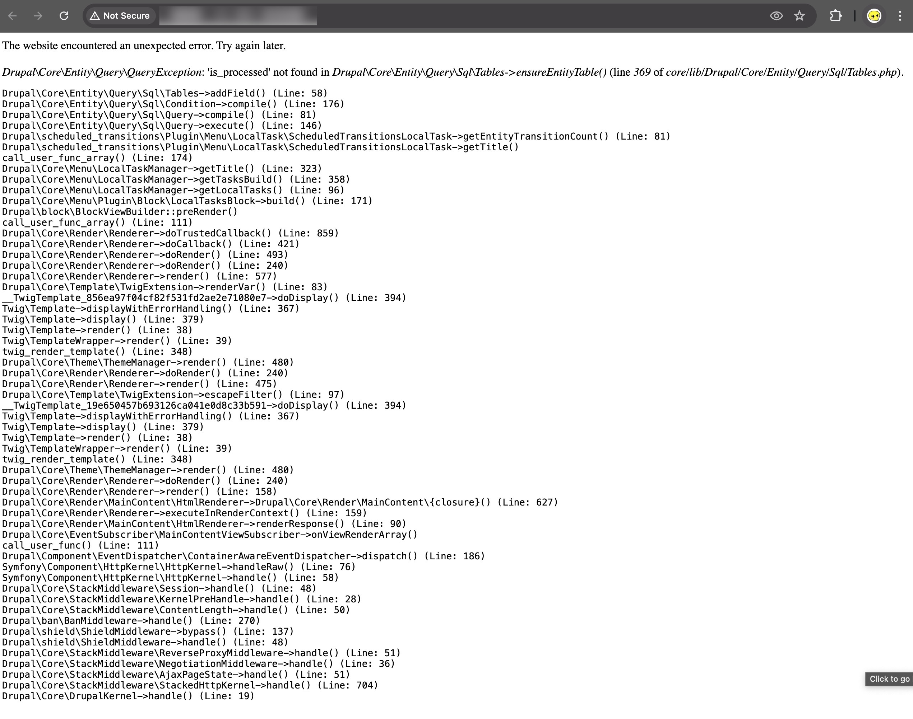

## Error Reproduced 

I come across this error when trying to do `ahoy up` on one of the GovCMS client project, whilst the command successes without throwing any error: 

```
> ahoy up

WARN[0000] /Users/suowei_hu/Documents/é GitHub/example/docker-compose.yml: `version` is obsolete 
[+] Running 8/0
 ✔ Container example-av-1       Running                                                                                                                   0.0s 
 ✔ Container example-mariadb-1  Running                                                                                                                   0.0s 
 ✔ Container example-cli-1      Running                                                                                                                   0.0s 
 ✔ Container example-solr-1     Running                                                                                                                   0.0s 
 ✔ Container example-test-1     Running                                                                                                                   0.0s 
 ✔ Container example-php-1      Running                                                                                                                   0.0s 
 ✔ Container example-nginx-1    Running                                                                                                                   0.0s 
 ✔ Container example-chrome-1   Running                                                                                                                   0.0s 
2024/06/19 22:36:30 Waiting for: tcp://mariadb:3306
2024/06/19 22:36:30 Connected to tcp://mariadb:3306
Project                  :  example
Site local URL           :  http://example.docker.amazee.io
WARN[0000] /Users/suowei_hu/Documents/é GitHub/example/docker-compose.yml: `version` is obsolete 
DB port on host          :  50658
```

when I visit the given url I see the following 



so I tried doing `ahoy down` followed by`ahoy build`, I see the following error in the compile stdout stream: 

```
=> => sha256:c166c2711a27f6dca7384848396227f6926abc2313dca75bd40aeeac469614c1 1.65MB / 1.65MB                           3.5s
 => => extracting sha256:1a95733790cfb9993230a9fed80bcc94f31ee2935f6778b6472afad772c811d4                               10.0s
 => => extracting sha256:f8a5851f683e87cc7a8aeeaaea44380e06e801c8938fef848d1f3eb8a37e9ce6                                0.0s
 => => extracting sha256:c166c2711a27f6dca7384848396227f6926abc2313dca75bd40aeeac469614c1                                0.1s
 => [php internal] load .dockerignore                                                                                    0.0s
 => => transferring context: 231B                                                                                        0.0s
 => CANCELED [test stage-1 1/7] FROM docker.io/govcms/test:10.x-latest@sha256:6b0841afde75f05c338e4b4020ea538b887605fa  18.8s
 => => resolve docker.io/govcms/test:10.x-latest@sha256:6b0841afde75f05c338e4b4020ea538b887605fa75d846f9468434143257055  0.0s
 => => sha256:6b0841afde75f05c338e4b4020ea538b887605fa75d846f94684341432570559 1.61kB / 1.61kB                           0.0s
 => => extracting sha256:7084c971b636351569cebfa5b81a640ec395c226da1c3f94d9ca7f8677db70eb                                0.0s
 => => sha256:cbdc86cc7d6d994a3ac6aebbffbe712af9f6a10094adf1cb099acd885cfcaa66 250B / 250B                               7.6s
 => => extracting sha256:cbdc86cc7d6d994a3ac6aebbffbe712af9f6a10094adf1cb099acd885cfcaa66                                0.0s
 => => sha256:4404425ed8debac7ea2e5b8dd31ac4eb1c453d6c78311c6a8ec390b20c80fab9 203B / 203B                               7.9s
 => => extracting sha256:4404425ed8debac7ea2e5b8dd31ac4eb1c453d6c78311c6a8ec390b20c80fab9                                0.0s
 => => sha256:b58739dd4330f2659ee9e2f058dfdf22e7af0135e8aea28761d4a2a3e716d045 5.14MB / 5.14MB                           9.1s
 => => extracting sha256:191ef7fc0c3a1e273e4b27754fa465eef9d2b7256e1a41e7b4d285bf670cc1bc                                7.4s
 => [test internal] load build context                                                                                   0.0s
 => => transferring context: 461B                                                                                        0.0s
 => CANCELED [php stage-1 1/2] FROM docker.io/govcms/php:10.x-latest@sha256:f90acaf2a3921a0d588ffb1a02b056d87fabf85c9f  18.8s
 => => resolve docker.io/govcms/php:10.x-latest@sha256:f90acaf2a3921a0d588ffb1a02b056d87fabf85c9fc180602df813d7188cb9e5  0.0s                        4.9s
 => => extracting sha256:191ef7fc0c3a1e273e4b27754fa465eef9d2b7256e1a41e7b4d285bf670cc1bc                                4.8s
------
 > [nginx stage-1 1/3] FROM docker.io/govcms/nginx-drupal:10.x-latest@sha256:9fdd3908628cae0992d865b54cd2a65929a27373db716edc7b66174c1044acfa:
------
failed to solve: failed to register layer: open /app/web/sites/all/modules/distro/aggregator/tests/src/Functional/AggregatorCronTest.php: no space left on device
```

I've also tried pulling a fresh instance of the filebase and do `ahoy build` there, which gives me pretty much similar error, all ends with the keyword `no space left on device` at the end of the stdout as the final error.


## Issue Resolved 

So I did some quick research, it turns out this error is due to **<u>docker running out of virtual disk space</u>** , so after running `docker system prune` to clear the unused volume/image/volume (just to be safe, in case it is something else running out of space) 

```
> docker system df

TYPE            TOTAL     ACTIVE    SIZE      RECLAIMABLE
Images          100       14        31.97GB   27.93GB (87%)
Containers      14        14        1.002GB   0B (0%)
Local Volumes   9         5         6.624MB   3.008MB (45%)
Build Cache     837       0         19.12GB   19.12GB (100%)

> docker systen prune 

TYPE            TOTAL     ACTIVE    SIZE      RECLAIMABLE
Images          100       14        XX.XXGB   0B (0%)
Containers      14        14        X.XXXGB   0B (0%)
Local Volumes   9         5         X.XXXMB   0B (0%)
Build Cache     837       0         0.000kB   0B (0%)
```

Then running `ahoy build` command will execute without error, the error get resolved easily ! 

