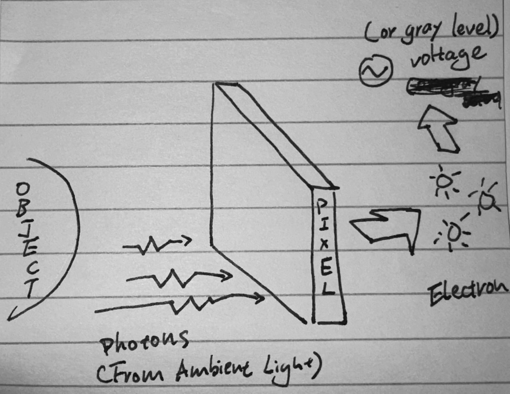
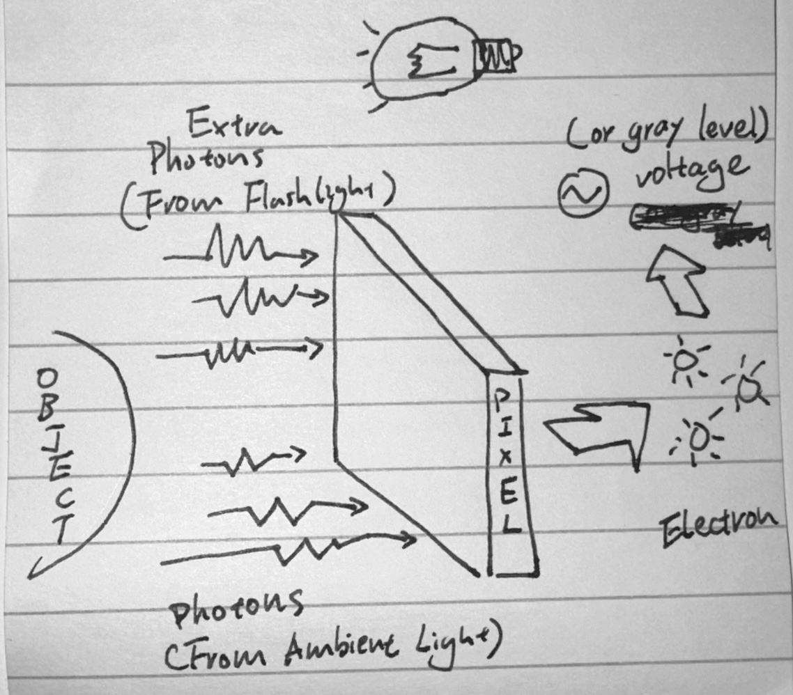
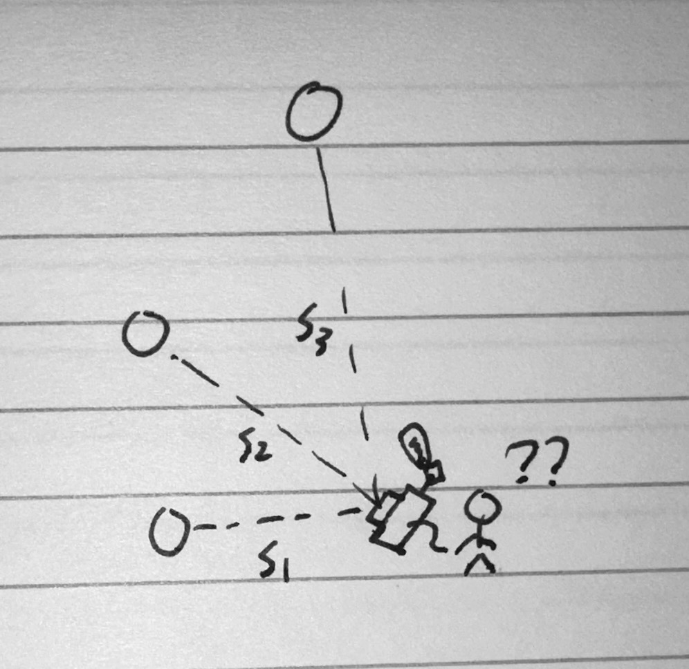

## An very old-fashioned scenario: Manual Flash

### Assumption: Ignore Background

For the sake of simplicity, let's consider a simple situation in this post, imagine a perfectly manual situation where you are shooting a **<u>main object without background</u>** or <u>**background that is infinitely far**</u> in a **<u>B&W setting</u>**. (i.e. let's dis-egard the difference between object/background)

### Ambient Light

Normally when you try to shoot a photo without the flash, you are only dealing with the ambient lighting: the lights get ejected from the light source, reflect from the main object, go into lense, land onto CMOS sensor, and triggers electrical signal of variying voltage corresponding to the strength of light (Flux? Luminosity? Maybe a topic for another day...).

The key step in the process that produces photo with varying brightness on different pixels, is the step where light (photon) gets transferred into electrical signal (voltage); On a pixel level, when the lights (photons) hits the CMOS, each pixel will transfer the photons that hits it into a corresponding number of photoelectrons (with a certain QE ratio); Photoelectrons are then converted into a voltage which is converted into a digital signal (a gray level). (This post explains it much better: [Photons, Electrons and Gray Levels](https://www.photometrics.com/learn/white-papers/photons-electron-and-gray-levels)).



The more photon lands on an pixel, the more electraons gets converted, the stronger the digital signal, the brighter the pixel is in the shot. A commonly used metaphor for this is water tank with caps in a rainy day, a worker will open the tank caps to collect some water in the rainy day: if the caps is opened for a constant time, the stronger the rain, the more water the tank can collect; similarly, if the rain is of a fixed intensity, the longer the worker keeps the caps open, the more water the tank can collect...


### Ambient + Flash Light

Now, you have a flashy flashlight in hand, you have the power to blind everyone in the house, but when you go back check the photo, you might find the majority of your photo being over exposed (especially when you use a non-TTL flashlight, have the camera on auto explosure, and the flashlight is on its max ouput). Why is that ?

This is because on auto explosure setting, the camera will make sure the environment have the right explosure based on the current amibent lighting (or you can set this manually); However, on non-TTL mode, it has no awareness towards this extra attached flash light, as a result it is not only getting the ambient light (which is just the right amount to produce a correctly exposed photo) but also the extra artificial lighting produced by the flash (that are not expected), hence over-exposing the shot.



In order to take a properly exposed photo (again non-TTL lens), you will need to adjust the camera setting to make it under-expose without flash.

Assume the object is 1m distance from the camera (and flash), the flash is set to a 1/128s (and certain Lumens, this can certainly be calculated in some way, a topic to learn another day maybe....) that will **<u>increase the explosure by 2-stops</u>**, to get a correctly exposed photo, you will need to:

-   If you are on **<u>Auto Mode (P/S/A)</u>**, simply use the explosure compensation dial to reduce the explosure by 2-stops.
-   If you are on a **<u>Manual Mode</u>**, you can either one of the shutter speed, aperature, ISO by 2-stop; Or a combination of the above to accumulate to 2-stop reduction. (Note that when the object is at the same explosure level, changing the shutter speed will result in a brighter/darker background, this will be discussed in another post)

Put it in a more straight-forward explaination: since the camera don't know the existance of the flashlight (without TTL function) you will need to get it "perpared" !


## Inverse Square Law

If you read the previous section carefully enough, we have set many assumptions to the condition of the light, that includes: the distance from object to the camera & flash, flash output power (e.g. XXX Watt-second), the flash output power percentage (e.g. 1/1 (full power output), 1/2, 1/4, ..., 1/128);

Certainlly you can control the last two factors, but the first factor, the distance to object, can change drastically when shooting outdoor (if you are taking a picture of your girl-fiend, animal, or other moving objects). Here comes the question: when the object moves around, how do we change "settings" to make sure the explosure level are kept consistent ?



### Amibient Light

To begin with, let's first make some assumption:

-   <u>Auto explosure mode</u>, that is: it will adjust aperture/shutter-speed/iso automatically to ensure the object's explosure are correct (matches with the explosure compensation setting)
-   <u>Ambient light is "global"</u>, that is: no matter what location it is at, it will emit the same luminosity (Imagine it as a LED panel that outputs light at a fixed wattage, say 200 Watts per hour.)

On the perspective of the camera, when the object move around (e.g. further), there are mainly two parameters gets changed that "may potentially" effect the explosure :

-   <u>Distance of object</u>
-   <u>Area of object</u>, when moving away from the camera, the area of object in the camera view reduces.
-   (the power of ommited light from the object kept consistent)

*(As I write this post, I'm starting to realize the importance of learning the proper concept for lighting such as flux, lluminosity, but since this is just an entry-level post to help my understanding, I will skip it and use some more generic language instead)*

Now, let's unveil the magnificent math equation

-   relation between flux, luminosity, and distance:

     `F = L / (4πɛ * D²)`  (ref: [inverse square law](http://hyperphysics.phy-astr.gsu.edu/hbase/Forces/isq.html))

-   relation between image height, object height and distance

    `H' = f * H / D` (ref: [my primary school math](2024-06-26T090458.jpg))

    `W' = f * W / D`

Image we have the same object at two distance distance `D1` and `D2` , their difference in flux can be calculated via:

```
  F1                 : F2
= (L / (4πɛ * D1²)) : (L / (4πɛ * D2²))
= (1 / D1²)          : (1 / D2²)
= D2²                : D1²
```

the difference in object's area on the perspective of the camera (its image on the CMOS) can be calculated via:

```
  A1'                 : A2'
= (W1' * H1)          : (W2' * H2')
= (f*H1/D1)*(f*W1/D1) : (f*H2/D2)*(f*W2/D2)
= (1/D1)   *(1/D1)    : (1/D2)   *(1/D2)
= (1/D1)²             : (1/D2)²
= D2²                 : D1²
```

Then, we can calculate power per unit of area on the image sensor (CMOS):

```
  PowerPerUnit-CMOS-1 : PowerPerUnit-CMOS-2
= F1  / A1'           : F2  / A2'
= D2² / D2²           : D1² / D1²
= 1                   : 1
```

From above, we can derive, even the object's distance changes,  per unit of area on the sensor, the power of the light input is the same (hence the explosure is the same)

Consequently, we can conclude for object with global ambient light, even it is placed at different location, the power of light per unit area on the sensor does not vary, hence even if the camera don't change any of the setting, the explosure of that particular object will not change.

### Ambinent + Flash Light

From the previous section, we have derived the object's gray level in the image has no relation with its position/distance (with global ambient light assumption). With the addition of flash light, however, this theory may or may not hold depending on different scenario.

**<u>Scenario-A</u>: off-camera flash sitting on fixed distance to object**

When the flash light sits at a **<u>still position</u>** relative to the object (imagine the scenario on a studio or comicon, where there's a sitting model with a wireless triggering flash sitting on a light pole) since the distance from light to object does not change, the amount of lighting the object receives from the light are also kept constant.

Therefore, we can think of the flashlight joining the environmental lighting as a part of the global ambient light, the only difference is that you have control over the intensity. Consequently, alike we derived in the previous section for "ambient light" only condition, no matter where we place the camera, we don't need to change any settings, the amount of explosure for the object with the addition of a fixed position flash will remain constant.

[ILLUSTRATION OF STILL FLASH AND MOVING CAM]


**<u>Scenario-B</u>: regular flash sitting on top of the camera (distance from flash to the object changes)**

This scenario is more commonly seems when you are an "one men army" that works outside the studio, or you are like me: too broke to afford a wireless flash...

When the flash light stays on your camera, its distance relative to the object is going to move as you move the camera, hence the amount of extra lighting it casts onto the object is going to be effected. (Let's assume the object is a A4 paper facing camera in front-facing direction, and you only move the camera forwards or backwards)

[ILLUSTRATION OF THE ON CAMERA FLASH MOVE TOGETHER]

Firstly, the distance between the camera and object `D` , and the distance between the light and object `D(L)` are the same:  `D = D(L)`

Secondly, say we have two different distances from camera to object: `D1` and `D2`, we have previously calcualted:
- Ratio of flux introduced by ambient light on perspective of the camera
```
  F1'                : F2'
= (L / (4πɛ * D1²))  : (L / (4πɛ * D2²))
= (1 / D1²)          : (1 / D2²)
= D2²                : D1²
```
- Similarly, ratio of flux introduced by flashlight `F(L)` at the distance `D(L)` , if the luminosity of the flash light is `L(L)`, 

```
  F(L)1                   : F(L)2
= (L(L) / (4πɛ * D(L)1²)) : (L(L) / (4πɛ * D(L)2²))
= (L(L) / (4πɛ * D1²))    : (L(L) / (4πɛ * D2²))
= (1 / D1²)               : (1 / D2²)
= D2²                     : D1²
```

- Ratio of object's image's area on the CMOS

```
  A1'                 : A2'
= (W1' * H1)          : (W2' * H2')
= (f*H1/D1)*(f*W1/D1) : (f*H2/D2)*(f*W2/D2)
= (1/D1)   *(1/D1)    : (1/D2)   *(1/D2)
= (1/D1)²             : (1/D2)²
= D2²                 : D1²

(A1' is the area of the image of the object,
in the sensor area of the camera, 
when the object of area A is D1 distant away from the camera+flash
```

Thirdly, let's calculate the amount of light the flashlight "casts" to the object `L(Obj)` from its distance `D(L)`, assuming the object's area is a constant `A`. As well as the amount of extra flux introduced by that light in the perspective of the camera 
```
     L(Obj)1     : L(Obj)2
=    F(L)1 / A   : F(L)2 / A
=    D2² / A     : D1² / A
=    D2²         : D1²

(L(Obj)1 is the amount of lighting/photon the object receives
from the flashlight when the flashlight of power L(L) is on distance D1

   F1''          : F2''
=  L(Obj)1 / A1' : L(Obj)1 / A2'
=  D2² * D2²     : D1² * D1²

(F1'' is the amount of light per unit area, 
caused by the flashlight's photon reflecting off object,
and on the perspective of the camera,
when the camera+flash is at the distance D1 away from object
```

Lastly we can calculate the luminosity of the object on the perspective of the camera with the addition of the flash: 

```
            L(Obj)'1     : L(Obj)'2
=  (F1' + F1'') / A1'    : (F2' + F2'') / A2'
=  (D2² + D2²*D2²) / D2² : (D1² + D1²*D1²) / D1²
=  1 + D2²               : 1 + D1²
≈  D2² : D1²   (when the ambient light is dark)
```

[ILLUSTRATION OF HOW LIGHT DROPS AS FLASH+CAM MOVE]


## Reference

-   https://www.photometrics.com/learn/white-papers/photons-electron-and-gray-levels
-   https://blog.csdn.net/Bolly_He/article/details/113255526
-   http://hyperphysics.phy-astr.gsu.edu/hbase/Forces/isq.html
