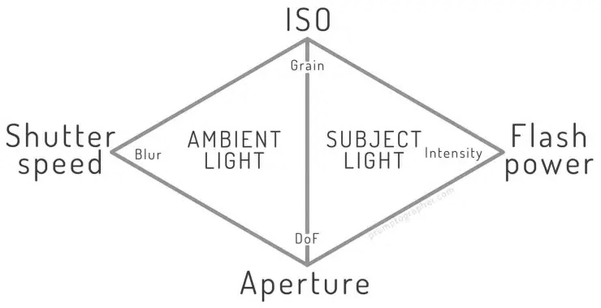
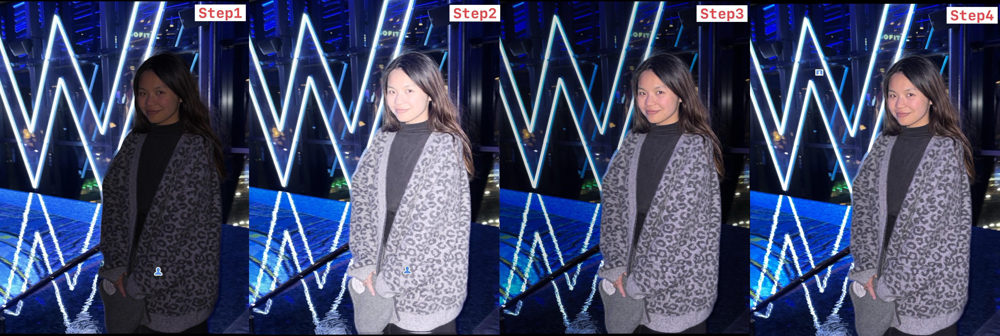

Since this concept is well explained by others, I won't delve into a lot of detail on this. To understand the concept, you can either find one of the flashlight 101 video on YouTube, or read one/some of the resource I've went through to understand it:

- YouTube Video
    - [Tricks for using FLASH without KILLING Ambient Color](https://www.youtube.com/watch?v=Z3nbMSvsO1g&t=36s)
    - [How to Balance Ambient Light and Flash? | Ask David Bergman](https://www.youtube.com/watch?v=JOQOPZvKXzk)
    - [NATURAL LIGHT vs OFF CAMERA FLASH- A Shocking Difference!](https://www.youtube.com/watch?v=Ss3YEISeU2Q&t=411s)
- Sony Flashlight Manual
    - [HVL-F43M (EN)](./HVL-F43M%20(EN).pdf)
    - [HVL-F32M (ZH)](./HVL-F32M%20(ZH).pdf)

## S/A/I Difference

#### Overview

Changing <u>S (shutter speed)</u>, <u>A (Aperature)</u>, and <u>I (ISO)</u>, will alter the explosure of different part of the image:

-   Alter `S` will change the explosure of the **ambient only**

-   Alter `A` will change the explosure of the **<u>ambient + object</u>**

-   Alter `I` will change the explosure of the **<u>ambient + object</u>**

#### S: Shutter Speed

Changing the shutter speed primarily adjusts the amount of **<u>ambient light</u>** captured because it alters how long the sensor is open to the continuous light in the scene.

This is because the burst light from a flash unit usually last for a very short duration (1/200s) comparing to the shutter speed, which means the sensor captures the flash-lit subject almost instantaneously, regardless of how long the shutter stays open. The ambient light, however, is continuous, so its exposure on the sensor is directly proportional to the shutter speed duration.

**<u>One exception: if shutter speed is faster than the flash speed (for instance flash=1/50s, shuter=1/200s), then this rule will no longer hold !</u>**

#### A: Aperature

Aperture affect the overall exposure by controlling the amount of light reaching the sensor, respectively. Unlike shutter speed, which primarily affects ambient exposure, changing the aperture directly impacts the exposure of **<u>both ambient light and the flash-lit subject</u>**.

This is because changing the aperature will effect the ambient light and flash light in the same 1:1 proportional amount.

#### I: ISO

Similar to aperatrue, ISO affect the overall exposure by controlling the sensor's sensitivity, respectively. Unlike shutter speed, which primarily affects ambient exposure, changing the aperture directly impacts the exposure of **<u>both ambient light and the flash-lit subject</u>**.

This is because changing the ISO will effect the ambient light and flash light in a 1:1 equivalant amount.

## Balance Ambient and Flash-lit Object

In the previous section, we explained that I&A will change the exposure of the whole image. S will only affect the exposure of the ambient/background. We can use this knowledge to achieve a balance between the exposure of the ambient and flash-lit object.

Balance via the following steps:

1.   Setting the ambient exposure using S/I/A appropriately.
2.   Introducing the flash at an appropriate power level.
3.   Reduce **<u>aperture</u>** and **<u>ISO</u>** to correctly expose the flash-lit object.
4.   Adjusting the <u>**shutter speed**</u> to fine-tune ambient light exposure without affecting the flash-lit subject.

Using these steps, you can control the exposure to create a well-balanced photograph where both the background and the subject are properly illuminated.

