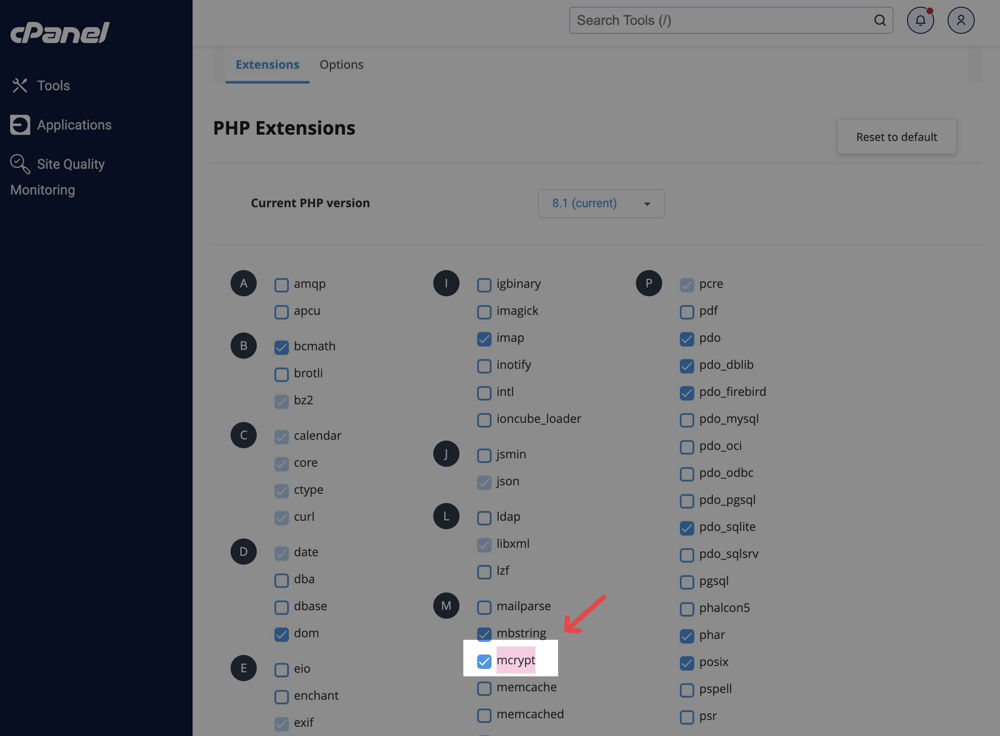
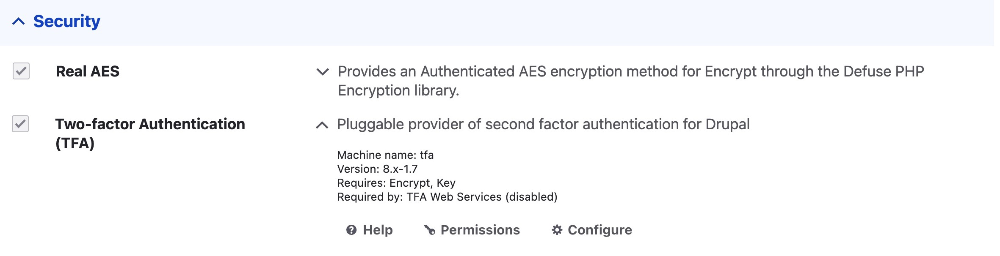
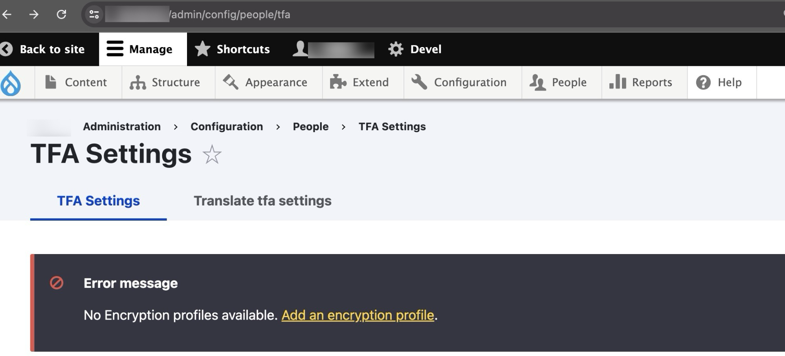
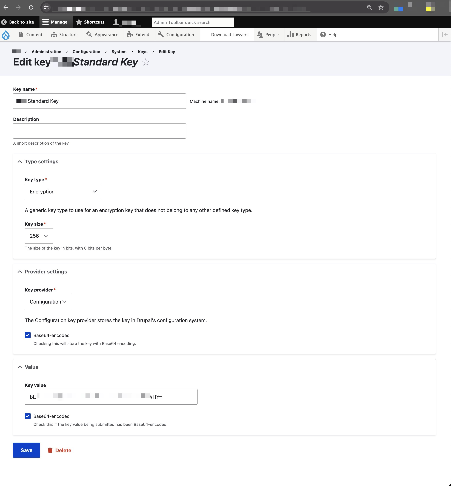
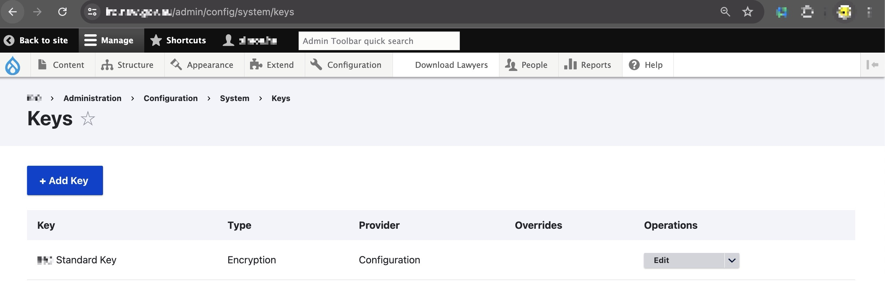
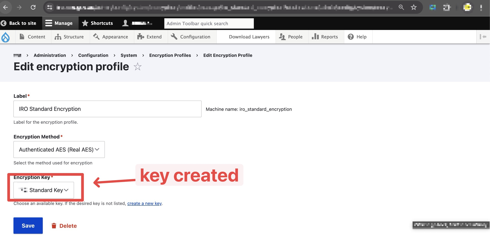
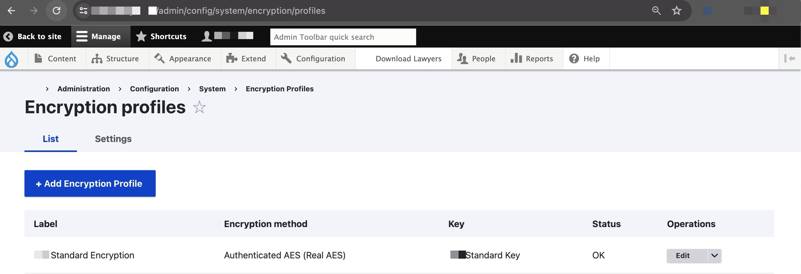
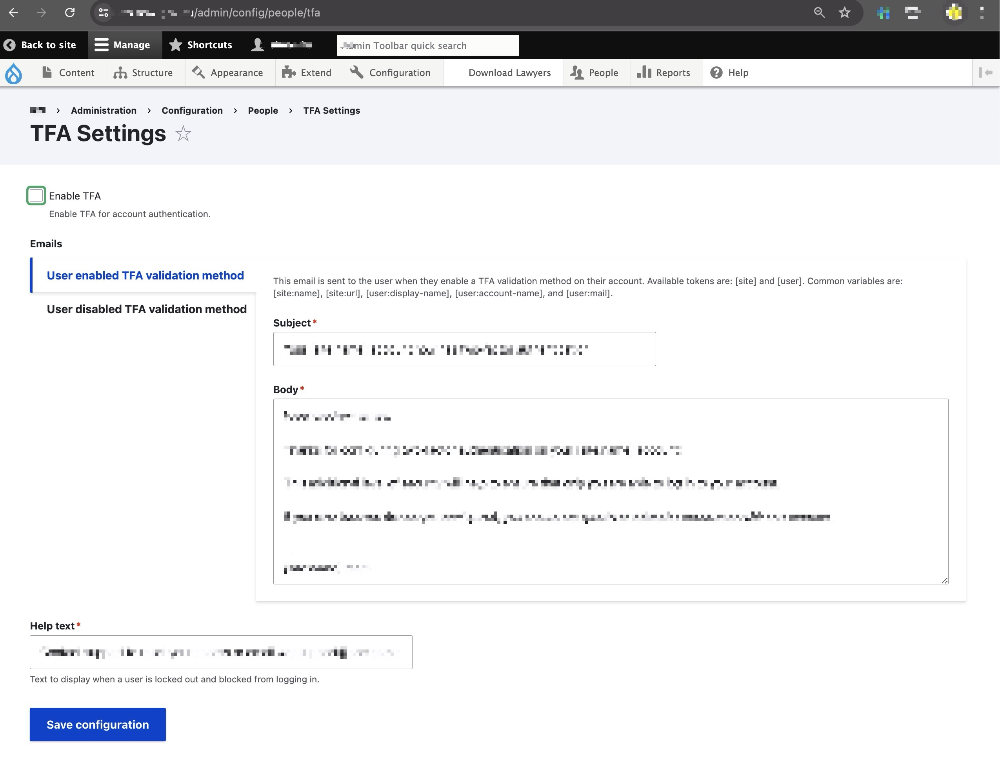
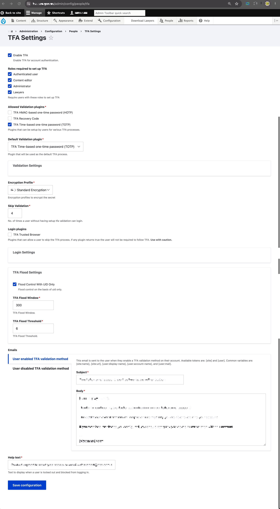

>   This post records steps that I've went through to setup the TFA feature on drupal website, so I can quickly reproduce the step quickly without wondering around like a fly.


## Step-1: Module Installation & Environental Setup

To begin with, it is always recommended to take a backup of your server (filebase/database/htaccess file) before doing everything, this ensures you have a second chance when something went wrong in the upcoming process

First, you will need to enable the "PHP Mcrypt" extension on your web server:



Second, install the required drupal modules: [TFA](https://www.drupal.org/project/tfa) (for the authentication feature), [Real AES](https://www.drupal.org/project/real_aes) (for the encryption profile) via composer, and install them via drupal:

```
composer require 'drupal/real_aes'
composer require 'drupal/tfa'
```



Also remeber to revert `.htaccess` file in case you have any special redirect/cache related configuration for your web server, as the `composer` command will by default over-rider it.

When everything has been installed, and you click on the configure option in the TFA extension (or directly go to `/admin/config/people/tfa`); You might see something like the following, where it says: "**<u>*No Encryption profiles available. Add an encryption profile.*</u>**". We'll set this up in the next step.




## Step-2: Key → Encryption Profile → TFA

First, setup the **key** on `/admin/config/system/keys` (you can generate the key value via some online base64 string generator, such as [this one](https://generate.plus/en/base64)):





Second, create a **encryption profile** via `/admin/config/system/encryption/profiles`:

(choose "Real AES" as the encryption method use the key created previously)





Lastly, go back to the configuration page for TFA, and you will no-longer see the error message anymore:




## Step-3: TFA Configuration

Simply turn onf the TFA via the "Enable TFA" toggle on top of the configuration page (`/admin/config/people/tfa`), use the previously created encryption profile and change settings as you like (e.g. how many time to skip before the user will be blocked):




