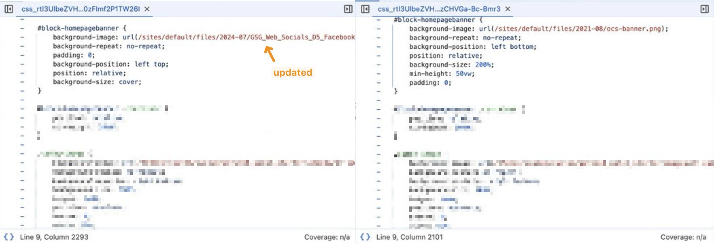

(Production Website does not change Upon Successful Deployment)


## Incident Happened ?

I come acorss this incident whilst updating a banner image for a GovCMS website client, the client would like to replace the image from `image-a` to `image-b`. After some quick investigation, I found the image to be applied via css styling: `background-image: url(/site/../../image-a)`, so I simply changed the line to ``background-image: url(/site/../../image-b)`, made some adjustment to the position/cover etc, and have everything merged & deployed onto the production.

But once the deployment is complete, I was not able to see my changes taking effect, and inspecting the `background-image` property on the corresponding component reveals an older version of the css file (before my change is commenced). But once I login as a admin user, I am able to see my changes...




(in the above images, left is the <u>logged-in</u> version, right is the <u>logged-out</u> version)

I tried "clearning cache" via adding task in GovCMS panel, refreshing using "Command + Shift + R", none of which worked ...


## GovCMS's Reasoning

(which I took for granted... waited for almost 2 hour, and nothing happen ... so please see next section on solution)

**Deploying code**

-   Failed deployments may be impacting any code changes you may have made. You should:

    -   Confirm you made your code commit to the relevant branch

    -   Double check the branch URL you are using and that it aligns to the correct branch

    -   Review the information within the [Drupal 10 - CSS and JavaScript aggregation issues](https://www.govcms.support/support/solutions/articles/51000363726-drupal-10-css-and-javascript-aggregation-issues) article

    -   Review your deployments
        -   Check your deployment in GitLab [https://projects.govcms.gov.au](https://projects.govcms.gov.au/) that it has finished and passed
            -   Check your deployment in Lagoon [https://dashboard.govcms.gov.au](https://dashboard.govcms.gov.au/) that the deployment has finished and marked as Complete
            -   Check the [How to investigate deployment failures](https://www.govcms.support/support/solutions/articles/51000300881-how-to-investigate-deployment-failures) article for more information on common deployment issues

**Site caching**

-   Theme changes on production sites are not instant and take time to deploy, due to the caching layer that is on production sites.

-   If you have made theme changes and have deployed them to your production site, ensure you [**clear the site cache**](https://www.govcms.support/a/solutions/articles/51000004985) (via GovCMS Dashboard tasks) and also your browser cache if the changes are not present.

-   If you still cannot see the changes after **15-30 minutes**, please contact the GovCMS Support team so they can look into the issue.


## Solution Proposed by my Genius Colleague

Simply edit the `xxxx.libraries.yml` file, for my instance `themes/custom/govcms8_uikit_starter/govcms8_uikit_starter.libraries.yml`:

1.   change version from `1.x` to `-1`
2.   add `preprocess: false` to the relevant CSS or JavaScript file.


For instance the following:

```diff
 global-styling:
-  version: 1.x
+  version: -1
   css:
     theme:
       css/modal.css: {}
       css/style.css: {}
       css/dropdown.css: {}
       css/homepage.css: {}
-     css/homepage.css: {}
+      css/homepage.css: {preprocess: false}
       css/icomoon.css: {}
       scss/webform_contact.css: {}
   js:
     js/govcms8_uikit_starter.js: {}
     js/script.js: {}
   dependencies:
     - core/jquery
     - core/once

...
```


## Reference

- https://www.govcms.support/support/solutions/articles/51000005251-theme-changes-js-file-changes-are-not-updating-on-our-live-site
