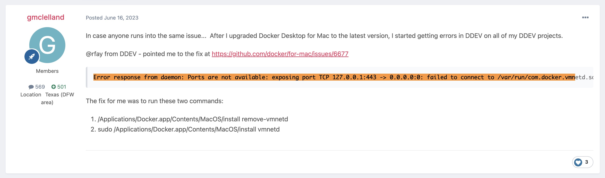
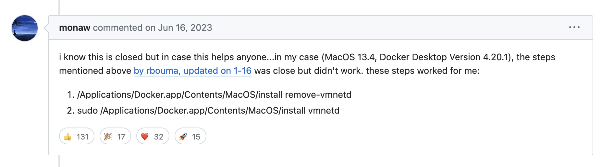

## Intuition

Getting the following error when running `ddev start`:
```
> ddev start
Starting my-site...
Mutagen sync session 'my-site' exists but unable to get sync label 'com.ddev.volume-signature': '' This is normal on upgrade from v1.21.6; error=Mutagen sync session for app 'my-site' does not exist or is not enabled; status=not enabled; err=<nil>
Building project images...
.Project images built in 1s.
 Network ddev-my-site_default  Created
 Container ddev-my-site-db  Created
 Container ddev-my-site-web  Created
 Container ddev-my-site-web  Started
 Container ddev-my-site-db  Started
Starting Mutagen sync process...
Mutagen sync flush completed in 1s.
For details on sync status 'ddev mutagen st my-site -l'
Waiting for containers to become ready: [web db]
Starting ddev-router if necessary...
 Container ddev-router  Created
Error response from daemon: Ports are not available: exposing port TCP 127.0.0.1:443 -> 0.0.0.0:0: failed to connect to /var/run/com.docker.vmnetd.sock: is vmnetd running?: dial unix /var/run/com.docker.vmnetd.sock: connect: no such file or directory
Failed to start my-site: failed to start ddev-router: composeCmd failed to run 'COMPOSE_PROJECT_NAME=ddev-my-site docker-compose -f /Users/suowei_hu/.ddev/.router-compose-full.yaml -p ddev-router up --build -d', action='[-p ddev-router up --build -d]', err='exit status 1', stdout='', stderr=' Container ddev-router  Creating
 Container ddev-router  Created
 Container ddev-router  Starting
Error response from daemon: Ports are not available: exposing port TCP 127.0.0.1:443 -> 0.0.0.0:0: failed to connect to /var/run/com.docker.vmnetd.sock: is vmnetd running?: dial unix /var/run/com.docker.vmnetd.sock: connect: no such file or directory'
```


## Solution

Start by `vmnetd` running:

```
/Applications/Docker.app/Contents/MacOS/install remove-vmnetd
```

followed by

```
sudo /Applications/Docker.app/Contents/MacOS/install vmnetd
```


## Reference



https://processwire.com/talk/topic/27433-using-ddev-for-local-processwire-development-tips-tricks/page/2/



https://github.com/docker/for-mac/issues/6677