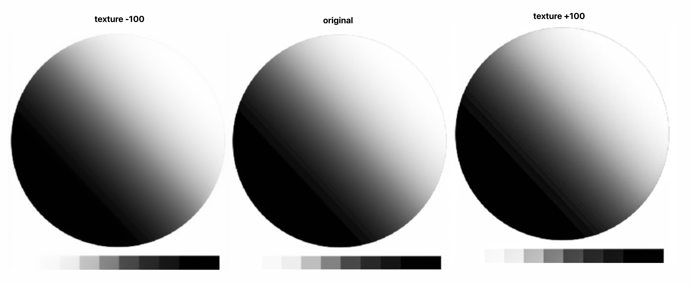
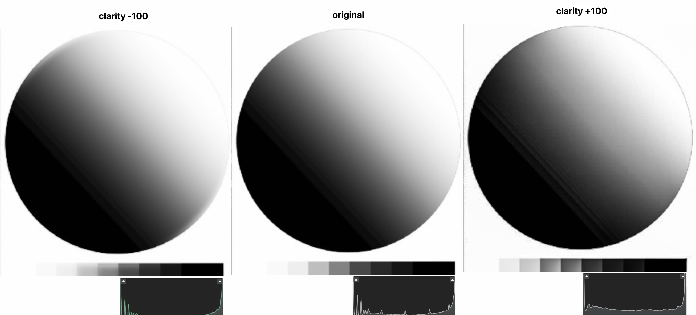
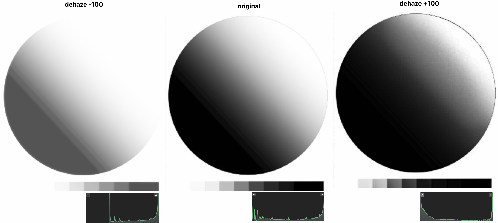

## Introduction

In Adobe Lightroom, under the "**Effect**" section of the "**Edit**" panel, you can see four options: **Texture**, **Clarify**, **Dehaze**

All of which make the image "**sharper/clearer**" when tuned up and "**hazier/softer**"when tuned down, so there must be some reason behind Lightroom seperating these similar setting into three different sliders, and that's what we will discuss in this post.

## Texture

Texture effect the **mid-high frequency** part of the image (for instance, texture of a sand paper), turning it up will increase the details of the mid-high frequency part of the image, put it simply, make it more obvious; And turning it down will do the opposite.

Texture's effect to the image is **more subtile** comparing to the other two slider.

It is commonly used in scenario:

1.   **Soften Skins**: as reducing Texture can help in softening skin without making it look overly processed or plastic-like. ([example](2024-08-05T132520.jpg))
2.   **Reduce Noise**: educing the appearance of noise, especially in high ISO images, by smoothing out the grain
3.   **Brings Out Details (Mid-Frequency Details)**: for landscape and architectural photography, increasing the Texture slider can help bring out the details in rocks, trees, buildings, and other elements, making the image appear more dynamic.

## Clarity

The Clarity adjustment primarily affects the **mid-tones**, so it enhances details without significantly altering the highlights and shadows, although it can make the overall image appear more contrasty.

It is commonly used in scenario:

-   **Enhances Edge Contrast**: Increasing Clarity boosts the contrast in the midtones, making the edges of objects more defined and pronounced. This gives the image a crisper and more detailed appearance.
-   **Increases Perceived Sharpness**: The enhancement of edge contrast can make the image appear sharper. This is particularly useful for bringing out fine details in textures and surfaces.
-   **Bring Out-of-Focus Object Back in-Focus**: [see example](2024-08-05T134051.jpg)

## Dehaze

The Clarity adjustment primarily affects the **highlight**, so it enhances details without significantly altering the shadow and mid-tone.

It is commonly used in scenario:

-   **Reduces Haze and Fog**: The primary function of the Dehaze slider is to reduce or remove atmospheric haze or fog from an image, making it clearer and more defined. ([example](2024-08-05T132536.jpg))

## Reference

-   https://photzy.com/what-is-the-difference-between-clarity-texture-and-dehaze-in-post-processing/#:~:text=Clarity%20targets%20mid%2Dtones.,will%20be%20affected%20by%20Texture.