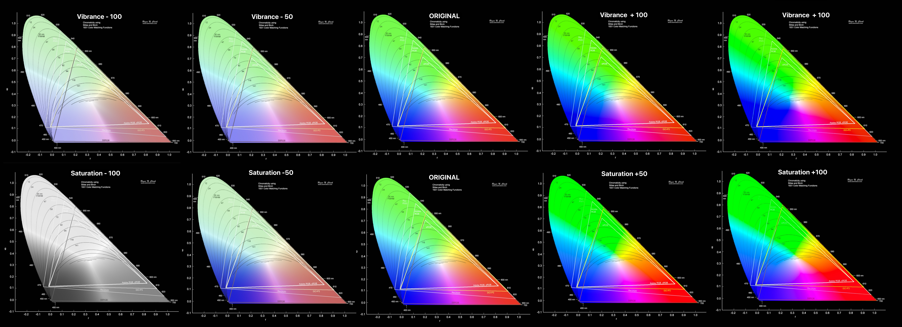
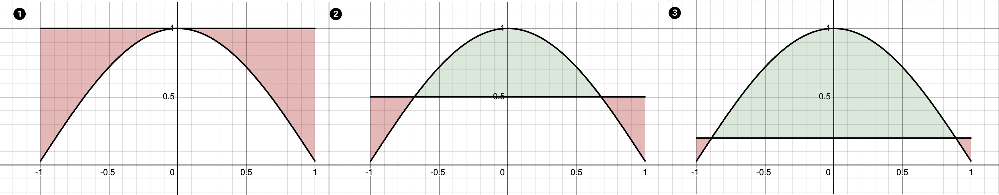
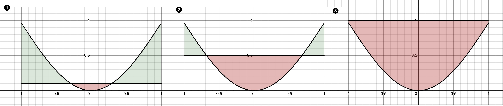

## Saturation

>   TLDR: uniform adjustment

- **Adjust all color evenly**
    - For example, when in the [HSV color space](hsvcone-20240807174428648.gif) when you turn saturation down by 10%, all the colors' saturation will move towards the center by 10%; 
    - Similarly, when you eventuallu reduce all the color's saturation  down by 100%, all the colors on all hue, will reach the center, that is pure black/white/gray. 

-   **Adjust all brightness evently:** 
    -   No matter it is black, shadow, mid-tone, highlight or white, the saturation will adjust them all without distinguishing. 

## Vibrance 

>    TLDR: selective adjustment

-   **Adjust colors un-evenly**:
    -   **Color Clipping:** As explained previously, saturation changes all color evenly, that means if we have two colors, one being `55%` saturated, the other being `95%` saturated, and we change the saturation by `5%`, their changed saturation will be `60%` and `100%`respectively. However , what is we change the saturation by `10%`, the saturation of the second color will exceed the `105%` and be clipped to `100%`; In another word color cannot be more saturated than `100%`, once it reaches the edge of the [color space](2024-08-07T175558.jpg), it will be bounded to 100%. 
    -   Vibrance is her to tackle this problem: instead of adding the saturation evenly, vibrance multiplies the original saturation by a factor; Non-rigerously speaking, when you increase the vibrance by 5%, the aforementioned `55%` and `95%` colors will be multiplied by `(100+5)=105%` and become `57.5%` and `99.75%` saturated, hence preventing the problem (a multiplying factor based on the brightness of the color will also need to be considered, it will be discussed in the next point, here it is ignored for the sake of simplicity)
-   **Focus of mid-tone:**
    -   The vibrance will mainly adjust the mid-tone of the image, that is: when changing the vibrance for the same amount, the closer a pixel is to the middle of the histogram, the more it's saturation will change (see: [comparison illustration](2024-08-07T180724.jpg))

## Use Case

**Vibrance**

-   **Natural Look**: Since vibrance avoids over-saturating the already bright areas, it tends to produce a more natural and realistic look. This is particularly useful for skin tones, as it prevents them from becoming overly orange or red.

-   **Reduced Risk of Clipping**: Using saturation can sometimes lead to color clipping, where the colors become too intense and lose detail. Vibrance reduces the risk of this happening by applying a more controlled adjustment.
-   **Better for Portraits**: Vibrance is especially beneficial for portrait photography. It enhances the colors in a way that preserves the natural appearance of skin tones and other important details.

**Saturation**

-   **Simplicity**: Saturation is a straightforward adjustment that can be easier to understand and use, especially for beginners who may not be familiar with the more nuanced effects of vibrance.

-   **Stronger Effect**: Saturation provides a more pronounced and immediate effect on the colors in an image. If you want a bold and vivid look, increasing the saturation can achieve this more quickly.

    

## Combined Use Case

We can use combination of the vibrance and saturation to only change the saturation in the highlight&shadow or mid-tone.

**Vibrance ⊕  +  Saturation ⊖**

Since saturation will increase all saturation evenly, but vibrance emphasis on the mid-tone, increasing the vibrance and decreasing the saturation will have three outcome: 

-   Increase saturationonly in the mid-tone, while keeping saturation in highlight and shadow unchanged 
-   Decrease saturation/vibrance in the highlight and shadow, while keeping saturation in the mid-tone mostly unchanged 
-   Increase saturationin the highlight and shadow, while increasing saturation in mid-tone

**Vibrance ⊖  +  Saturation ⊕**

Similarly, you can do the opposite too

