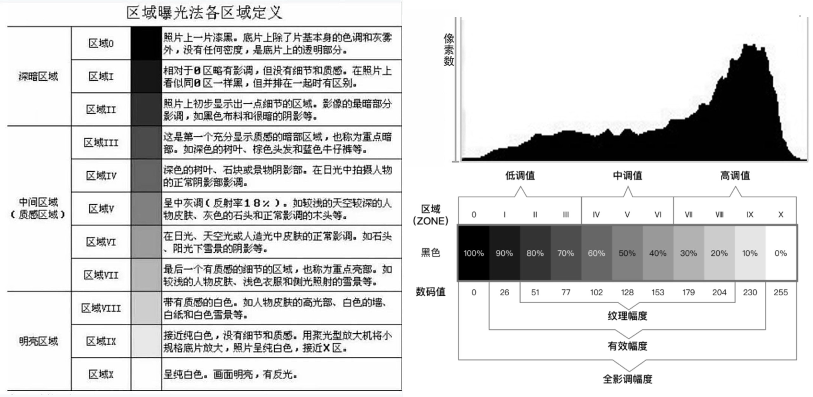
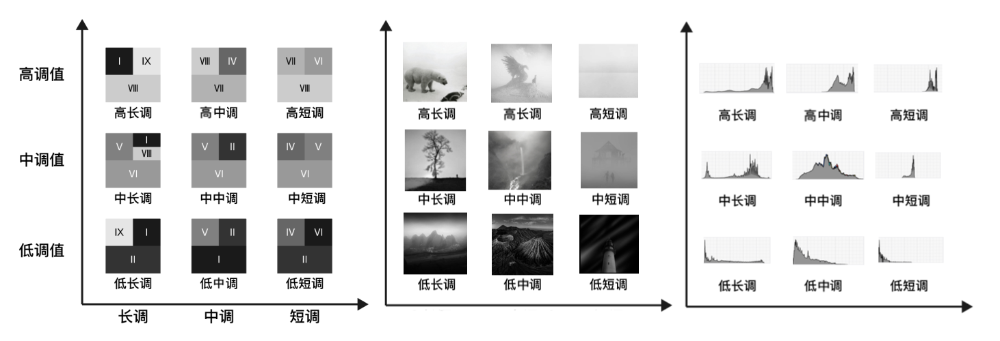

## 曝光分区

> **明度区域划分理论**
>
> 借鉴亚当斯的区域曝光法，黑白照片的色调或灰调可以分为十一个“区域”，由零区域（相纸能够表现出的最黑的部分）至第十区域（相纸的底色——白色）。
>
> 直方图有长有短（X轴），有高有低（Y轴），我们根据直方图X轴的长短还可以把影调细分为长调、短调、和中调。对于长、短、中的明度分区跨度并没有明确规定，我大致的归纳一下，直方图跨越小于等于4个明度区间的影调可以称为短调。直方图跨越大于4个明度区间而又小于等于7个明度区间的的影调可以称为中调。直方图跨越大于7个明度区间的我们可以称为长调。
>
> 
>
> \-\-\-*[500px-Joyous周游](https://500px.com.cn/joyou)*

## 明度基调

>   根据亚当斯分区曝光法，以“高中低”和“长中短”作为两个方向的坐标轴，我么可以获得九种不同的调性组合如下图所示。(明度基调)
>
>   
>
>   看似复杂调性，实际上是从**直方图**为分类基准的。接下来我们对九种不同的调子进行讨论。
>
>   -   **高调**
>
>       -   **高长调** [(案例)]((%E9%AB%98%E9%95%BF%E8%B0%83-%E6%A1%88%E4%BE%8B).jpg)
>           -   直方图显示明度信息集中在亮部，且明度信息遍布全长（从最亮部到最暗部都有信息），对比强烈。
>           -   高短调的片子比较难拍，也比较难后期
>       -   **高中调** [(案例)]((%E9%AB%98%E4%B8%AD%E8%B0%83-%E6%A1%88%E4%BE%8B).jpg)
>           -   直方图显示明度信息集中在亮部，且明度信息绵延较长（从较亮部到较暗部都有信息），对比度介于高长调和高端调之间。
>
>       -   **高短调 ** [(案例)]((%E9%AB%98%E7%9F%AD%E8%B0%83-%E6%A1%88%E4%BE%8B).jpg)
>           -   直方图显示明度信息集中在亮部，且明度信息也只集中在较小的范围内，体现为对比度较小。
>
>   -   **中调**
>
>       -   **中长调** [(案例)]((%E4%B8%AD%E9%95%BF%E8%B0%83-%E6%A1%88%E4%BE%8B).jpg)
>           -   大多数时候，被摄对象都是很复杂的，因此中长调是**最为常见的调性**。
>       -   **中中调** [(案例)]((%E4%B8%AD%E4%B8%AD%E8%B0%83-%E6%A1%88%E4%BE%8B).jpg)
>           -   有雾，不通透，但是作者逆来顺受，顺势而为，用中中调，表达了这样一个灰色的世界，风光摄影，不仅要记录大自然的火烧云、雷暴等极端天气，雾也是大自然更为常见而平凡的一面。
>
>       -   **中短调** [(案例)]((%E4%B8%AD%E7%9F%AD%E8%B0%83-%E6%A1%88%E4%BE%8B).jpg)
>           -   对比很不明显的灰色调。
>           -   游走与黑与白之间的灰，给人更多的遐想，这种灰调的片子也通常用来表达情绪非常适合。
>
>   -   **低调**
>
>       -   **低长调** [(案例)]((%E4%BD%8E%E9%95%BF%E8%B0%83-%E6%A1%88%E4%BE%8B).jpg)
>           -   片子整体偏暗。
>       -   **低中调** [(案例)]((%E4%BD%8E%E4%B8%AD%E8%B0%83-%E6%A1%88%E4%BE%8B).jpg)
>           -   片子整体偏暗，且对比不明显。
>
>       -   **低短调** [(案例)]((%E4%BD%8E%E7%9F%AD%E8%B0%83-%E6%A1%88%E4%BE%8B).png)
>           -   片子整体偏暗，且对比不明显。
>           -   \*低中调、低长调最为难调，但是却是目前摄影作品中的主流。
>
>   \-\-\-*[摸着羊的笔记本](https://www.mozheyang.top/2018/06/03/PhotographyTone/) / [500px-Joyous周游](https://500px.com.cn/joyou)*

## 引用资料

-   [Joyous周游] https://500px.com.cn/community/v2/graphic/detail/dfd8efca14e34cdfa72f2e251c304313
-   [摸着羊的笔记本] https://www.mozheyang.top/2018/06/03/PhotographyTone/
-   [阿布相机手册] https://www.youtube.com/watch?v=be_dFpjz7Fk
-   [CKO养成计划] https://www.shangyexinzhi.com/article/435428.html
-