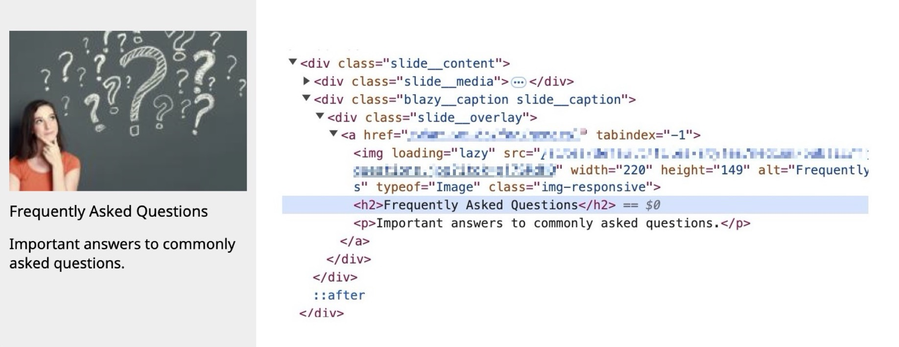
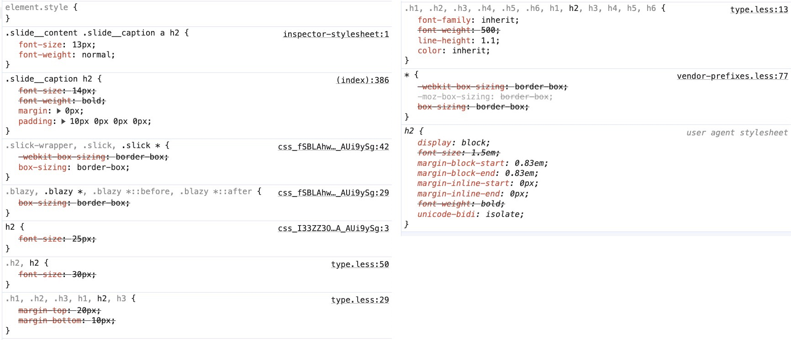
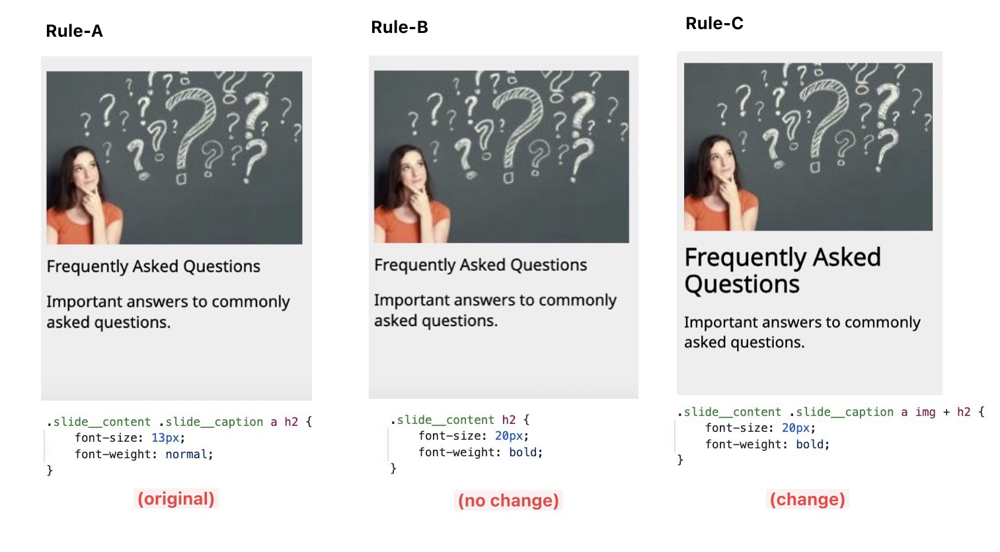
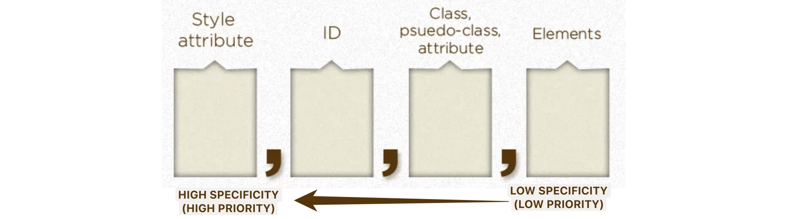

---
### Why does it matter ?

When writing new styles for a functioning website, it is common for individuals to override CSS styles above the existing ones. For example, if one aims to emphasize the `<h2>` heading on the FAQ card below, it is likely necessary to override its style settings to increase the `font-weight` and `font-size` values.

When a specific HTML element, such as an `<h2>`, already possesses predefined styles, it becomes necessary to craft new CSS rules that are sufficiently robust to supersede the current styling in effect. An example of this scenario is the CSS rule `.slide_content .slide_caption a h2` (`Rule-A`)which is being applied to the upper FAQ card (this can be observed within the style panel situated on the right side of DevTools in Chrome)

Upon adding a rule utilizing `.slide__content h2` as the selector (`Rule-B`), I adjusted the style to include a font-size of 20px and font-weight of bold. However, it appears that this new rule is not superseding the original one. Subsequently, when implementing an alternative rule with a more potent selector `.slide__content .slide__caption a img + h2` while maintaining the same style attributes (`Rule-C`), it effectively overrides the initial selector.

Why is the case that:

-   Styles in `Rule-B` <u>cannot</u> override styles in `Rule-A`
-   Styles in `Rule-C` <u>can</u> override styles in `Rule-A`

This is because:

-   Specificity of selector in `Rule-B` is smaller than that of `Rule-A`
    -   `Rule-B`'s selector `.slide_content h2                 ` have specificity of `(0,0,1,1)`
    -   `Rule-A`'s selector `.slide_content .slide_caption a h2` have specificity of `(0,0,2,2)`
-   Specificity of selector in `Rule-C` is greater than that of `Rule-A`
    -   `Rule-C`'s selector `.slide_content .slide_caption a img + h2` have specificity of `(0,0,2,3)`
    -   `Rule-A`'s selector `.slide_content .slide_caption a h2      ` have specificity of `(0,0,2,2)`

I hope this example has made clear the importance of understanding the concept of "<u>**selector specificity**</u>", learning the working mechnism behind the selector specificity will help you write css rules that is both predictable and consistent, and be more efficient in debugging.

---
### Calculating Selector's Specificty

#### Basic Rules

A selector’s specificity is calculated as follows:

-   (special case) if the style is applied <u>inline</u> of the component:
    -   add `(1, 0, 0, 0)` to the specificity
-   For each <u>id-value (#id)</u> found in the selector of the css rule:
    -   add `(0, 1, 0, 0)` to the specificity
-   For each <u>class (or pseudo-class, or attribute selector)</u> found in the selector of the rule:
    -   add `(0, 0, 1, 0)` to the specificity
-   For each <u>element reference</u> found in the selector of the rule:
    -   add `(0, 0, 0, 1)` to the specificity

*(\* some post you will find online may choose to ignore the first digit of the specificity, because when the style is applied inline of the component, they are always taken in the highest priority, it will alwasy override any style writting in the `<style>` tag or css files.)*

>   Examples for the above:
>
>   -   inline
>
>       -   `
`(1, 0, 0, 0)`
>       -   ``(1, 0, 0, 0)`
>       -   `<h1 style=" ...` =>`(1, 0, 0, 0)`
>       -   ``(1, 0, 0, 0)`
>   -   #id
>    -   `#footer-acknoledgement {...` =>`(0, 1, 0, 0)`
>
>    -   `#paragraph-card-link-1 {...` =>`(0, 1, 0, 0)`
>       -   `#search input {...` =>`(0, 1, 0, 1)`
>       -   `#search .s-box:focus {...` =>`(0, 1, 2, 0)`
>
>-   class, peseudo-class, attribute
>       -   `.container {...` =>`(0, 0, 1, 0)`
>       -   `.container:hover{...` =>`(0, 0, 2, 0)`
>       -   `.box[data-id="a9"]{...` =>`(0, 0, 2, 0)`
>       -   `div:focus-within{...` =>`(0, 0, 1, 1)`
>       -   `.box[data-id="a9"]:hover{...` =>`(0, 0, 3, 0)`
>
>-   element reference
>       -   `ul {...` =>`(0, 0, 0, 1)`
>       -   `ul ol a {...` =>`(0, 0, 0, 3)`
>       -   `#footer ul.container{...` =>`(0, 1, 1, 1)`
>       -   `div:focus-within{...` =>`(0, 0, 1, 1)`

#### Special Rules

There are some special rules

-   The <u>universal selector (*)</u> adds no specificity.
-   The <u>pseudo-class `:not`, `:is`, `:has`</u>  adds no specificity, only what's inside them matter.
-   The <u>pseudo-class `:where`</u> adds no specificity, even what's inside it doesn't matter.
-   The <u>pseudo-elements (e.g. `:nth-of-type`, `:nth-child`)</u> add `(0,0,0,1)`  to the specificity. *(unlike psuedo-class)*
-   The <u>!important</u> at the end of the style adds `(9,0,0,0)` to the specificity. *(it will at highest priority)*

>   Example for the above:
>
>   -   `html * nav ul li {...` => `(0, 0, 0, 4)`
>   -   `nav ul li:not(.hidden){...` => `(0, 0, 1, 3)`
>   -   `nav ul li:where(.show,.highlight){...` => `(0, 0, 0, 3)`
>   -   `nav ul li:last-of-type{...` => `(0, 0, 0, 4)`
>   -   `nav ul li{ margin:10px !important; ...` => `(9, 0, 0, 3)`

---
### Reference
- [Selector 4 - 17.Calculating a selector’s specificity](https://drafts.csswg.org/selectors-4/#specificity-rules)
- [Stack Overflow - Which CSS pseudo-classes don't have specificity?](https://stackoverflow.com/questions/59362436/which-css-pseudo-classes-dont-have-specificity)
- [Mdn Web Docs - Specificity](https://developer.mozilla.org/en-US/docs/Web/CSS/Specificity)
- [CSS TRICKS - Specifics on CSS Specificity](https://css-tricks.com/specifics-on-css-specificity/)
- [W3School - CSS Specificity](https://www.w3schools.com/css/css_specificity.asp)