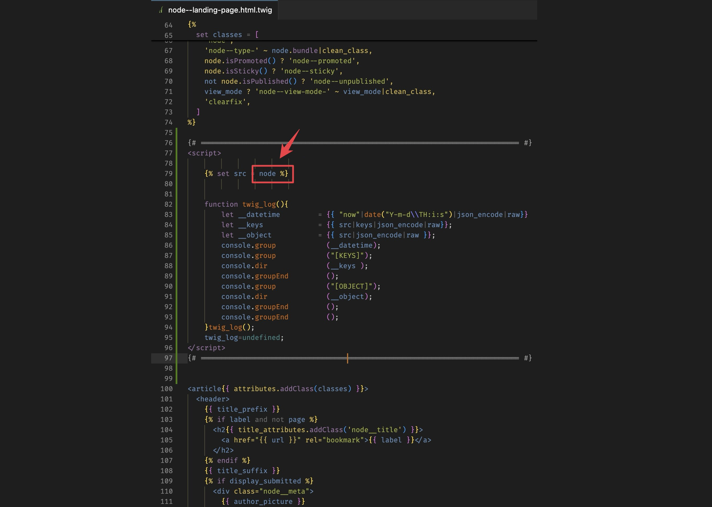
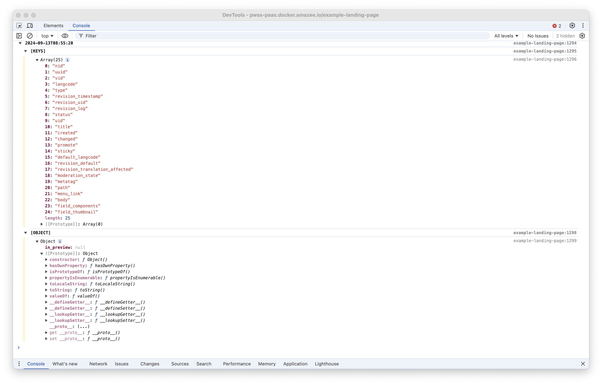
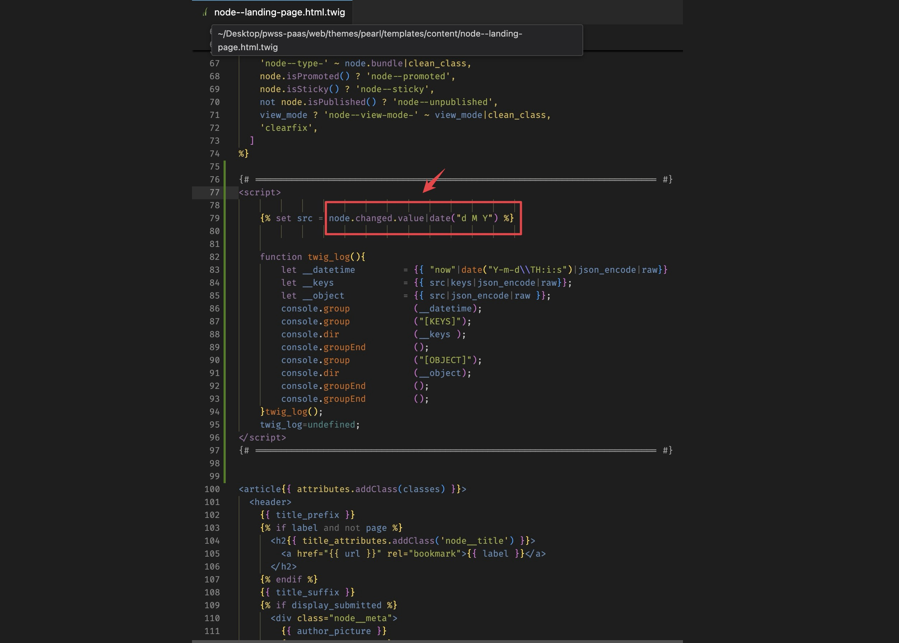

## Intuition

I come across twig template development a lot due to the need of developing styled component around "[Paragraph](https://www.drupal.org/project/paragraphs)" module. During the process, in order to get the required values from the twig variables, I always found myself endlessly trying difference combination of key/filter by using `dump()` or `var_dump()`.

For instance, to get the url of a media entity field, I'll need to write the following twig expression: `{{content['field_footer_image'].0["#media"]|file_uri|file_ur}}` . And in order to get to this long long expression, I will need to use `dump()` on every single key/filter.

Consequently, I started the journey of finding a easier appraoch to debug twig expression...


## My Method

After some study and research, I was able to establish the following code snippets. With the combination of JavaScript, and twig filter, it is able to console log whatever you put in the `src` variable into form of `key` + `object` format:

```
{# ============================================================================ #}
<script>
                                //                 /‾‾‾‾‾‾‾‾‾‾‾‾‾‾‾‾‾‾‾‾‾‾‾‾‾\
         // ←------------  | Only need to change this |
                                //                 \_________________________/

    function twig_log(){
        let __datetime         = {{ "now"|date("Y-m-d\\TH:i:s")|json_encode|raw}}
        let __keys             = {{ src|keys|json_encode|raw}};
        let __object           = {{ src|json_encode|raw }};
        console.group            (__datetime);
        console.group            ("[KEYS]");
        console.dir              (__keys );
        console.groupEnd         ();
        console.group            ("[OBJECT]");
        console.dir              (__object);
        console.groupEnd         ();
        console.groupEnd         ();
    }twig_log();
    twig_log=undefined;
</script>
{# ============================================================================ #}

```


## Usage Example

For instance you may start with something like the follows (simply chuck the above twig debug snippet into your template):



With this in-place, run `drush cr` and refresh your page, you should be seeing something like the follows in your console:



You can try on the keys in the first section of the console log, or expand the object in the second section to experiment with your variable. With the assistance of the console log message you will be able to alter the `node` and get the date where the node is changed:



