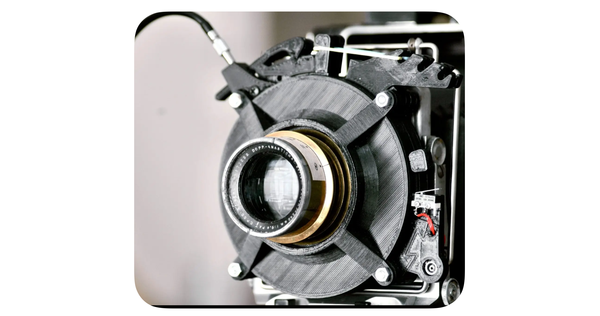
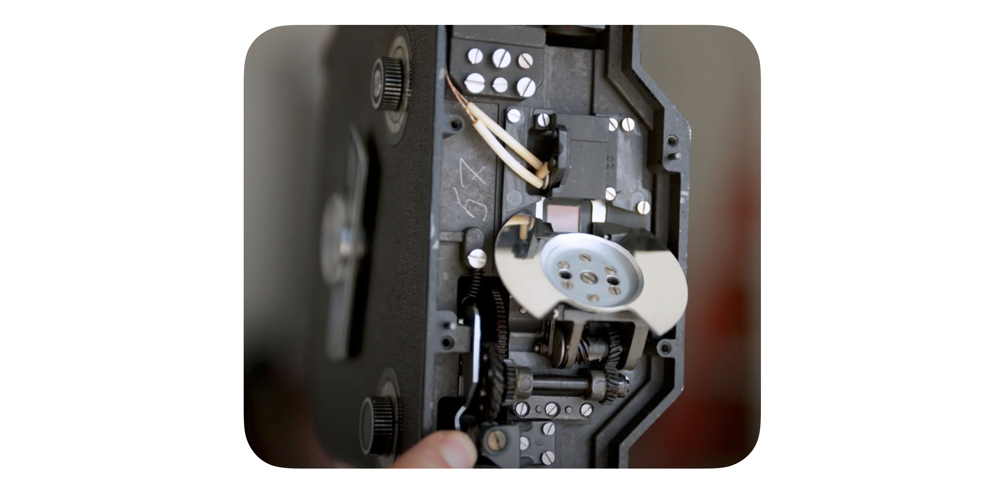

## 焦平面快门 (mechnical shutter)

焦平面快门又叫幕帘快门。早期的焦平面快门是一条长型涂胶黑布，上面排了几个长方形孔，一个比一个窄。当一个长方形孔以均匀的速度移过感光胶卷时，胶卷便曝光。孔越窄，胶卷上的光越少，快门的等效速度越高。下一步的发展是用两片幕帘构成一个宽窄可以变化的孔。幕帘的材料有涂胶黑布和金属；金属焦平面快门的幕帘，由多片狭长金属薄片组成，各相邻金属薄片略微重叠，不漏光线。幕帘快门开启时的运行方向，有横向和纵向两种。今日多数幕帘快门是用薄铝合金片制成的，也有一些是由钛合金制造。*<u>(注意：有些机器为了增加机械快门的速度，会使用马达或电磁铁提供额外动力，有些时候这些机器的快门也被称作“电子快门”，请注意区分这些快门与以下的"电子断流快门"并非同一种快门。) </u>* 由于焦平面帘幕快门在超过全开速度后是使用控制曝光范围区来达成等效速度的结果，因此在这种快门运作过程中任一时间快门帘都未全开的状况下，搭配使用发光时间极短的电子闪光灯时会产生无法同时照亮整个画面的问题，该快门帘能维持快门全开的最高快门速度称为闪灯同步速度上限。

>   -   **特点**： 使用<u>机械结构的前后帘</u>控制曝光
>   -   **优点**：
>       -   **高快门速度**：焦平面快门可以实现非常高的快门速度，现代相机常见的最高快门速度可以达到1/8000秒甚至更快。这对于捕捉高速运动的物体非常有用。
>       -   **简单的镜头设计**：由于快门位于相机机身内，镜头设计可以更加简单，不需要集成快门装置。这通常意味着镜头更轻、更便宜。
>       -   **可靠性**：机械焦平面快门经过多年发展，技术成熟，可靠性高，适合各种拍摄条件。
>   -   **缺点**：
>       -   **闪光同步速度低**：焦平面快门的闪光同步速度通常较低，常见的同步速度为1/200秒或1/250秒。这限制了在高速快门下使用闪光灯的能力。
>       -   **卷帘效应**：在高速快门速度下，焦平面快门可能会产生“卷帘效应”（rolling shutter effect），导致快速移动的物体出现变形或倾斜。
>       -   **操作噪音大**：焦平面快门的操作通常比镜间快门更响，这在需要低噪音的拍摄环境中（如野生动物摄影或安静的室内环境）可能是个问题。
>       -   **震动影响**：焦平面快门的操作可能会引起相机震动，尤其是在使用长曝光时间或高倍放大镜头时，这可能会影响图像的清晰度。

## 镜间快门(leaf shutter)

镜间快门是一种安装在相机镜头内部的快门机制。它由几片金属叶片组成，这些叶片在快门关闭时完全遮挡住镜头，阻止光线进入相机。当按下快门按钮时，这些叶片会迅速打开，允许光线通过镜头进入相机的感光元件（如胶片或数字传感器）。在设定的曝光时间结束后，叶片会迅速关闭，结束曝光。镜间快门的一个显著优点是它可以在任何快门速度下与闪光灯同步，这使得它在需要使用闪光灯的摄影中非常有用。此外，由于叶片的运动距离较短，镜间快门的操作通常比其他类型的快门更安静，震动也较小，有助于提高拍摄的稳定性。

>   -   **特点**：使用<u>镜头内的机械叶片</u>控制曝光
>   -   **优点**：
>       -   **无卷帘效应**：由于镜间快门在整个画面上同时开启和关闭，不会出现焦平面快门在高速拍摄时常见的“卷帘效应”（rolling shutter effect），即画面变形或倾斜。
>       -   **闪光同步速度高**：镜间快门可以在任何快门速度下同步闪光，因此适合需要使用闪光灯的拍摄场景，如人像摄影和静物摄影。
>       -   **安静操作**：镜间快门通常比焦平面快门更安静，这在需要低噪音的拍摄环境中（如野生动物摄影或安静的室内环境）非常有用。
>       -   **减少震动**：镜间快门的操作通常比焦平面快门更平稳，减少了快门震动对画质的影响。
>
>   -   **缺点**：
>       -   **快门速度限制**：镜间快门的最高快门速度通常低于现代焦平面快门，常见的最高速度在1/500秒或1/1000秒左右，而焦平面快门可以达到1/8000秒甚至更快。
>       -   **复杂性和成本**：镜间快门的设计和制造较为复杂，通常会增加镜头的成本和维修难度。
>       -   **镜头依赖性**：镜间快门集成在镜头中，这意味着每只镜头都需要一个快门装置，增加了镜头的重量和成本。
>       -   **镜头选择受限**：由于镜间快门的存在，镜头选择可能受限于特定品牌或型号，特别是在中画幅和大画幅相机系统中。
>
>

## 旋转快门（Rotary Shutter）

旋转快门是一种机械快门，通常由一个带有开口的圆盘组成。它的工作原理是，当按下快门按钮时，圆盘开始旋转。当圆盘上的开口旋转到感光元件（如胶片或数字传感器）前时，光线通过开口进入相机，完成曝光。当开口离开感光元件后，曝光结束。旋转快门的结构相对简单，主要由一个带有开口的圆盘和驱动圆盘旋转的机械装置组成。这种设计使得旋转快门的制造和维护成本较低，因此常见于一些低成本相机中。然而，旋转快门的快门速度受限于圆盘的旋转速度，通常无法达到非常高的快门速度。此外，由于旋转快门的开口在旋转过程中逐渐暴露感光元件，曝光时间的精度相对较低，因此不适合需要高精度曝光控制的场景。尽管如此，旋转快门在早期的电影摄影机和一些特殊用途的照相机中有着广泛应用，适合某些特定的拍摄需求。总体来说，旋转快门是一种设计简单、成本较低的机械快门，但其快门速度和曝光精度有限，适用于一些特定的拍摄场景和应用。

>   -   **特点**：通过<u>圆盘的缺口</u>曝光，可以在曝光的同时通过取景器取景 (*摄像机中多见
>   -   **优点**：
>       -   **高同步速度**：旋转快门可以实现较高的闪光同步速度，因为它在整个曝光过程中保持一致的开合方式。
>       -   **无卷帘效应**：由于旋转快门的设计，它不会像焦平面快门那样产生“卷帘效应”（rolling shutter effect），因此在拍摄快速移动的物体时不会出现变形或倾斜。
>       -   **连续曝光**：旋转快门可以实现连续曝光，这在电影摄影中尤为重要，因为它允许每帧画面在相同的时间间隔内曝光。
>       -   **结构简单**：旋转快门的机械结构相对简单，可靠性高，适合长时间连续拍摄。
>
>   -   **缺点**：
>       -   **体积和重量**：旋转快门通常体积较大，重量较重，这在便携性和相机设计上可能是一个限制。
>       -   **复杂的机械设计**：尽管结构简单，但旋转快门的机械部分需要精确的制造和维护，这可能增加相机的成本和维修难度。
>       -   **曝光控制有限**：旋转快门的曝光时间受限于其旋转速度和开口大小，调整曝光时间可能不像其他类型的快门那样灵活和方便。
>       -   **能量消耗**：旋转快门的操作需要一定的机械能量，这在电力驱动的相机中可能会增加能量消耗。
>
>

