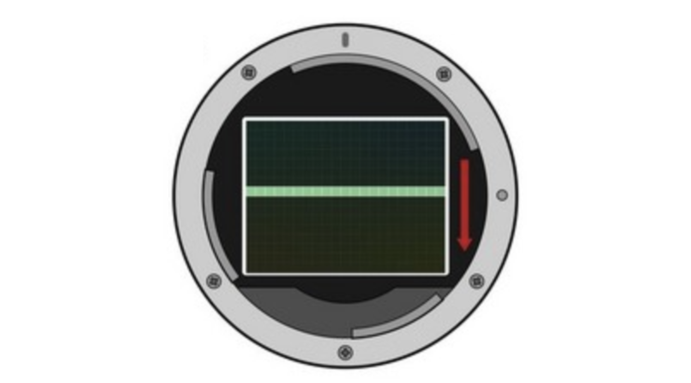
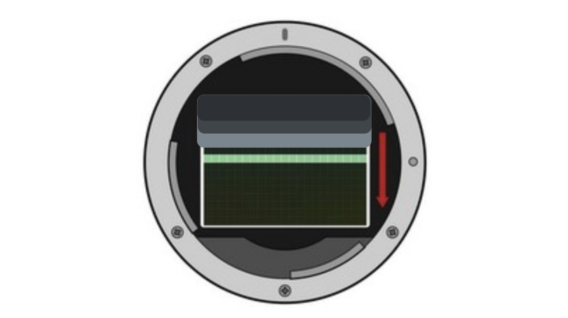
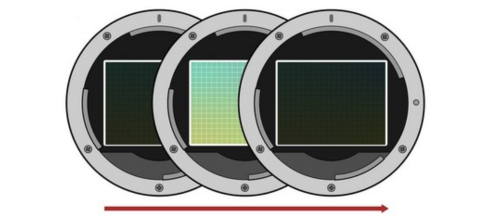

## 电子卷帘快门  (electronic rolling shutter)

电子卷帘快门是一种通过电子方式控制曝光的快门类型，常见于数码相机和智能手机中。其工作原理是逐行读取感光元件上的像素数据，而不是一次性读取整个图像。这意味着曝光是按行顺序进行的，从图像顶部逐行扫描到底部。
这种快门的主要特点是可以实现非常高的快门速度，因为没有机械运动部件。此外，电子卷帘快门可以在无声模式下工作，适合需要安静拍摄的场景。然而，由于逐行扫描的特性，快速移动的物体可能会出现变形或扭曲的现象，这被称为“卷帘快门效应”。尽管如此，电子卷帘快门在现代数码摄影中仍然非常普及，尤其是在需要高速度和低噪音的情况下。

> -   **特点**：使用<u>电子模拟的前后帘</u>控制曝光
>
> -   **优点**：
>     -   **无机械部件**：电子卷帘快门没有机械运动部件，因此更加耐用，减少了磨损和故障的可能性。
>     -   **安静操作**：由于没有机械部件的运动，电子卷帘快门在拍摄时几乎没有噪音，非常适合需要安静环境的拍摄场景，如野生动物摄影或某些室内活动。
>     -   **高速连拍**：电子卷帘快门可以实现非常高的连拍速度，因为它不需要机械快门的复位时间。这对于捕捉高速运动的场景非常有用。
>
> -  **缺点**:
> 	-   **卷帘效应**：电子卷帘快门在逐行读取传感器数据时，可能导致“卷帘效应”（rolling shutter effect），即快速移动的物体会出现变形或倾斜。这在拍摄高速运动的物体或快速移动的相机时尤为明显。
> 	-   **闪光灯同步问题**：电子卷帘快门的闪光灯同步速度较低，通常无法在高快门速度下同步闪光灯，这限制了在某些拍摄条件下的使用。
> 	-   **图像失真**：在某些情况下，电子卷帘快门可能会导致图像失真，特别是在拍摄快速移动的物体或使用广角镜头时。
> 	-   **动态范围限制**：电子卷帘快门的动态范围可能受到限制，因为传感器的逐行读取方式可能无法捕捉到极端光照条件下的细节。
> 	-   **曝光不均匀**：在某些光照条件下，电子卷帘快门可能会导致曝光不均匀，特别是在使用高快门速度时。

## 电子前帘快门 (electronic front shutter)

电子前帘快门是一种结合了电子和机械快门优点的快门技术。其工作原理是在曝光开始时使用电子方式逐行激活感光元件，从而取代传统机械快门的前帘动作。曝光结束时，机械快门的后帘则会关闭以结束曝光。
这种快门的主要特点是减少了机械前帘的移动，从而降低了相机的震动和噪音，提高了拍摄的稳定性和安静性。此外，电子前帘快门还能实现更快的响应时间和更高的快门速度，适合快速连续拍摄。不过，由于电子前帘快门依然依赖机械后帘，因此在某些极端拍摄条件下，可能会出现轻微的曝光不均匀现象。但总体来说，它在提高拍摄效率和图像质量方面有显著优势。

>   -   **特点**：使用<u>电子模拟的前帘</u>+使用<u>机械结构的后帘</u>控制曝光
>
>   - **优点**
>       - **减少快门震动**：电子前帘快门在曝光开始时使用电子方式，避免了机械快门启动时的震动。这对于长曝光时间或使用高倍放大镜头时非常有利，有助于提高图像的清晰度。
>       - **更安静的操作**：由于曝光开始时没有机械运动，电子前帘快门的操作噪音较低，这在需要安静环境的拍摄场景中非常有用。
>       - **延长机械快门寿命**：电子前帘快门减少了机械快门的使用频率，从而延长了机械快门的使用寿命。
>       - **提高连拍速度**：通过减少机械快门的动作，电子前帘快门可以提高连拍速度，因为相机不需要等待机械快门复位。
>       - **减少黑影效应**：在使用闪光灯拍摄时，电子前帘快门可以减少由于机械快门启动延迟而产生的黑影效应。
>
>   - **缺点**
>       - **高快门速度限制**：在使用非常高的快门速度时（如1/2000秒以上），电子前帘快门可能会导致曝光不均匀或图像失真。
>       - **闪光灯同步速度**：虽然电子前帘快门可以提高闪光灯同步速度，但在某些情况下，其同步速度仍然不如全机械快门。
>       - **图像失真**：在某些高动态范围的场景中，电子前帘快门可能会导致轻微的图像失真，特别是在使用广角镜头时。
>       - **兼容性问题**：并非所有镜头都完全兼容电子前帘快门，某些老旧镜头或第三方镜头可能会出现问题。
>
>

## 全域电子快门 (electronic global shutter)

全域电子快门是一种先进的快门技术，通过电子方式同时激活感光元件上的所有像素，从而实现瞬间曝光。与传统的电子卷帘快门不同，全域电子快门不会逐行扫描，而是一次性读取整个图像数据。
这种快门的主要特点是能够消除“卷帘快门效应”，即快速移动的物体不会出现变形或扭曲现象。这使得全域电子快门特别适合拍摄高速运动的物体或在需要高精度曝光的场景中使用。此外，由于没有机械部件的移动，全域电子快门可以实现完全无声的拍摄，并且减少了机械磨损，提高了相机的耐用性和可靠性。总体来说，全域电子快门在速度、精度和安静性方面具有显著优势，广泛应用于高端数码相机和专业摄影设备中。

> -   **特点**：<u>没有前后帘</u>全传感器同时开始曝光，同时结束曝光
>
> -   **优点**
>     -   **无卷帘效应**：全域电子快门可以同时捕捉所有像素，消除了“卷帘效应”（rolling shutter effect），因此在拍摄快速移动的物体时，不会出现变形或倾斜。
>     -   **高闪光同步速度**：全域电子快门可以在任意快门速度下同步闪光灯，提供了更大的创作自由度，特别是在需要使用闪光灯的高速摄影中。
>     -   **无机械部件**：与传统机械快门相比，全域电子快门没有机械运动部件，因此更加耐用，减少了磨损和故障的可能性。
>     -   **安静操作**：由于没有机械部件的运动，全域电子快门在拍摄时几乎没有噪音，非常适合需要安静环境的拍摄场景，如野生动物摄影或某些室内活动。
>     -   **高速连拍**：全域电子快门可以实现非常高的连拍速度，因为它不需要机械快门的复位时间。这对于捕捉高速运动的场景非常有用。
> -   **缺点**
>     -   **成本较高**：全域电子快门的技术复杂度和制造成本较高，因此配备这种快门的相机通常价格较贵。
>     -   **功耗较高**：全域电子快门的操作可能比传统电子卷帘快门和机械快门更耗电，这可能会影响电池续航时间。
>     -   **动态范围和噪声控制**：尽管全域电子快门在消除卷帘效应方面表现出色，但其在动态范围和噪声控制方面可能不如一些高端机械快门或卷帘快门传感器。
>     -   **技术成熟度**：全域电子快门技术相对较新，尚未在所有类型的相机中普及，尤其是在消费级市场中。某些型号可能在技术上还不够成熟。