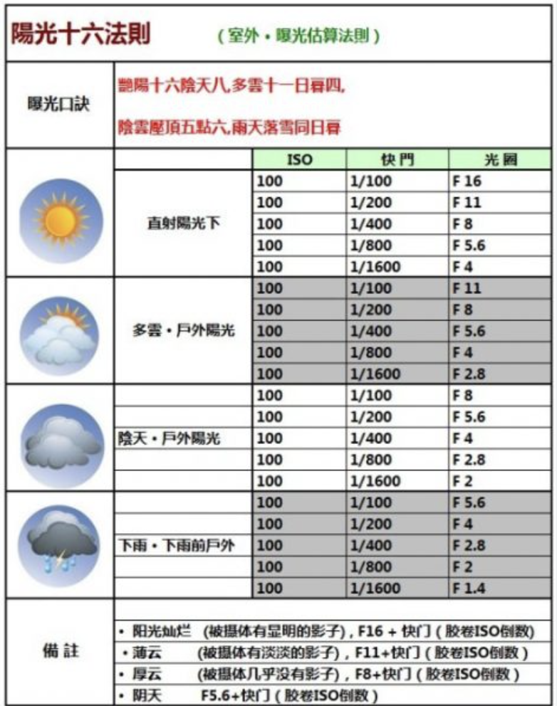

## 阳光16法则

>   阳光16法则是摄影术中不借助电子测光表来估计照相机的光圈大小和快门长短的法则

>   阳光16的基本法则如下：
>
>   -   在室外阳光下，如果光圈是f/16，则快门速度应是所用胶片的国际感光度指数的倒数 (例如，在室外阳光下，如用光圈是f/16，而所用胶片的感光度为ISO100，则快门应为1/100秒)
>   -   口诀中的“16”，并不是光圈非f/16不可，如选用f/11，则快门速度当提高一倍成为1/200秒
>   -   基础光圈需要根据天气状况作调整，如多云，用ISO100胶片，如果快门速度仍旧取1/100秒，则光圈应从f/16开大一倍到f/11

>   

## Reference

https://zh.wikipedia.org/wiki/%E9%98%B3%E5%85%8916%E6%B3%95%E5%88%99

https://www.dujingtou.com/article_387.shtml