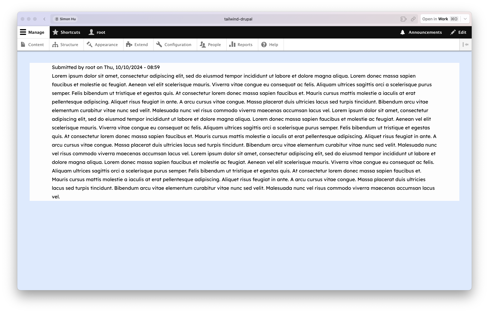
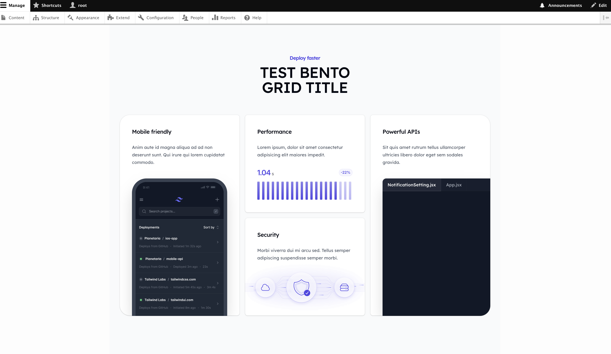

## Introduction

This post will provide a quick guidance on:

-   how-to for installing the "Tailwind CSS" on to your custom drupal theme/sub-theme,
-   how to create a reusable component styled based on "Tailwind UI" using paragraph module

Resources referenced in this post includes:

-   Tailwind CSS - Official Installation Guide: https://tailwindcss.com/docs/installation
-   Tailwind UI - Official Installation Guide: https://tailwindui.com/documentation
-   Theme Drupal - Adding assets: [https://www.drupal.org/.../asset](https://www.drupal.org/docs/develop/theming-drupal/adding-assets-css-js-to-a-drupal-theme-via-librariesyml)


## Step-1: Initialization of Sub-Theme

To begin with, you can refer to [this post](https://www.drupal.org/docs/develop/theming-drupal/creating-sub-themes) on how to create a sub-theme based on any contributed theme, for my instance I am creating my sub-theme of machine name `tailwind-civic` based on the [CivicTheme](https://www.drupal.org/project/civictheme), which has its special provided script to generate sub-theme (see [screenshot](2024-10-10T113214.png)):

```
> cd "themes/contrib/civictheme"
  # cd to the base theme's directory to begin with

> php civictheme_create_subtheme.php tailwind_civic "Civic Theme (Tailwind)" "Custom theme using Tailwind CSS with Civic Theme as base" "../../themes/custom/tailwind-civic"
  # altered based on template -> php civictheme_create_subtheme.php <theme_machine_name> "Human theme name" "Human theme description" /path/to/theme_machine_name)

   ------------------------------------------------------------------------------------------------------------------
  | Civic Theme (Tailwind) (tailwind_civic) sub-theme was created successfully in ".../themes/custom/tailwind-civic".
  |
  | ----------
  | NEXT STEPS
  | ----------
  |
  | Ensure that front-end assets can be built:
  |   cd ".../themes/custom/tailwind-civic"
  |   npm install
  |   npm run build
  |   npm run storybook
  |
   ------------------------------------------------------------------------------------------------------------------

> cd ".../themes/custom/tailwind-civic"
  # cd to the sub-them's directly

> npm install && npm run build && npm run storybook
  # install dependencies (not all theme requires this step)

```

At the end you will have a sub-theme under your `theme/custom` folder with a hierachy alike the following:

```
tailwind_civic
    |-tailwind_civic.info.yml       # defining a theme's metadata and configuration
    |-tailwind_civic.libraries.yml  # defining asset libraries, which include CSS, JavaScript, and other front-end resources
    |-tailwind_civic.theme          # defining theme-specific logic and functions that alter or enhance the theme's behavior
    |-css
       |-style.css
       |-style.css.map
    |-js
       |-script.js
    |-templates
       |-maintenance-page.html.twig
       |-node.html.twig
       |-html.html.twig
    |-images
       |-buttons.png
       |-banner.png
       |-avatar.png
    |-logo.svg
    |-config
       |-install - tailwind_civic.settings.yml
       |-schema  - tailwind_civic.schema.yml
```

Then simply enable your sub-theme (as well as the base theme if you haven't done so) in the drupal backend, or via the `drush` command :

```
> drush theme:enable civictheme -y
> drush config-set system.theme default civictheme
> # Eanble Base Theme

> drush theme:enable tailwind_civic -y
> drush config-set system.theme default tailwind_civic
> # Enable sub-theme

> drush cr
> # Clear the cache
```

Once properly installed you should see your theme's style taking effect. (I would recommend you double-check by adding some debug css in the `style.css` file, for instance `*{border: 5px dotted #F9B455 !important;}` refresh the page and see if they take effect)


## Step-2: Installation of Tailwind CSS

Tailwind CSS along with its dependencies are managed by node package manager, we can install it following the guide provide on the official website:

### 2A. Install Tailwind CSS

Install tailwindcss via npm, and create your `tailwind.config.js` file.

```
> npm install -D tailwindcss
> npx tailwindcss init
```

You should be getting a  `tailwind.config.js` file like the following to begin with:

```
/** @type {import('tailwindcss').Config} */
module.exports = {
  content: ["./src/**/*.{html,js}"],
  theme: {
    extend: {},
  },
  plugins: [],
}
```

### 2B. Configure your template paths

The template paths in `content` attribute tell Tailwind which files to scan for class names. This is essential because Tailwind uses a process called "purging" to remove unused styles from the final CSS output, which helps keep the file size small (in another word, if you don't configure your template path correctly, the after the `npx build` process, all but the default the styling will be removed). For our later usage, we will be using the Tailwind UI component via paragraph's twig template, hence let's change the `content`  to include the `.twig` files living in `\template` folder.

Moreover, we will be using the tailwind `colors`, sans `font` family, and plugins: `@tailwindcss/forms`,  `@tailwindcss/aspect-ratio`, add them in the configuration file. At the end you'll get something like

```js
/** @type {import('tailwindcss').Config} */
const defaultTheme = require('tailwindcss/defaultTheme');
const colors = require('tailwindcss/colors');

module.exports = {
  content: ['./templates/**/*.{html,js,twig,html.twig}'],
  theme: {
    colors: {
      transparent: 'transparent',
      current: 'currentColor',
      black: colors.black,
      white: colors.white,
      gray: colors.gray,
      emerald: colors.emerald,
      indigo: colors.indigo,
      yellow: colors.yellow,
      blue: colors.blue,
      red: colors.red,
      green: colors.green,
    },
    extend: {
      fontFamily: {
        sans: ['InterVariable', ...defaultTheme.fontFamily.sans],
      },
    },
  },
  plugins: [
    require('@tailwindcss/forms'),
    require('@tailwindcss/aspect-ratio'),
  ],
};

```

### 2C. Add the Tailwind directives to your CSS

Use  `@tailwind` to include different layers of Tailwind's pre-designed styles into your CSS

```css
@tailwind base;
@tailwind components;
@tailwind utilities;
```

You can either :

-   add the above to your main `style.css` file for the sub-theme, and change your sub-theme to use the css file after built
-   (OR) create a new css file `tailwind/input.css`, and after using the `npx tailwind` command to build the css file into `tailwind/output.css`, import it to your main `style.css` file via `@import url(../tailwind/output.css)`.

We will take the second approach.

### 2D. Start the Tailwind CLI build process

Run the CLI tool to scan your template files for classes and build your CSS and clear drupal cache

```
> npx tailwindcss -i ./tailwind/input.css -o ./tailwind/output.css             # Compile Once
> npx tailwindcss -i ./tailwind/input.css -o ./tailwind/output.css --watch     # Watch Change
> ../../../vendor/bin/drush cr                                                 # Clear Cache
```

For the convinience, you can add the following to your `package.json` file:

```json
{
    "scripts": {
        "...":                   "...",
        "build-tailwind":        "npx tailwindcss -i ./tailwind/input.css -o ./tailwind/output.css         && ../../../vendor/bin/drush cr",
        "...":                   "...",
    }
}
```

Then you can build your tailwind css via simply running: `npm run build-tailwind`

### 2E. Add Build Tailwind CSS File to Sub-theme

Now let's add the `tailwind/output.css` to the sub-theme's library via `tailwind_civic.libraries.yml`

```
global:
  css:
    theme:
        dist/civictheme.css: {}
        tailwind/output.css: {}
  js:
    dist/civictheme.js: {}
  dependencies:
    - core/drupal
    - core/once
    - core/drupalSettings
```

### 2F. Dry-run Your Tailwind CSS

Lately let's try  superpower of tailwind css, by adding some extra style via `class` to the base template `html.html.twig`:

```
...
    <!DOCTYPE html>
    <html{{ html_attributes }} class="bg-blue-100 p-10">
        ...
        ...
    </html>
...
```

Remeber to recompile the tailwind css file and clear the cache:

```
> npm run build-tailwind

     npx tailwindcss -i ./tailwind/input.css -o ./tailwind/output.css && ../../../vendor/bin/drush cr
     Rebuilding...
     Done in 148ms.
     [success] Cache rebuild complete.
```

At the end you will get something like the following:




## Step-3: Building Re-usable Component (with Tailwind UI + Paragraph Module)

Let's demostrate by creating the "bento grid" component (free Tailwind UI component), and make the title a field in paragraph type (for quick demostration purpose):


### 3A. Create Pragraph Type

I won't go into the details of this step, create the paragraph type, configure its fields and make it available on the content type:


### 3B. Generate Dummy Content

Make the paragraph type available in one of your content, and create one of those contetn with this (paragraph) component


### 3C. Create Twig Template

First goto the Tailwind UI offcial page and find the HTML snippets there: https://tailwindui.com/components/marketing/sections/bento-grids


Then create the twig template corresponding to the paragraph type that was created (`template/paragraph--tailwind-ui-bento-grids.html.twig` in our case)


And use the html we just copied to create fill in the template:

```twig
<div class="bg-gray-50 py-24 sm:py-32">
  <div class="mx-auto max-w-2xl px-6 lg:max-w-7xl lg:px-8">
    <h2 class="text-center text-base/7 font-semibold text-indigo-600">Deploy faster</h2>
    <p class="mx-auto mt-2 max-w-lg text-pretty text-center text-4xl font-medium tracking-tight text-gray-950 sm:text-5xl">
      {{ content.field_bento_title.0["#context"].value }}
...
```


### 3D. See The Changes Live !

Perform `tailwind css build` and `drush cr` , and voilà, you get the Bento Grid component with the title from the paragraph, and by copying it from the Tailwind UI store, we almost spend no effort creating this stunning component.



And usually these components are built to be mobile responsive as well !


