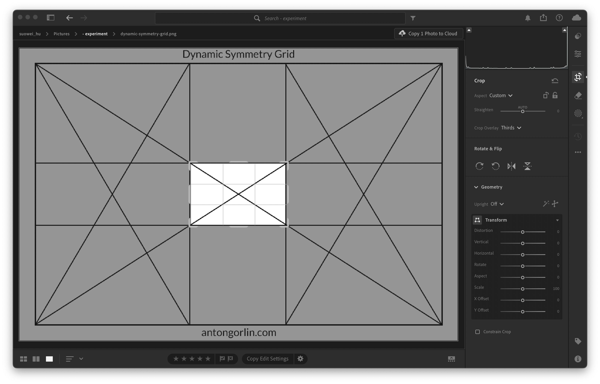

## ① Correct Geometry + Composition (矫正透视 + 重新构图)
Correcting geometry and cropping help in refining the image to ensure that it is both visually appealing and accurately represents the scene as intended by the photographer.

## ② Increase Vibrance + Decrease Saturation (提高鲜艳度 + 降低饱和度)
By combining these two adjustments, you can achieve a balanced enhancement where colors are vivid but not overwhelming, preserving the natural look of the image while enhancing its visual appeal. This technique is often used to create a more aesthetically pleasing image that draws attention to the subject without overwhelming the viewer with too much color intensity. (Please refer to the post of "Saturation vs Vibrance")

## ③ Color Correction (右右左 - 颜色校准)

Color correction is a fundamental step in the post-production process that ensures the final output looks professional and meets the intended visual standards. (For instance, to achieve teal and orange color grading, simply move red sliders right, green siders to right, blue sliders to left, see below)

