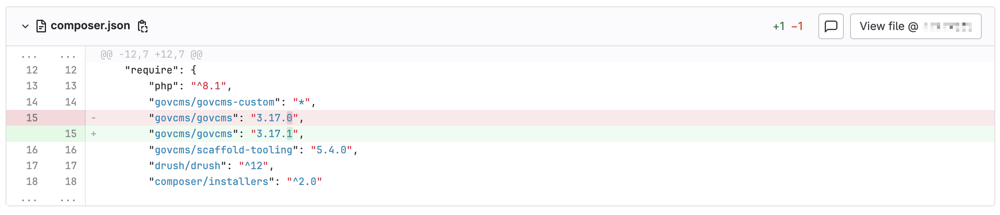
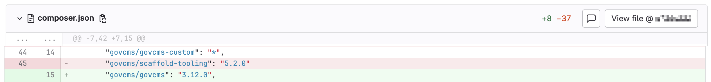
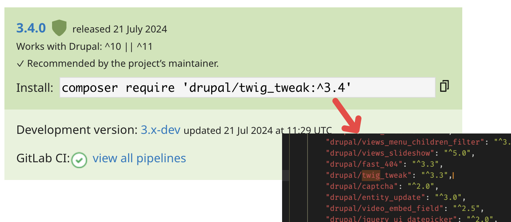
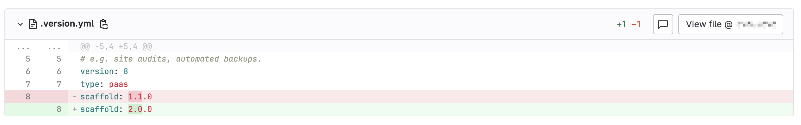

As mentioned in a earlier post "GovCMS SaaS vs PaaS", in SaaS website, the client is responsible for all the patching including security updates (unlike SaaS environments which does it all automatically). This post will guide you through on how to perform these update yourself.


## Introduction

To begin with, we'll need to differntiate the compositional part of the GovCMS PaaS website that will need update:

*    `govCMS/govCMS` : the main repository for the Drupal-based GovCMS distribution, which provides a content management system tailored for Australian government websites. It includes core functionality and modules necessary for compliance and accessibility standards. ([GitHub](https://github.com/govCMS/GovCMS), [Packagist](https://packagist.org/packages/govcms/govcms))
*   `govCMS/scaffold-tooling`: comprises a collection of standard configurations, scripts, and packages designed to support the GovCMS scaffold. It includes tools for continuous integration and testing, enhancing development and deployment processes. ([Github](https://github.com/govCMS/scaffold-tooling), [Packagist](https://packagist.org/packages/govcms/scaffold-tooling))
*   `custom/patch` : some PaaS website also have custom module (contributed module) installed, or patches serve as temporary fixes or modifications to the website's existing codebase. They are utilized to rectify bugs that may emerge during regular operation, ensuring the site maintains optimal performance and user experience.
*   `govcms/scaffold`: serves as a template for creating GovCMS projects. It helps streamline the setup process by providing a predefined structure and configuration for new projects, ensuring consistency and best practices. (Github)


## Composer

Likewise explaied in this knowledge base post by GovCMS: [link](https://www.govcms.support/support/solutions/articles/51000177893-keeping-your-govcms-scaffold-up-to-date-paas-customers). You will need to update all the dependencies via altering the version number in the `composer.json` and `patch.json` files, and run `composer update` (resolve dependency issue that arises).

All the associated composer/patch files that need your attention are the follwing:

*   `$root_folder / composer.json`: record the version of core/scaffold  (Example File for Reference: [link](composer.json))
*   `$root_folder / custom / composer / composer.json`: record version of custom module that is installed (Example File for Reference: [link](custom-composer.json))
*   `$root_folder / custom / composer / patches.json`: record any patches that is in-use (Example File for Reference: [link](custom-patches.json))
*   `$root_folder / composer.lock`: it is important that you commit the new `.lock` file to override the old `.lock` file on the server (Example File for Reference: [link](composer.lock))

And below are some important note you might want to keep in mind:

-   **Pinning Version Number**
    -   It is recommended to use pinned version numebr such as `"govcms/govcms": "3.8.0"` instead of `"govcms/govcms": "^3.8"`, this is to prevent the deployment updating your dependencies automatically without your audit, this could potentially cause an error without a developer knowing (imagine you made a style update but it break the website somehow)
-   **Custom Modules' Composer File**
    -   Notice that the path for the custom module / patch can be altered in the main `composer.json` file: `"repositories": [ { "type": "path", "url": "custom/composer" },`)

*   **Unlock Locked Files**
    *   Sometimes key files can become locked in your repository due to changes made by GovCMS service accounts. While SaaS customers are unable to fix this themselves, PaaS clients can by running the following command: `git-lfs unlock <Filename goes here> -f`
*   **Force Pull Image**
    *   You may need to force your Docker instance to pull down the most recent image.  This can happen when docker is caching your Volumes and Images locally, and is trying to be helpful. `docker pull govcms/govcms:10.x-latest && ahoy build`


### Composer - GovCMS/GovCMS

You can track the release of the main repository for govcms distribution at: https://github.com/govCMS/GovCMS. Whenever there's an update available you will need to update it via your main `composer.json` file:



Then run `composer update` will updates its dependencies and put them in `composer.lock` file. Remeber to add both files into the commit when you are done with the update.


### Composer - GovCMS/Scaffold-Tooling

Similar to the previous section, you can find release for scaffold tooling at: https://github.com/govCMS/scaffold-tooling. And update them the same `composer.json` file:



Then run `composer update` will updates its dependencies and put them in `composer.lock` file. Remeber to add both files into the commit when you are done with the update.


### Composer - Custom Modules

Unlike the core dependencies, custom module (contributed modules) only exists in the PaaS platform, and updating then will involve update to the corresponding `composer.json` file used to manage these custom modules (for instance `custom/composer/composer.json`). Instead of pinned version numbers fore the core dependencies, these modules are usually using `^` and `*` to allow automatic update.

With that said, it is still recommended that you check the version number against its official modules page on drupal website, for instance consider the following `custom/composer/composer.json` file:

```
{
    "name": "govcms/govcms-custom",
    "description": "Provides additional packages over the GovCMS base distribution.",
    "repositories": [],
    "require": {
        "drupal/backup_migrate": "^5.0",
        "drupal/better_exposed_filters": "^7.0@beta",
        "drupal/blazy": "^3.0",
        "drupal/bootstrap_barrio": "^5.5",
        "drupal/entity_clone": "^2.0@beta",
        "drupal/fullcalendar_view": "^5.1",
        "drupal/google_map_field": "^2.0",
        "drupal/jquery_ui_checkboxradio": "^2.1",
    	"drupal/schema_metatag": "^3.0",
    	"drupal/search_api_autocomplete": "^1.9",
    	"drupal/search_api_exclude_entity": "^2.0",
    	"drupal/simple_recaptcha": "^1.0@beta",
    	"drupal/slick": "^3.0",
     	"drupal/slick_views": "^3.0",
    	"drupal/superfish": "^1.7",
    	"drupal/time_field": "^2.1",
        "drupal/views_menu_children_filter": "^3.0@RC",
        "drupal/views_slideshow": "^5.0",
        "drupal/fast_404": "^3.3",
        "drupal/twig_tweak": "^3.3",
        "drupal/captcha": "^2.0",
        "drupal/entity_update": "^3.0",
        "drupal/video_embed_field": "^2.5",
        "drupal/jquery_ui_datepicker": "^2.0",
        "drupal/jquery_ui_slider": "^2.1",
        "drupal/jquery_ui_touch_punch": "^1.1",
        "drupal/config_perms": "^2.1",
        "drupal/jquery_ui_autocomplete": "^2.1",
        "drupal/autologout": "^2.0",
        "drupal/jquery_ui": "^1.7",
        "egulias/email-validator": "4.0.2 as 3.2.6"
    }
}
```

We will need to check every single modules listed to make sure their version number is the same as its project page; For instance, the below example checks module `drupal/twig_tweak`, its project can be found at: https://www.drupal.org/project/twig_tweak.  (as a result of the comparison, we need to change `^3.3` to `^3.4`; but this is not necessary the case, in some condition, `3.3` might be a dependency of the core, in that case it will cause an conflict when you run `composer update`)



Remeber to run `composer update` at the \*root directly to check if your change of version number will/will-not cause any conflict.


## Scaffold

(Pending, I have not performed such update before) The same information can be found at [this link](https://www.govcms.support/support/solutions/articles/51000177893-keeping-your-govcms-scaffold-up-to-date-paas-customers), you will need to update the `scaffold` version number at file `.version.yml` (but it might not be simple as updating the version number, you might also have to play with php version etc) the releases can be found at: https://github.com/govCMS/scaffold/releases.




## Reference

-   https://github.com/govCMS/GovCMS
-   https://github.com/govCMS/scaffold
-   https://github.com/govCMS/scaffold-tooling
-   https://www.govcms.support/support/solutions/articles/51000177893-keeping-your-govcms-scaffold-up-to-date-paas-customers


