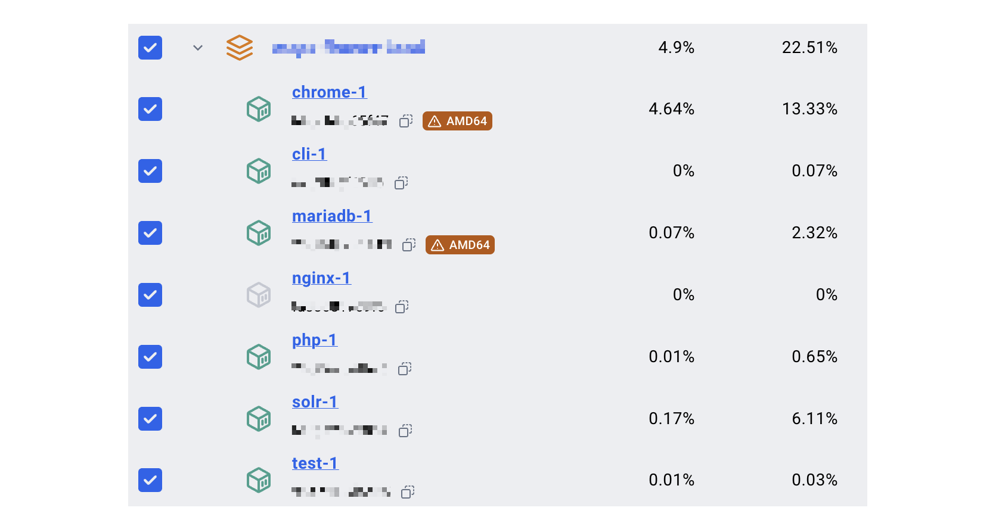
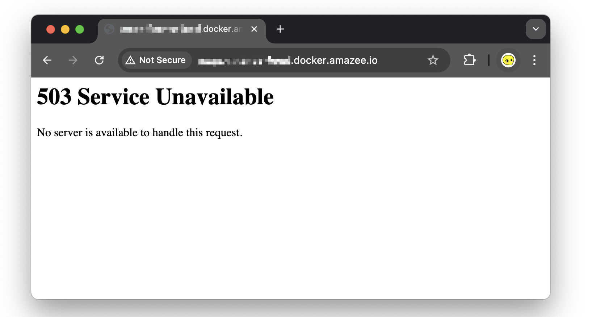

## Issue Repeated

The other day I was encountering a GovCMS PaaS client with very odd code-base, deplpying on my local computer first require my GitHub ghp_xxxxxxxx authentication key (solved via adding `docker-compose.override.yml` file), then it raised an issue of `"/usr/local/bin/drush": not found` (solved via uncommenting lines in `Dockerfile.cli` file), then I found its scaffold to be outdated (solved via updating `.version.yml` scaffold version number) ...


Even after all these patches, once I run ahoy up, the website still cannot run properly. All the associated docker container starts as I run `pygmy up && ahoy build` as expected, but soon as the build process finishes, the `nginx-1` container magically kills/pauses itself with the following error:

```
2024-XX-XX XX:XX:XX Setting up Healthz routing
2024-XX-XX XX:XX:XX 2024/10/16 04:36:54 [emerg] 7#7: host not found in resolver "kube-dns.kube-system.svc.cluster.local" in /etc/nginx/helpers/012_internal_resolver.conf:1
2024-XX-XX XX:XX:XX nginx: [emerg] host not found in resolver "kube-dns.kube-system.svc.cluster.local" in /etc/nginx/helpers/012_internal_resolver.conf:1
```



Causing all of its reqeust to the url to be unsesolved `503 Service Unavailable` :




## Issue Resolved

When it comes to situations where you are unable to run the actual website directly on your computer, whether due to technical limitations, resource constraints, or compatibility issues, it can be quite challenging. I've found it universal solution that can work on almost any website "broken" due to the filebase (but not database).

### Initializing GovCMS Scaffold

To begin with, install an empty scaffold by cloning from https://github.com/govCMS/scaffold, and initialize the empty scaffold  with the same type (`SaaS`/`PaaS`), same version (`8`/`9`/`10`), but slightly different project_name (e.g. suffix `_scaffold`).

For instance:

```
> git clone "https://github.com/govCMS/scaffold.git"
> mv scaffold project_name_suffix
> cd project_name_suffix
> ahoy init project_name_suffix paas 10
```

And make it running by running the follows:

```
> composer install  # dependencies
> pygmy up          # amazie containers
> ahoy build        # docker build
```

In theory, once all these steps are completed, you should receive a URL that, when opened, will appear as follows:

![Unable to install Drupal on Windows [#2275499] | Drupal.org](DrupalStep.png)

### Copy Themes Folder (PaaS and SaaS)

Once you got your empty scaffold working, you will need to copy everything within `web/themes` folder of the "broken" website's filebase, to the `web/themes` folder of the empty scaffold. Usually there're two files and two folders:

```
[example_site]
  ⤷ web
      ⤷ themes
            ⤷ README.txt
            ⤷ .gitignore
            ⤷ contrib
            	⤷ bootstrap_barrio
            	⤷ ...
            ⤷ custom
                ⤷ xxyyzz_custom_theme
```

### Copy Modules Folder (PaaS only)

After the theme folder is migrated, for PaaS environment, you will need to also copy over the custom/contributed modules you have used, those modules are located at `web/modules` folder, copy them to the `web/modules` folder of the empty scaffold as well, an example of the hierarchy of the folder is as follows:

```
[example_site]
  ⤷ web
      ⤷ modules
            ⤷ README.txt
            ⤷ .gitignore
            ⤷ contrib
            	⤷ address
            	⤷ bigmenu
            	⤷ search_api_solr
            	⤷ ...
            	⤷ ...
            	⤷ token
            	⤷ twig_tweak
            	⤷ username_enumeration_prevention
            ⤷ custom
                ⤷ calendar_recurring_event
                ⤷ draggableviews
                ⤷ ...
                ⤷ xxyyzz_custom_module_1
                ⤷ xxyyzz_custom_module_2
                ⤷ xxyyzz_custom_module_3
```

(it is just a shortcut I choose to use, you may also migrate the conrtibuted modules via updating the relevant `composer.json` file and run `composer install`)

### Ahoy Import Database  (PaaS and SaaS)

Lastly you will need to import the database of the website to the empty scaffold:

```
> ahoy mysql-import "your_database_file.sql"
  Do you really want to drop all tables in the database drupal? (yes/no) [yes]: Yes

> ahoy drush cr
  [success] Cache rebuild complete.

> ahoy info
  Project                  :  example-site-scaffold
  Site local URL           :  http://example-site-scaffold.docker.amazee.io
  DB port on host          :  17525
```

Get the setup scaffold's URL via `ahoy info`, and in theory, the "brand new" site will no longer suffer from the issues of the original broken site.


## Topic Alias (for Search Purpose)
- GovCMS Ahoy Issue Fallback Solution
- GovCMS Local Install Issue Fallback Solution
- GovCMS Docker Issue Fallback Solution