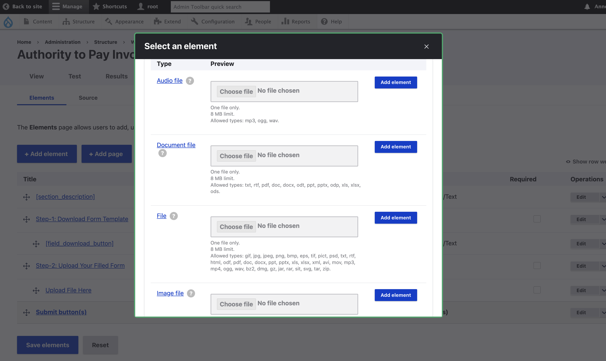
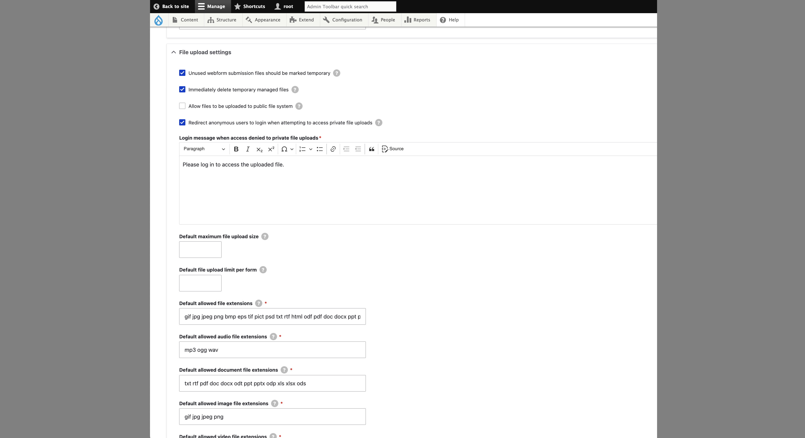

## Issue Repeated

I am in the process of creating a form in Drupal 10 utilizing the Webform module. I can successfully add elements such as "Textfield" and "TextArea." However, when I attempt to add the "File upload" field, it does not appear in the list of available options. Please refer to the attached screenshot for clarification. I would appreciate your assistance in resolving this issue and enabling the file upload field in the form.


## Resolution Method

Simply add the following line in `settings.php`, and clear cache via `drush cr`:
```
$settings['file_private_path'] = 'sites/default/files/webform';
#P.S. You can replace the path with any directory of your choice
```
Then you should be able to see the following "file upload element" options in your webforms:




You may also verify the "File Upload Element" via visiting: `http://example.com/admin/structure/webform/config/elements/`



## Resource

- [File upload element is not listing in Drupal 10 Webform](https://stackoverflow.com/questions/78533756/file-upload-element-is-not-listing-in-drupal-10-webform)