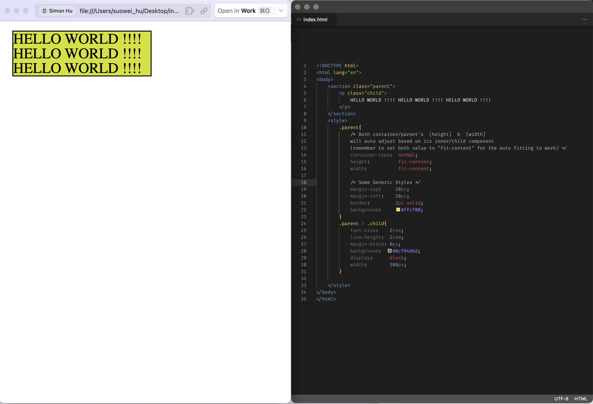
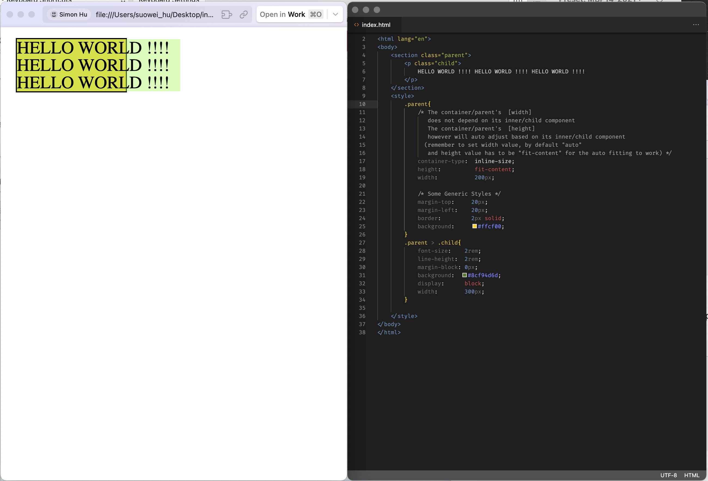
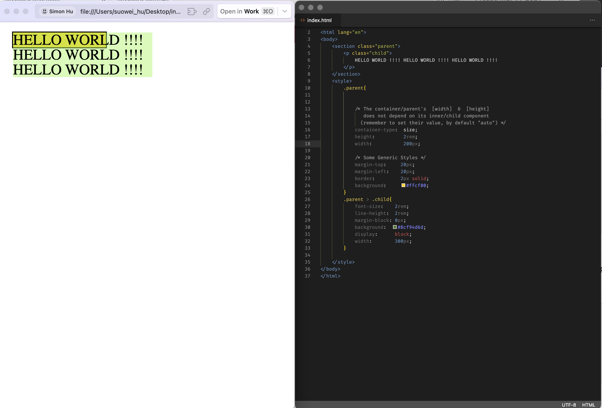

## Intuition (What does it differs to Media Query (`@media`))

You might be very familiar with controlling the style of the component depending on the device width via the `@media` query, for instance I've been using the following code snippets to style full-width component for all device endpoints in Drupal:

```
@media                         (min-width: 1200px)  { _PASTESELECTOR_HERE_ {padding-inline:30px; width:1176px;} }
@media (max-width: 1199px) and (min-width:  992px)  { _PASTESELECTOR_HERE_ {padding-inline:30px; width: 968px;} }
@media (max-width:  991px) and (min-width:  768px)  { _PASTESELECTOR_HERE_ {padding-inline:30px; width: 744px;} }
@media (max-width:  767px)                          { _PASTESELECTOR_HERE_ {padding-inline:30px; width:  100%;} }
```

Media Query is very handy for most cases, with a slight draw back that one will have to cater for every single relevant components' style along with the styling for component of interest. Let me explain - say for instance you have two container both in a flex layout, you  only care about the style for the first component, you want it to hide the long description text whenever its width is too narrow. 


The above example showcase the example, when the screen reaches `500px` upper echelon, the `<p>` component in the first container will be hidden; But truth of fact, we are not concerned with the width of device/breakpoint, in nature what we want to do is to hide the description when the container does not have enough space to display it gracefully (we are interested in the width of the container !). The media query will not 100/100 work for that, for example if the sibling component `container-2`  happen to get a fixed width that squeeze the `container-1` to a smaller available flex space, the media query may no longer work. (this is just one example to showcase the challenges, the real-world scenarios are much more complicated)


Container queries are essential in this context, as they enable components to manage their styles independently based on their own properties, such as width and height, rather than relying on potentially irrelevant global properties. This approach also enhances the "containerized" or "componentized" styling of containers.


## Container Query (`@container`)

**PENDING EXAPLINATION HERE**


## Containment API (`container-type`)

### Relation between "Containment API" and "container query"

You might have noticed that in order for the `@container` query on the child to work, we always have to set `containter-type` property on the parent. And after some testting, it can be found that:

1.   When the parent's `container-type` property is set to `normal` (default), all of the `@containe` query on the child will not be evaluated (will not take effect);
2.   When the parent's `container-type` property is set to `inline-size`, the `@container` height associated query on the child will work as anticipated, the the `@container` width query will work as anticipated;
3.   When the parent's `container-type` property is set to `size`, all of the `@container` query on the child will work as anticipated;

This ie because when we want to change child's style based on its parent/container's height/width, we DO NOT want the parent/container to depend on the height/width of the child.

Imagine a case where a parent component's width is depending on its child (i.e. `.parent{width:fit-content;}`), and child's width will be 200px when its parent has width less than 100px (i.e. `@container(max-width:100px){.child{widht:200;}}`); If the aforementioned constrain does not exist, then the whole component will keep looping/bouncing between `100px` and `200px`. Below is a similar example using `font-size` illustated in Josh Comeau's post:


### How does "Containment API" work ?

The `container-type` property have three different values:

-    `normal`: both parent's width and height can be dependent on the child
-    `inline-size`: only parent's height can be dependent on the child, width is either controlled by itself or its parent
-   `size`: both parent's width and height are not controlled by its child

Let's showcase them one by one:

#### Example-1: `container-type: normal` ([link](example-1.html))



#### Example-2: `container-type: inline-size` ([link](example-3.html))



#### Example-3: `container-type: size` ([link](example-3.html))




## Reference

- [Josh Comeau - A Friendly Introduction to Container Queries](https://www.joshwcomeau.com/css/container-queries-introduction/?from=newsletter)

-   [mdn web docs - container-type](https://developer.mozilla.org/en-US/docs/Web/CSS/container-type)