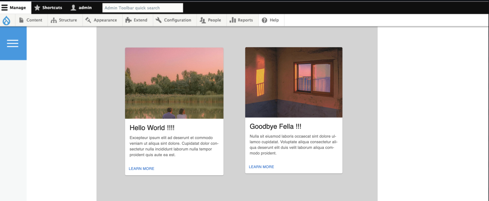
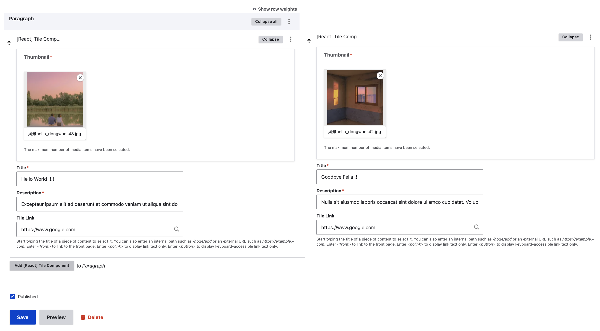
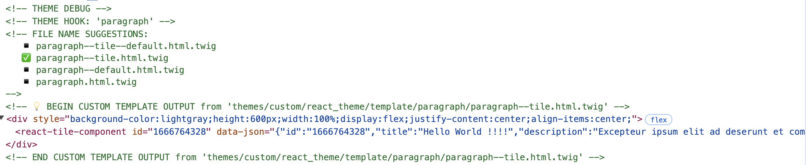
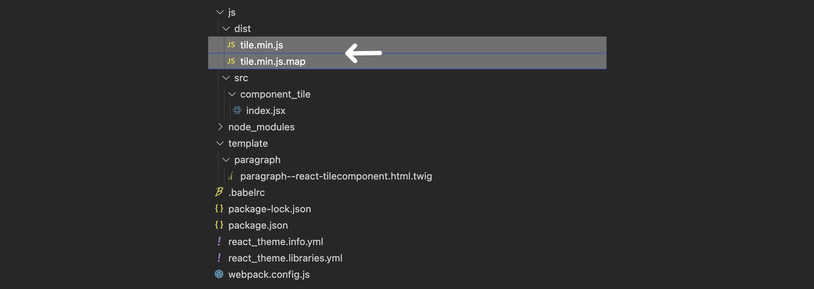
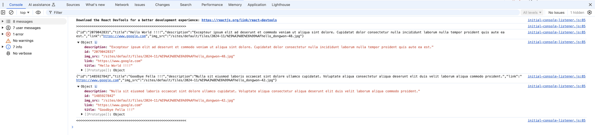

## Intuition

The notion has repeatedly occurred to me since I first entered the Drupal industry, where I have observed numerous online tutorials and blog posts asserting the necessity of frameworks such as Vue and React. These resources often emphasize that beginners, like I was at the time, should familiarize themselves with these technologies. Amidst the enthusiasm for these new frameworks, there exists a tendency to disparage traditional content management systems (CMS) such as WordPress, which are frequently characterized in bleak terms as an <u>"old, dying whale.</u>" This idea raises significant concerns about my future in the field. 

Which has lead to today's topic: Are we allowed to integrate framework like react into drupal, enabling me to fulfill the commitments made by my agency to our clients while simultaneously exploring and learning React (and other front-end frameworks) in the process.


## Overview

In order to have drupal render a react component, there're three steps we will need to undertake:

-   **Step-1**: have Drupal outputting a html DOM element that contains data (that will be later used by the React component to render the styled component), and this is achievable via parargraph module + a custom theme's `twig` template.
-   **Step-2**: create the corresponding `js`/`jsx`/`ts` file that rendered the DOM element with data into a styled component, and use the appropriate module bundler to build and minify these files.
-   **Step-3**: add the rendered single javasctipt file into the custom theme's library, and attach it to the relevant `twig` template

The final outcome and the example code can be found as the following:



I have also attached a copy of the custom theme code I worked-on, in case you run into any problems during the process, you can take it as a reference: [download](example_custom_theme.zip). 


## Setup Process Breakdown

### Step-1: output DOM element

I won't go into the details on how to configura paragraph modules, enable twig debug, have create twig file that will be used as the template rendering the certain paragraph type, you can find that on paragraph modules's [official documentation](https://www.drupal.org/docs/contributed-modules/paragraphs). In our case we will create a paragraph with machine name `tile` (and a content type to hold this paragraph type, and new content as a demo page for us to work on) then we will override the `tile` paragraph's template with the following  `paragraph--tile.twig.html` file. 

Basically it is extracting all data in the paragraph component, and saving them inside the data-attribute of custom-named DOM element, as a well formatted json string.

```twig
{# ========================= #}
{# paragraph--tile.twig.html
{# ========================= #}










    <div style="background-color:lightgray;height:600px;width:100%;display:flex;justify-content:center;align-items:center;">
        <react-tile-component id="{{unique_id}}" data-json="{{data}}"/> {# HERE THE DATA IS ENTERED TO THE JSON DATA ATTRIBUTE READY TO BE REACT BY JS #}
    </div>

```

Once completed, clear the cache via `drush cr`, and you should get the following: 






### Step-2: Framework Related Code & Bundler

In this step you can dis-regard the presense of Drupal, it will solely produce a JavaSctipt that replace an HTML component with a "Tile" looking component using react. Here we need to have the following: 

-   **JavaScript Module Bundler**: The `webpack.config.js` file specifies configurations such as the development mode for faster builds, entry points for the application, output paths for bundled files, and module rules for processing JSX files. The `.babelrc` file configures Babel to use modern JavaScript features and transform JSX syntax. 
-   **Package/Dependency Manager**: The `package.json` file lists project metadata, dependencies like React and Material-UI, and development dependencies including Babel and Webpack, along with scripts for building and watching changes. 
-   **React Component**: The React component defined in `index.jsx` uses Material-UI components to render a tile UI element using the data found in the designated HTML component, and initializes these components within the HTML document. (in this example we use the MUI card component: https://mui.com/material-ui/react-card/)

```js
// =================
// webpack.config.js
// =================

const path = require("path");                       // This line imports Node.js's built-in path module, which provides utilities for working with file and directory paths. It's used later in the configuration to ensure that paths are resolved correctly, regardless of the operating system.
module.exports = {
  devtool:  "source-map",                           // The devtool option controls how source maps are generated. "source-map" creates a separate source map file, which helps in debugging by mapping the bundled code back to the original source code.
  mode:     "development",                          // The mode option specifies the mode in which Webpack should run. "development" enables optimizations for faster build times and more readable output, which is useful during development. Alternatively, "production" would enable optimizations for smaller file sizes.
  resolve:  {extensions:[".js",".jsx"]},            // The resolve option specifies the file extensions Webpack will resolve when importing modules. This means you can import files without specifying their extensions if they are .js, .jsx, or .ts.
  entry:    {                                       // The entry property defines the entry points for your application.
    tile:["./js/src/component_tile/index.jsx"],     // ⤷ Here, an entry point named tile  is defined, which includes the file ./js/src/component_tile/index.jsx.   Webpack will start building the dependency graph from this file.
  },
  output: {                                         // The output section specifies where the bundled files should be output
    path:      path.resolve(__dirname, "js/dist"),  // ⤷ path: The output directory for the bundled files, resolved to an absolute path using path.resolve(). __dirname is a Node.js variable that gives the directory name of the current module, ensuring the path is correctly resolved.
    filename: "[name].min.js",                      // ⤷ filename: The name of the output file. [name] is a placeholder that will be replaced by the name of the entry point (e.g., tile), resulting in tile.min.js as the output file.
  },
  module: {                                         // The module property contains rules that define how different types of modules should be treated.
    rules: [                                        // ⤷ rules: An array of rules for module processing.
      { test: /\.jsx?$/,                            //    ⤷ test:     A regular expression that matches file names. Here, it matches files with .js or .jsx extensions.
        loader: "babel-loader",                     //    ⤷ loader:   Specifies the loader to use for the matched files. babel-loader is used here to transpile JavaScript files using Babel, which allows you to use modern JavaScript features.
        exclude: /node_modules/,                    //    ⤷ exclude:  Excludes files in the node_modules directory from being processed by babel-loader, which is a common practice to improve build performance.
        include: path.join(__dirname, "js/src") }   //    ⤷ include:  Specifies the directory to include for processing, ensuring only your source files are processed by Babel.
    ]
  }
};

// ========
// .babelrc 
// ========
{
    "presets": [            //  Babel is a JavaScript compiler. Babel is a toolchain that is mainly used to convert ECMAScript 2015+ code into a backwards compatible version of JavaScript in ...
      "@babel/preset-env",  // 	⤷ @babel/preset-env is a smart preset that allows you to use the latest JavaScript features without needing to micromanage which syntax transformations (and optionally, browser polyfills) are needed by your target environment(s). It automatically determines the Babel plugins and polyfills you need based on your target environments, which you can specify in a separate configuration or directly in the .babelrc.
      "@babel/preset-react" //  ⤷ @babel/preset-react is a preset that includes plugins necessary for transforming React JSX syntax to JavaScript. JSX is a syntax extension used in React that allows you to write HTML-like syntax directly in JavaScript files, and this preset ensures that it is properly compiled to JavaScript that browsers can understand.
    ]
}
```

```json
// ============
// package.json
// ============
{
    "name":            "olivero_npm",
    "version":         "1.0.0",
    "description":     "N/A",
    "author":          "Simon Hu",
    "license":         "ISC",
    "dependencies":    { "@emotion/react": "^11.13.3","@emotion/styled": "^11.13.0","@fontsource/roboto": "^5.1.0","@mui/icons-material": "^6.1.6","@mui/material": "^6.1.6","@mui/styled-engine-sc": "^6.1.6","browser": "^0.2.6","prop-types": "^15.8.1","react": "^18.3.1","react-dom": "^18.3.1","styled-components": "^6.1.13"},
    "devDependencies": { "@babel/core": "^7.26.0","@babel/preset-env": "^7.26.0","@babel/preset-react": "^7.25.9","babel-loader": "^9.2.1","ts-loader": "^9.5.1","typescript": "^5.6.3","webpack": "^5.96.1","webpack-cli": "^5.1.4","webpack-shell-plugin-next": "^2.3.2"},
    "scripts":         { "build": "webpack --config webpack.config.js && ../../../vendor/bin/drush cr", "watch": "webpack --watch --config webpack.config.js"}
  }
```

```js
// =====================================
// FILE TILE/index.jsx (REACT COMPONENT)
// =====================================

// importing reuqired libraryies
import React        from 'react';
import ReactDOM     from 'react-dom/client';
import Card         from '@mui/material/Card';
import CardActions  from '@mui/material/CardActions';
import CardContent  from '@mui/material/CardContent';
import CardMedia    from '@mui/material/CardMedia';
import Button       from '@mui/material/Button';
import Typography   from '@mui/material/Typography';

// Constructor for tile of well defined attributes/variables & render function
class Tile {
    constructor(data_json) {
      this.title        = data_json.title;
      this.description  = data_json.description;
      this.link         = data_json.link;
      this.img_src      = data_json.img_src;
    }
    renderTile_ver1(){
        return (
            <div style={{width:"300px", height:"500px", background:"gray", overflow:"hidden"}}>
                <a href={this.link}>
                    
                    <h2>{this.title      } </h2>
                    <p> {this.description } </p>
                </a>
            </div>
        );
    };
    renderTile_ver2(){
        return (
            <Card sx={{ maxWidth: 345 }}>
                <CardMedia
                sx={{ height: 250 }}
                image={this.img_src}
                />
                <CardContent>
                    <Typography gutterBottom variant="h5" component="div">
                        {this.title}
                    </Typography>
                    <Typography variant="body2" sx={{ color: 'text.secondary' }}>
                        {this.description }
                    </Typography>
                </CardContent>
                <CardActions>
                    <Button href={this.link} size="small">Learn More</Button>
                </CardActions>
            </Card>
        );
    }
    render(){
        return this.renderTile_ver2();
    }
}

console.log(">>>>>>>>>>>>>>>>>>>>>>>>>>>>>>>>>>>>>>>>>>>>>>>>>>>>>>>>>");

document.querySelectorAll('react-tile-component').forEach((dom_component) => {
    // Getting data from the twig rendered html
    const data_jsonString  = dom_component.dataset.json;
    const data_json        = JSON.parse(data_jsonString);
                             console.log(data_jsonString);
                             console.log(data_json);
    
    // Initialize new tile object, and render component
    const tile = new Tile(data_json);
    ReactDOM.createRoot(dom_component).render(tile.render());
});

console.log("<<<<<<<<<<<<<<<<<<<<<<<<<<<<<<<<<<<<<<<<<<<<<<<<<<<<<<<<<");
```

Once setup, we can run the following in terminal to install the dependencies and build the javascript:

```
# ========
# terminal
# ========

> npm install      // if you copied my "package.json", all the dependencies will be already there, otherwide you can also install via the following
OR 
> npm install --save react react-dom prop-types                                            // React Libraries & Component Library MUI
> npm install --save @mui/material @emotion/react @emotion/styled @mui/icons-material @mui/styled-engine-sc styled-components @fontsource/roboto 
> npm install --save-dev @babel/core @babel/preset-env @babel/preset-react babel-loader    // JS Compilation - Babel
> npm install --save-dev webpack webpack-cli                                               // Web Bundler    - WebPack
                                                                                           
                                                                                           
> npm run build
```

And we will have the rendered `tile.min.js` and `tile.min.js.map` file: 




### Step-3: Compiled JavaScript as Library

Lastly, we need to connect the built/minified JavaScript wtih the paragraph type (tile component), to do that we add the JavaScript to an library via ``theme_name.libraries.yaml`, and attach it to the paragraph tyoe via `{{ attach_library("theme_name/library_name") }}` in the twig template. 

```yaml
# ==========================
# theme_name.libraries.yaml
# ==========================

lib_paragraph_tile:
  version: VERSION
  js:
    js/dist/tile.min.js: {minified: true}
```

```twig
{# ========================= #}
{# paragraph--tile.twig.html
{# ========================= #}

{# ↓↓↓↓↓↓↓↓↓↓↓↓↓↓↓↓↓↓↓↓↓↓↓↓↓↓↓↓↓↓↓↓↓↓↓↓↓↓↓↓↓↓↓↓↓↓↓↓ #} 
{{ attach_library("react_theme/lib_paragraph_tile") }} {# ◀ Add the compiled js via library #}
{# ↑↑↑↑↑↑↑↑↑↑↑↑↑↑↑↑↑↑↑↑↑↑↑↑↑↑↑↑↑↑↑↑↑↑↑↑↑↑↑↑↑↑↑↑↑↑↑↑ #}









    <div style="background-color:lightgray;height:600px;width:100%;display:flex;justify-content:center;align-items:center;">
        <react-tile-component id="{{unique_id}}" data-json="{{data}}"/>
    </div>


```

### Final Outcome 

As a result we will see the following MUI component (and print-out in the console)




## Reference

-   [React for Drupal](https://reactfordrupal.com/)
-   [Drupalize Me - Connect React to a Drupal Theme or Module](https://drupalize.me/tutorial/connect-react-drupal-theme-or-module)
-   [Data Binding in React](https://www.joshwcomeau.com/react/data-binding/)
-   [Add React to an Existing Project](https://react.dev/learn/add-react-to-an-existing-project)
-   [Adding assets (CSS, JS) to a Drupal module via *.libraries.yml](https://www.drupal.org/docs/develop/creating-modules/adding-assets-css-js-to-a-drupal-module-via-librariesyml#s-attaching-a-library-to-pages)