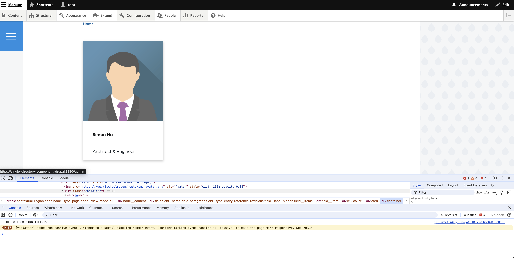
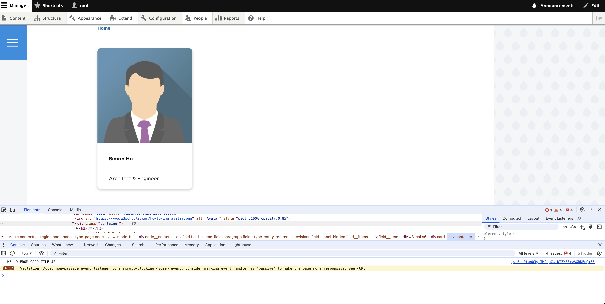
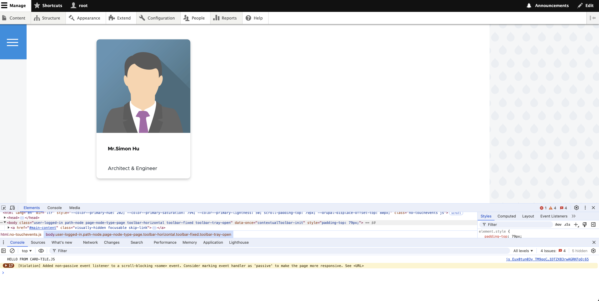

## Step Progress Breakdown

### Level-1: Component using Paragraph Twig Tempalte

To begin with, let's start by building a simple component using drupal paragraph module:

1.   We create the paragraph type `paragraph_cardtile` with one field `field_title` only (see [screenshot](2024-11-14T235657.png))
2.   Turn on twig debug, create a demo content item, f12 inspection over it to get the overriding twig file name
3.   Create that twig template, in this case `paragraph--paragraph-cardtile.html.twig` and write related html code to make it look like a "card tile" component, and you can have its associated js/css included in the global css/js library(won't go into detail in this post)

When you complete all the steps above, the code you have in your theme folder should be something like the following:

```
theme
  ⤷ olivero_custom
      ⤷ oliver_custom.info.yaml
      ⤷ oliver_custom.libraries.yaml
      ⤷ template
            ⤷ paragraph--paragraph-cardtile.html.twig
      ⤷ global
    	    ⤷ js  / ...
            ⤷ css / ...
```

>   demo code example can be found at: [level_1.zip](level_1.zip)

Finally, run `drush cr` to clear the cache and you should get something like [this screenshot](2024-11-15T000355.png)




### Level-2: Component using SDC via Paragraph Twig Template

In this level, we'll take advantage of SDC (single directory component) and move the style related code from twig tempalte to the SDC component, first we begin by specifying the component, lets name this component as `card-tile`:

1.   create `components` directory within the theme folder (optional if you have not had one)
2.   create `card-tile` directory within the `components` folder in step-1
3.   create `card-tile.yaml` to store the particular component related configuration; Note that: in this yaml file we will delcare the bunch of the properties, which will be used later as a variable in the twig templates.
4.   create `card-tile.twig` for template, `card-tile.css` for style sheet, `card-tile.js` for JavaScript, etc

Secondly, we move all of the code that was involved in the `card-tile` component into the related file:

-   All code in `paragraph--paragraph-cardtile.html.twig` into `card-tile.twig`, and change the variabales being used to match with the properties defined in the component's yaml file
-   All code in `global.css` (or other css files) that are associated with the component into `card-tile.css`
-   All code in `global.js` (or other js files) that are associated with the component into `card-js`

Lastly, we need add the following line into the `paragraph--paragraph-cardtile.html.twig` file, to make it render from the `card-tile` component we just created: ``.

The code you should have at this level will be something similar to the following:

```
theme
  ⤷ olivero_custom
      ⤷ oliver_custom.info.yaml
      ⤷ oliver_custom.libraries.yaml
      ⤷ template
            ⤷ paragraph--paragraph-cardtile.html.twig    (remove template code, only have one include statement
      ⤷ global
    	    ⤷ js  / ...                                   (purged component related code
            ⤷ css / ...                                   (purged component related code
      ⤷ components
      	    ⤷ card-tile
      	         ⤷ card-tile.yaml
      	         ⤷ card-tile.twig
      	         ⤷ card-tile.css
      	         ⤷ card-tile.js

(things in global directory are no longer relevant
 to the component, hence will be removed from the next representation)
```

>   demo code example can be found at:  [level_2.zip](level_2.zip)

*(\*before the last step you may want to add a bit different styling in your css, or make slightly different interaction with the js, such that you can tell the difference, for this one we've added a bit of round-ness to the card)*

Finally run `drush cr` again to clear the cahce, and you will get a component rendered using single-directory-component, like shown below! Note that cache for the component somehow persists even for CSS and JavaSctipt, you will need to clear the cache everytime you change anything within the component.




### Level-3: Component using SDC and Theme Hook

Now, would it be possible us go one more further step, to eliminate the one-line `paragraph--paragraph-cardtile.html.twig` from the codebase, and have a tidy `theme` folder where everything relating to component are managed by its own directory like `card-tile` within the `components` directory ? **Yes we can ! ! ! !**

We are able to use the theme preprocessing hook to conditionally have drupal render a certain paragraph type with the component we specify, the following lines are present in file `olivero_custom.theme` file:

```
<?php

...

function olivero_custom_preprocess_paragraph(array &$variables) {

    // Getting varaible type
    $paragraph      = $variables["paragraph"];
    $paragraph_type = $variables["paragraph"] -> getType();
    $field_title    = $paragraph->get('field_title')->value; //dump($field_title);

    // Use single directory component if parargraph type name is matched
    if($paragraph_type == "paragraph_cardtile"){
        $variables['content']=[
            '#type'      => 'component',
            '#component' => 'olivero_custom:card-tile',
            '#props'     => ['title'=> "Mr. ".$field_title]
        ];
    }
}

...

```

*(Notice that we've added a `Mr.` in from of the title to differentiate this instance with the level 2?)*

After that we can safely rename the `paragraph--paragraph-cardtile.html.twig` file to something else like `OLD_paragraph--paragraph-cardtile.html.twig`, such that it is no longer being a part of the template that renders; Or you can delete the `paragraph--paragraph-cardtile.html.twig` file completely if you want, which is exactly what we will do.

Once all above is done you should have a file hierachy similar to:

```
theme
  ⤷ olivero_custom
      ⤷ oliver_custom.info.yaml
      ⤷ oliver_custom.libraries.yaml
      ⤷ oliver_custom.theme
      ⤷ components
      	    ⤷ card-tile
      	         ⤷ card-tile.yaml
      	         ⤷ card-tile.twig
      	         ⤷ card-tile.css
      	         ⤷ card-tile.js

(things in global, and template directory are no longer relevant
 to the component, hence removed from this representation)
```

>   demo code example can be found at:  [level_3.zip](level_3.zip)

To show case this new change, now we have a `Mr` before my name ~




## Reference
- [Creating a single-directory component](https://www.drupal.org/docs/develop/theming-drupal/using-single-directory-components/creating-a-single-directory-component)
- [Single Directoy Component | Quickstart](https://www.drupal.org/docs/develop/theming-drupal/using-single-directory-components/quickstart#:~:text=Drupal's%20Single%2DDirectory%20Components%20consist,they%20are%20important%20for%20Drupal.)

