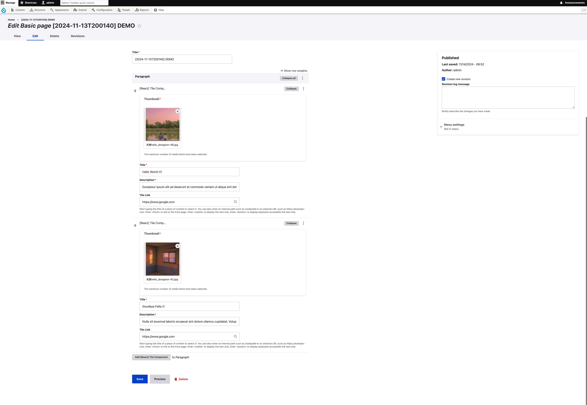
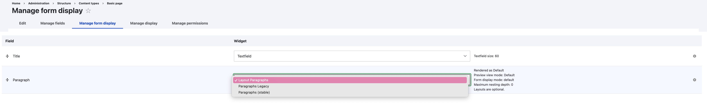
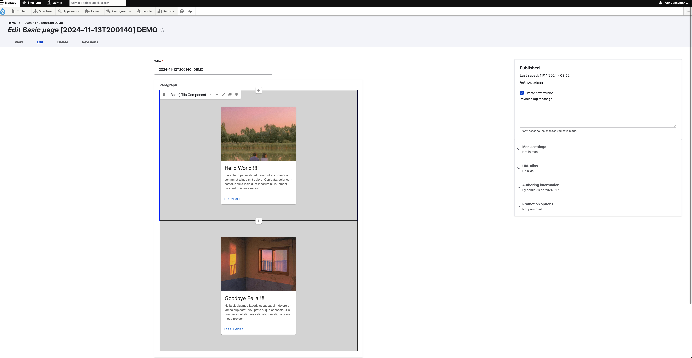
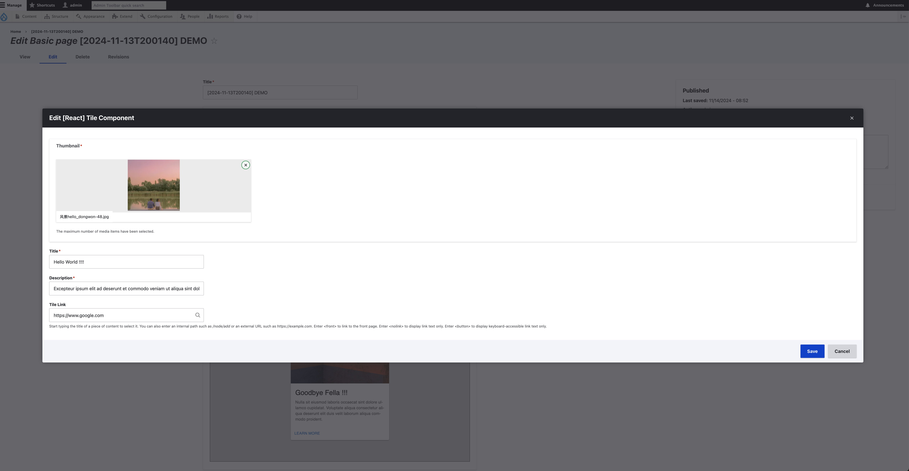

## Step to install the Layout Paragraph Module

Step-0: below is how the paragraph component by default looks like in the drupal admin backend: 

Step-1: Install and enable the "`drupal/layout_paragraph`" module, and configure view of the content/paragraph to use "Layout Paragraph": 

Step-2: add the `paragraph--name--xxyyzz.html.twig` to the administration theme (we are using `claro` as admin theme in this case), you would need to keep the ``, ``, and `
` in order for the paragraph layout to work:

## Reference

https://www.drupal.org/project/layout_paragraphs