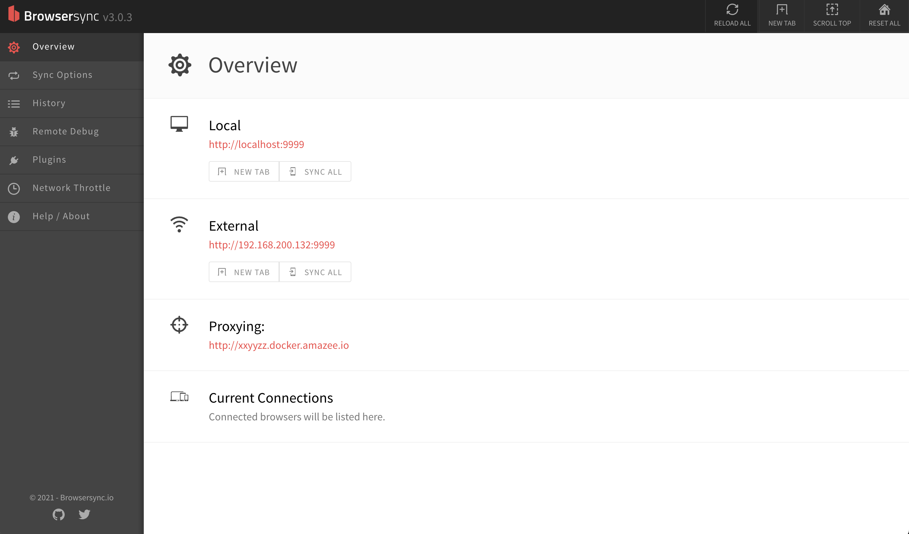
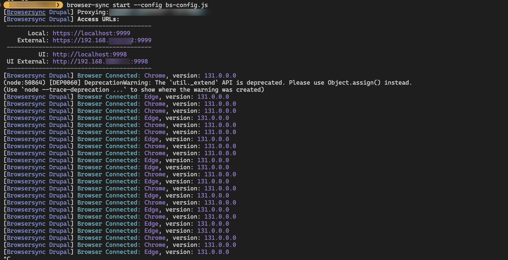
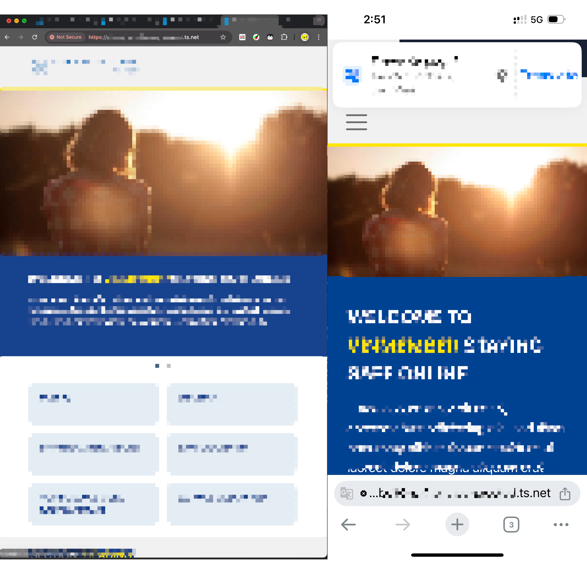

## Intuition

For the longest time, I've been waiting to have the local envrionemnt running version of the website to be accessed from my varying devices and browsers, not only because I can put the mobile, tablet, and desktop devices side-by-side and test their responsiveness, but also to test some of the browser/device specific feature and make sure they are enabled properly via browser preflexed properties such as `-webkit-xxyyzz`.

The ways I've been trying till this point all seems to fail, either because they are too trivial to setup (MAMP + NAMO), or too complicated for me the understand (Docker + DDEV + Tailscale), or network evironment dependent and potentially dangerous (Disabling the firewall via `pf`/`ipfw`, directly exposing the port).

This is until I meet BrowserSync, it not only allows me to proxy my locally hosted website (via any approach!), to the local network; But also gives me the ability to sync all the opened websites on all devices, so I can test them altogether by scrolling/clicking on just a single device (and browser)!


## Steps Breakdown

###  Step-1: Installaing Package

To begin with if you have not done so, you can install the `Browser-Sync` package via the following:

```
$ npm install -g browser-sync            # Global Install
$ npm install browser-sync --save-dev    # Local  Install
```

(Above instructions are for MacOS, for other devices, please refer to: [Browsersync Documentation - Installation](https://browsersync.io/docs))

### Step-2: Initializing Config File

After installation, open a new terminal, and navigate to the folder where the drupal files are located (for instance `my_website/public_html`); At here, you will need to initialize a configuration file, of which will be used by the `Browser-Sync` command-line later :

```
$ browser-sync init
$ ls -al
    total 216
    drwxr-xr-x   30 suowei_hu  staff    960 Dec  4 14:17 .
    drwx------+  16 suowei_hu  staff    512 Dec  3 23:32 ..
    -rw-r--r--    1 suowei_hu  staff   2480 Dec  4 14:41 bs-config.js     ←--- (created file)
    drwxr-xr-x  770 suowei_hu  staff  24640 Nov 27 13:44 files
    drwxr-xr-x    8 suowei_hu  staff    256 Nov 27 09:26 themes
    ...           ...          ...      ...        ...
```

Here you will need to configure to:

-   **Log Connection**: change log connection to `true`, such that we get a print-out like `Browser Connected: Chrome, version: 131.0.0.0` whenever a device visits the URL and gets connected.
-   **Proxy:** enable proxy for your drupal website; For instance, if I am getting the website up running via  `ddev` or `docker (ahoy)`, I can have `"proxy": {"target":"http://chiefscientist.docker.amazee.io","ws": true}`)
-   **Port:** change port to a less commonly used port; For instance, `9998`, `9999` are ports that I used very commonly.
-    **Ghost Mode**: if you wish to have different device syncing on `scroll`/`click`/`form-change`/etc, made changes to `ghostMode`.

Here's more detailed list of the configuration you can play with: [Browsersync Documentation - Options](https://browsersync.io/docs/options#option-reloadDebounce). Here's is my configurationfile for your reference: [example-bs-config.js](bs-config.js).

### Step-3: Start BrowserSync

Once you have the `bs-config.js` configuration/option file, you can then launch Browsersync via command-line:

```
$ browser-sync start --config bs-config.js
    [Browsersync Drupal] Proxying: http://xxyyzz.docker.amazee.io
    [Browsersync Drupal] Access URLs:
     ----------------------------------------
           Local: http://localhost:9998
        External: http://192.168.1.1:9998
     ----------------------------------------
              UI: http://localhost:9999
     UI External: http://192.168.1.1:9999
     ----------------------------------------
```

You can visits the UI configuration panel of BrowserSync via the UI (user-interface) Url provided in the command-line printout, for the above example it is `http://192.168.1.1:9998`, in this page you perform actions such as **sync/reload** the devices, and **change settings** for the current running BrowserSync instance:



### Step-4: BrowserSync Script Injection

Finally, before we open the `External` url, we will need to insert the following script right before the `</body>` closing tag, to every single page user will visit:

```html
<script id="__bs_script__">//<![CDATA[
  (function() {
    try {
      var script = document.createElement('script');
      if ('async') {
        script.async = true;
      }
      script.src = 'http://HOST:3000/browser-sync/browser-sync-client.js?v=3.0.3'.replace("HOST", location.hostname);
      if (document.body) {
        document.body.appendChild(script);
      } else if (document.head) {
        document.head.appendChild(script);
      }
    } catch (e) {
      console.error("Browsersync: could not append script tag", e);
    }
  })()
//]]></script>
```

For our instance, we are working with a drupal website, hence we can do that via the `html.html.twig` template:

```html
    ....
	</div>
    {{ page_top }}
    {{ page }}
    {{ page_bottom }}
    <js-bottom-placeholder token="{{ placeholder_token }}">
    {# ================================================================================== #}
    <script id="__bs_script__">
        //<![CDATA[
        (function() {
            try {
            var script = document.createElement('script');
            if ('async') {
                script.async = true;
            }
            script.src = 'http://HOST:3000/browser-sync/browser-sync-client.js?v=3.0.3'.replace("HOST", location.hostname);
            if (document.body) {
                document.body.appendChild(script);
            } else if (document.head) {
                document.head.appendChild(script);
            }
            } catch (e) {
            console.error("Browsersync: could not append script tag", e);
            }
        })()
        //]]>
    </script>
    {# ================================================================================== #}
  </body>
  ....
</html>

```

Remeber to clear the cache via after you save this global twig template.

### Step-5: Opening External Url

Lastly, let us open the `external` url previously prompted on the command-line on our **different browsers** or even **different devices**, and see the magic happen !

**Different Browsers:**


**Difference Devices:**


**Command-line Print-out:**



*(\*Please make sure all the devices you want to access the website from are connected under the same network, and there's no firewall blocking the port)*

*(\*Sometimes FireFox and Safari would block the browser-sync javascript, if you are not seeing the syncing, please check in console if you are seeing [anything like this](2024-12-04T151955.png))*


### Step-6: (Option) Open on Device of Different Network

If you are using VPN like tailscale, then you can change the port to `443` (default port of http), and open you website just by the IP address (of the device running browser-sync on) on any device within the private network, if you are using tailscale you can even using the magic-dns: `https://your-magic-dns-with-device-name`. 



