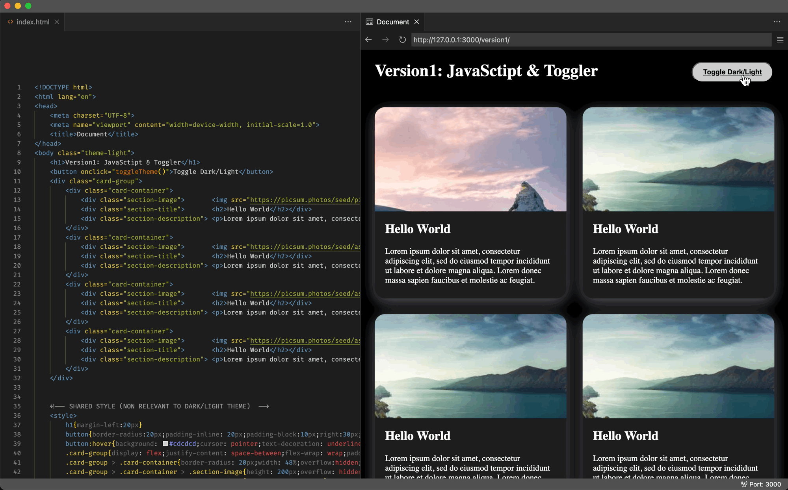
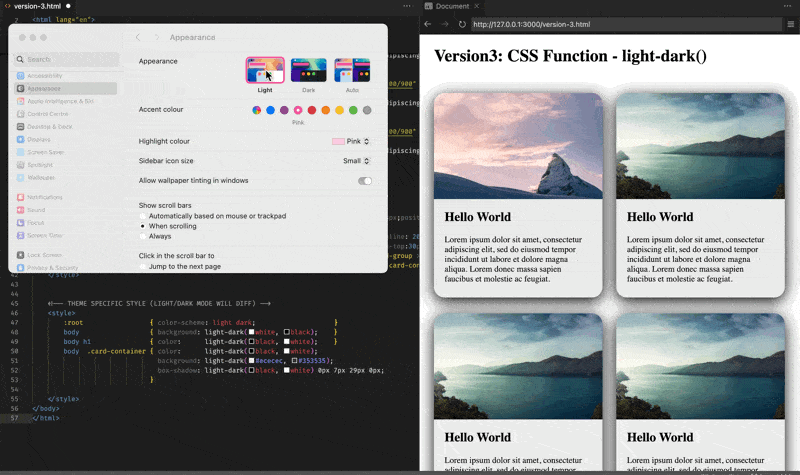

## Version 1: JavaSctipt Toggler + CSS Class-name

For the longest time, I never know about the media query or light-dark function, so here's the approach I've been going with: 



Below are the most relevant code snippets:

```html
...
<!-- TOGGLER FOR CALSSNAME & ITS SCRIPT --> 
<button onclick="toggleTheme()">Toggle Dark/Light</button>
<script> toggleTheme = () => {
    document.querySelector("body").classList.toggle("theme-light");
    document.querySelector("body").classList.toggle("theme-dark");
}</script>
...
<!-- THEME SPECIFIC STYLE (LIGHT/DARK MODE WILL DIFF) -->
    <style>
        body.theme-light                 { background: white; }
        body.theme-dark                  { background: black; }
        body.theme-light h1              { color:black;       }
        body.theme-dark  h1              { color:white;       }
        body.theme-dark  .card-container {
                                           color:white;
                                           background: rgb(29, 29, 29);
                                           box-shadow: rgba(215, 215, 239, 0.4) 0px 7px 29px 0px; }
...
```

The complete code can be found at: [version-1.html](version-1.html)


## Version-2: CSS Media Query - prefers-color-scheme

Here's a more civilized way of implenting the dark/light feature that will display the website differently depending on the system setting: 

>    The `prefers-color-scheme` CSS media feature is used to detect if a user has requested light or dark color themes. A user indicates their preference through an operating system setting (e.g. light or dark mode) or a user agent setting.


Below are the most relevant code snippets:

```html
<!-- THEME SPECIFIC STYLE (LIGHT/DARK MODE WILL DIFF) -->
<style>
    @media (prefers-color-scheme: light){
        body                  { background: white; }
        body h1               { color:      black; }
        body  .card-container { color:      black;
                                background: #ececec;
                                box-shadow: rgba(100, 100, 111, 0.4) 0px 7px 29px 0px;}
    }
    @media (prefers-color-scheme: dark){
        body                  { background: black; }
        body  h1              { color:      white; }
        body  .card-container { color:      white;
                                background: rgb(29, 29, 29);
                                box-shadow: rgba(215, 215, 239, 0.4) 0px 7px 29px 0px;}
    }
</style>
```

The complete code can be found at: [version-2.html](version-2.html)


## Version-3: CSS Function - light-dark()

I guess the the previous usecase should be able to cover all your needs, except for that it makes your codebase extremely messy, you would either have to seprate your `dark-theme` code and `light-theme` code in different sections (like shown in the above example), or have every single css rule to have this media query, which I am preety sure isn't a good practice (as it will blow up your css file size un-necessarily):

>   The `light-dark()` CSS `<color>` function enables setting two colors for a property - returning one of the two colors options by detecting if the developer has set a light or dark color scheme or the user has requested light or dark color theme - without needing to encase the theme colors within a prefers-color-scheme media feature query. 



Below are the most relevant code snippets:

```html
<!-- THEME SPECIFIC STYLE (LIGHT/DARK MODE WILL DIFF) -->
<style>
    :root                 { color-scheme: light dark;                    }
    body                  { background: light-dark(white, black);    }
    body h1               { color:      light-dark(black, white);    }
    body  .card-container { color:      light-dark(black, white);
                            background: light-dark(#ececec, #353535);
                            box-shadow: light-dark(black, white) 0px 7px 29px 0px;
                          }
</style>
```

The complete code can be found at: [version-3.html](version-3.html)


## Reference

1.  https://www.youtube.com/watch?v=XtTcWT8XGug
2.  https://caniuse.com/?search=prefers-color-scheme
3.  https://caniuse.com/?search=light-dark
4.  https://developer.mozilla.org/en-US/docs/Web/CSS/@media/prefers-color-scheme
5.  https://developer.mozilla.org/en-US/docs/Web/CSS/color_value/light-dark
