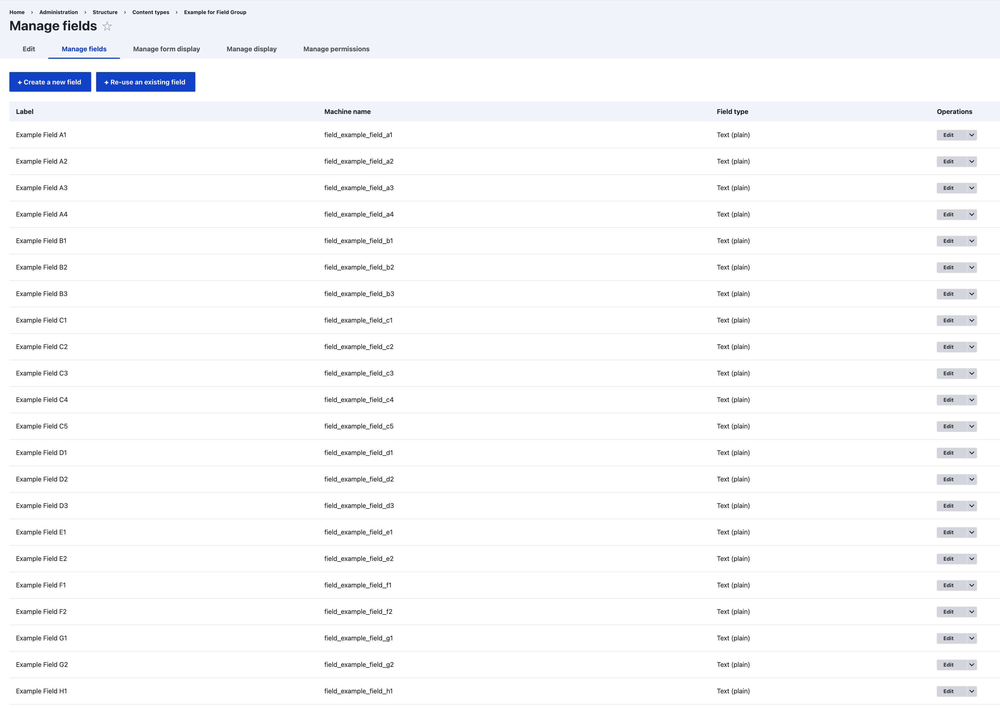
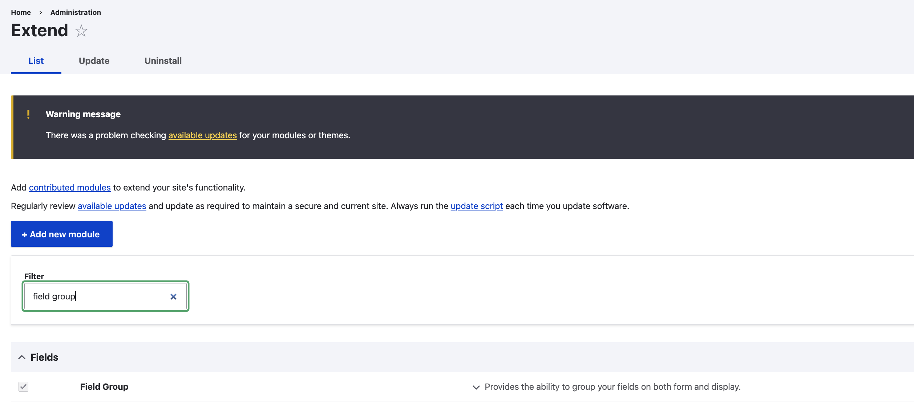

## Intuition

The "Field Group" module can come in handy when you have huge amount of fields, for instance let's say you have a website that collects the statistics for the average salary for every single region for every single state within Australia, and every content item is a average salary data for a date data-point. Potentially your content type could have insamely amount of fields like the following, and we can use some help of the module to group the regions by state.

## Setup and Quick Preview

To install the module, simply run `composer require 'drupal/field_group'` followed by `drush en field_group`, or enable the module via Drupal's GUI backend:

Once installed, if you would proceed to the "content type" form display tab, you will be able to add structure to the edit/new page of that "content type":

And eventually you will have something alike the following:

## Reference

- [https://www.drupal.org/project/field_group](https://www.drupal.org/project/field_group)
- [https://www.youtube.com/watch?v=GPYYonFf6f4](https://www.youtube.com/watch?v=GPYYonFf6f4)