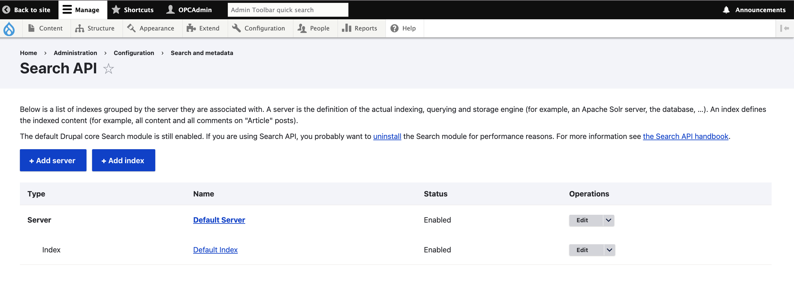
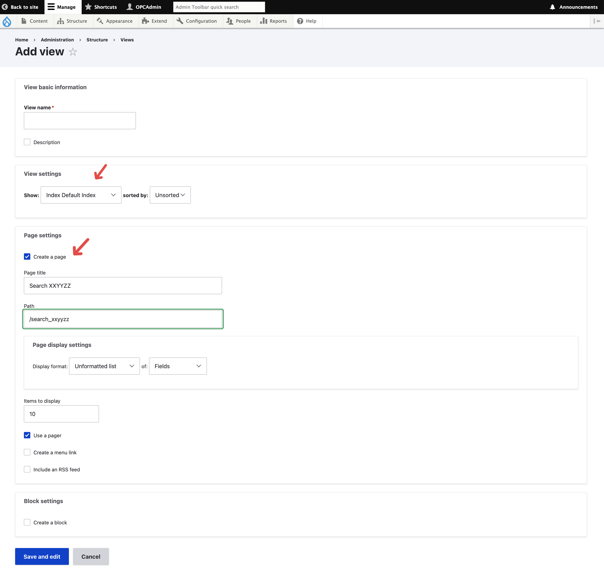
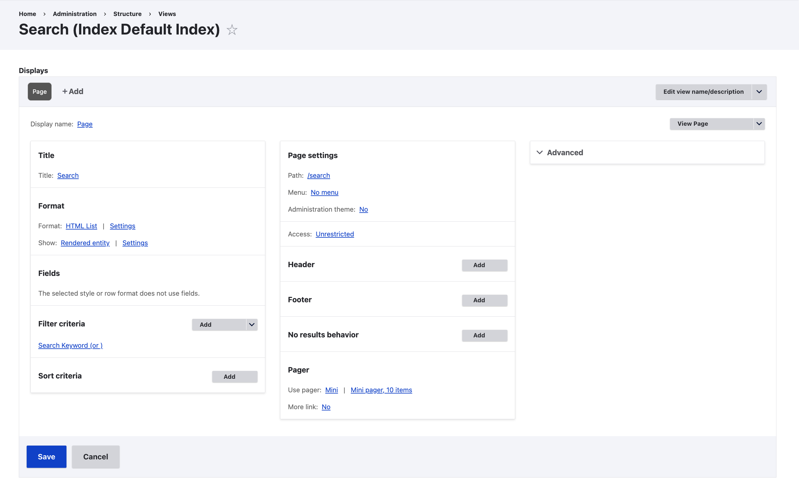
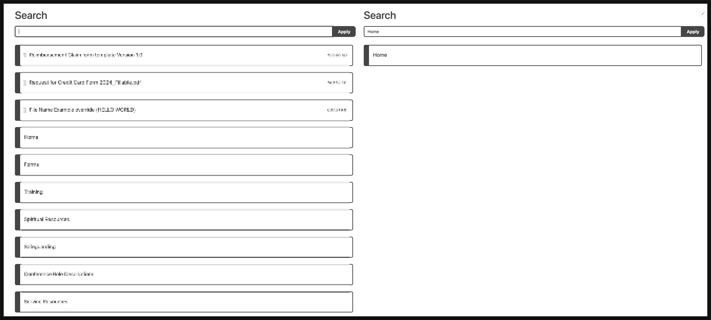

*\*Note: This is just a quick note for myself in order to get my head around the topic, maybe I'll formulate this into a more structured post one day ... but for now if you are looking for something formal Search API's documentation is your goto.*

## Step-1: Preliminary Setup 

Install and enable the following modules in your website :

-   **Search API:** Provides a generic framework for modules offering search capabilities.
-   **Database Search**: Offers an implementation of the Search API that uses database tables for indexing content.

Prepare at least content type (or media/file/taxnonomy/etc) that have your desired search field in it.

## Step-2: Search API Config

Goto the "**Configuration > Search and metadata > Search API**" and start your conriguration there: 

-   Create a **server** 
    -   With the "backend" database as database (see: [screenshot-1](2024-12-18T132454.png)) 
-   Create a **index** 
    -   At the **datasource tab** pick  your desired "content type " or/and "media/file/taxnonomy/etc" (see: [screenshot-2](2024-12-18T134653.png))
    -   At the **fields tab** pick the fields in those datasource that you want to search with (see: [screenshot-3](2024-12-18T134847.png))
    -   At the **processors tab** you can change the pre/post-process data at index time and search time, to archive effect such as search partial word, ignore special character, case insensive, content access etc (see: [screenshot-4](2024-12-18T135111.png)) Please remember to choose all relevant field at the processor setting, otherwise that specific processor setting won't take effect. 

Eventually you will use the "index" you created here in a "view" to enable the search capacbilities in the next step. 

 

## Step-3: View using Index

Create the search view using the index you just created, for instance we just created the index of name "Default Index", then we will need to select "Index - Default Index" on view setting when first creating the view, and tick the page : 

Once view is created, we will need to 

-   In the **filter criteria** **section**, add exposed filter, that is the search box where user input their query (see: [screenshot](2024-12-18T135838.png))

-   In the **format section**, change its display setting, it is usually recommended to change this to "rendered entity +  teaser" so you may override the look of the items in the search page, via the display setting of the content type it self, or override it with the `node--XXXXYYYZZ--teaser.html.twig` template. (see: [screenshot](2024-12-18T140151.png))

Once setup your search view setting will look something like this: 

## Final Result

